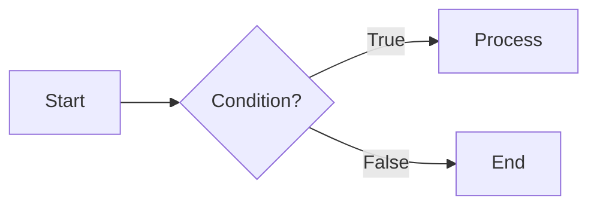

# Template Lecture - Console App

> This is a **template** lecture illustrating the standard folder layout. Copy this folder to start a new lecture.

## Goals

- Understand the standard structure of a lecture folder in this wiki.
- Know how to run the accompanying console app project.

## Folder structure

```
00-console-app-template/
├── README.md                       # Lecture content (English) - required, this is the default
├── README.vi.md                    # Vietnamese translation (optional)
└── src/
    ├── ConsoleAppTemplate.csproj
    └── Program.cs
```

## Running the project

```bash
cd lectures/00-console-app-template/src
dotnet run
```

## Lecture content

Write the lecture content here in Markdown: paragraphs, code blocks, tables, blockquotes...

```csharp
Console.WriteLine("Hello from the sample lecture!");
```

Mermaid diagrams are supported too:



## Notes

- Add a matching entry to [lectures.json](../../lectures.json) at the repo root so the lecture shows up in the sidebar.
- See [src/Program.cs](./src/Program.cs) for the sample code.
