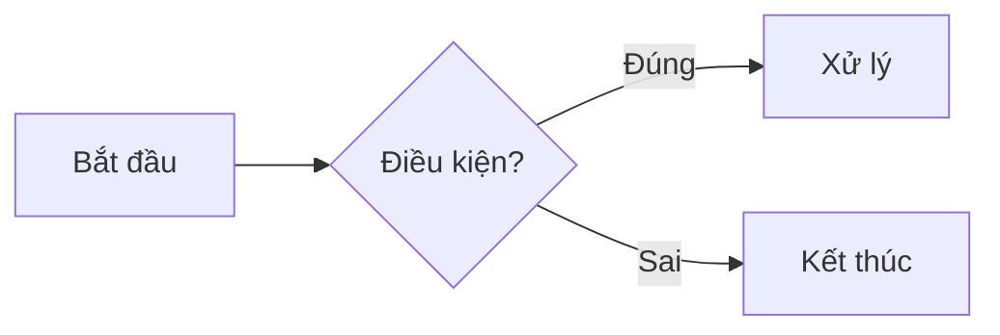

# Bài giảng mẫu - Console App

> Đây là bài giảng **mẫu** minh hoạ cấu trúc một folder bài giảng. Sao chép folder này để tạo bài giảng mới.

## Mục tiêu

- Hiểu cấu trúc chuẩn của một bài giảng trong wiki.
- Biết cách chạy project console app kèm theo.

## Cấu trúc folder

```
00-console-app-template/
├── README.md                       # Nội dung bài giảng (tiếng Việt) - bắt buộc
├── README.en.md                    # Bản dịch tiếng Anh (tuỳ chọn)
└── src/
    ├── ConsoleAppTemplate.csproj
    └── Program.cs
```

## Chạy thử project

```bash
cd lectures/00-console-app-template/src
dotnet run
```

## Nội dung bài giảng

Viết nội dung bài giảng ở đây bằng Markdown: đoạn văn, code block, bảng, blockquote...

```csharp
Console.WriteLine("Xin chào từ bài giảng mẫu!");
```

Sơ đồ Mermaid cũng được hỗ trợ:



## Ghi chú

- Thêm entry tương ứng vào [lectures.json](../../lectures.json) ở thư mục gốc để bài giảng xuất hiện trên sidebar.
- Xem file [src/Program.cs](./src/Program.cs) để biết code mẫu.
