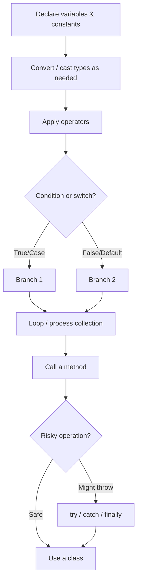

# C# Basics

A detailed introduction to the core building blocks of the C# language: comments, variables, data types, console I/O, constants, enums, value vs. reference semantics, type conversion, operators, the `Math` class, string formatting and manipulation, conditionals, nullability, variable scope, loops, collections, tuples, methods, exception handling, and a first class. Every concept below has a runnable counterpart in [src/Program.cs](./src/Program.cs).

## Goals

- Write comments that explain intent, including XML doc comments.
- Declare variables with explicit types and with `var`, and know the common built-in types.
- Read input from the console safely, without crashing on bad or missing input.
- Declare constants and understand why they can never change.
- Define an `enum` for a fixed set of named values instead of magic numbers or strings.
- Tell value types and reference types apart, and know what "copying" means for each.
- Convert between types safely, with implicit conversions, explicit casts, and `Parse`/`TryParse`.
- Use arithmetic, compound-assignment, and logical operators, plus common `Math` helpers.
- Format values for output with string interpolation and format specifiers, and manipulate strings with common string methods.
- Write `if`/`else`, ternary, `switch` statements, and `switch` expressions.
- Handle absent values with nullable types, `?.`, `??`, and `??=`.
- Understand variable scope - where a variable is and isn't visible.
- Write `for`, `while`, `do-while`, and `foreach` loops.
- Work with arrays (including multi-dimensional and jagged) and `List<T>`.
- Group related values with tuples, including deconstruction.
- Define methods with default and `params` parameters.
- Handle runtime errors with `try`/`catch`/`finally`.
- Define a simple class with properties and a constructor.

## 1. Comments

Comments are ignored by the compiler; they exist to help humans reading the code. Prefer explaining _why_ something is done a certain way - the code itself already shows _what_ it does.

```csharp
// A single-line comment - everything after // on this line is ignored.

/* A multi-line comment -
   can span several lines. */

/// <summary>
/// An XML doc comment - describes a member for IntelliSense/tooling.
/// Placed directly above the method, class, etc. it documents.
/// </summary>
static void Greet() => Console.WriteLine("Hi!");

Greet();
```

## 2. Variables and data types

A variable is a named storage location with a type. C# is statically typed: once declared, a variable's type cannot change.

```csharp
string name = "Alice";
int age = 25;
double height = 1.68;
bool isStudent = false;
char grade = 'A';
```

| Type      | Stores                                | Example   |
| --------- | ------------------------------------- | --------- |
| `byte`    | Whole numbers, 0 to 255               | `255`     |
| `short`   | Whole numbers, ±32K                   | `1000`    |
| `int`     | Whole numbers, ±2.1 billion           | `42`      |
| `long`    | Whole numbers, ±9.2 quintillion       | `42L`     |
| `float`   | Floating-point numbers, less precise  | `3.14f`   |
| `double`  | Floating-point numbers, more precise  | `3.14`    |
| `decimal` | Precise decimal numbers (money)       | `19.99m`  |
| `bool`    | `true` / `false`                      | `true`    |
| `char`    | A single character                    | `'A'`     |
| `string`  | Text                                  | `"Hello"` |
| `object`  | Anything - the base type of all types | `42`      |

`int` and `double` are the everyday defaults for whole numbers and fractional numbers, respectively; reach for the others only when you specifically need their range or precision trade-off. The `L`/`f`/`m` suffixes tell the compiler which type a numeric literal is - without one, `42` defaults to `int` and `3.14` defaults to `double`.

`var` tells the compiler to infer the type from the initializer. The variable is still strongly typed - `var` is just a shorthand at the declaration site.

```csharp
var favoriteNumber = 7; // inferred as int
```

Prefer `decimal` (not `double`) for money and other values where exact decimal precision matters - `double` uses binary floating-point and can introduce tiny rounding errors that are unacceptable in financial math.

## 3. Console input

`Console.WriteLine` writes output; `Console.ReadLine` reads one line of text typed by the user (or piped into the program) and returns it as a `string`. It returns `null` if there's no more input to read (for example, the input stream was redirected and reached its end) - always guard against that instead of assuming you got real text:

```csharp
Console.Write("Enter your name: ");
string? input = Console.ReadLine();
string userName = string.IsNullOrWhiteSpace(input) ? "Anonymous" : input;
Console.WriteLine($"Hello, {userName}!");
```

Since `ReadLine` always returns a `string` (or `null`), combine it with `TryParse` to safely read a number:

```csharp
Console.Write("Enter your age: ");
string? ageInput = Console.ReadLine();
int userAge = int.TryParse(ageInput, out var parsedAge) ? parsedAge : 0;
Console.WriteLine($"Next year you'll be {userAge + 1}.");
```

## 4. Constants

`const` declares a value that is fixed at compile time and can never be reassigned - useful for values like mathematical constants or fixed limits that should never accidentally change.

```csharp
const double Pi = 3.14159;
double circleArea = Pi * 2 * 2;
// Pi = 3.14; // <- would not compile: a const can never be reassigned
```

`const` must be initialized with a value known at compile time. If you need an immutable value that's computed at runtime (e.g. from configuration), use `readonly` on a field instead - it can be set once, in the constructor, and never changed after that.

## 5. Enums

An `enum` defines a fixed, named set of values - a safer, more readable alternative to magic numbers or free-form strings when a value can only be one of a known few options.

```csharp
Weekday today = Weekday.Wednesday;
Console.WriteLine(today);      // "Wednesday" - ToString() prints the member name
Console.WriteLine((int)today); // 2 - members are backed by int, numbered from 0 by default

enum Weekday
{
    Monday,
    Tuesday,
    Wednesday,
    Thursday,
    Friday,
    Saturday,
    Sunday
}
```

Enums pair naturally with `switch`, and the compiler can warn you if a `switch` over an enum doesn't handle every member.

(As with the `Animal` class later in this lecture, the `enum` declaration is written _after_ its usage - a top-level statement must precede any `class`/`enum`/`namespace` declaration in the file.)

## 6. Value types vs. reference types

This distinction explains a lot of behavior that otherwise looks surprising. **Value types** (`int`, `double`, `bool`, `char`, `struct`, `enum`) hold their data directly; assigning one variable to another **copies the value**, so the two variables are completely independent afterward:

```csharp
int x = 10;
int y = x; // copies the value
y = 99;
Console.WriteLine(x); // still 10 - x and y are independent
```

**Reference types** (`string`, arrays, `List<T>`, and any `class`) hold a reference to data stored elsewhere; assigning one variable to another **copies the reference**, so both variables end up pointing at the _same_ underlying object:

```csharp
var box1 = new int[] { 1, 2, 3 };
var box2 = box1; // copies the reference, not the array
box2[0] = 99;
Console.WriteLine(box1[0]); // 99 - box1 and box2 point at the same array
```

(`string` is a reference type but behaves like a value because it's immutable - every operation that looks like it "changes" a string actually produces a new one, so you never observe two variables silently diverging.)

## 7. Type conversion and casting

**Implicit conversion** happens automatically when no data can be lost (a smaller type fitting into a larger one, e.g. `int` → `double`):

```csharp
int wholeNumber = 42;
double asDouble = wholeNumber; // safe, automatic
```

**Explicit conversion (a cast)** is required when data could be lost, so you must opt in with `(type)`:

```csharp
double preciseNumber = 3.99;
int truncated = (int)preciseNumber; // 3 - the fractional part is discarded, not rounded
```

**Parsing** converts text to a number. `Parse` throws an exception if the text is invalid; `TryParse` never throws - it returns `true`/`false` and gives you the result through an `out` parameter, which is almost always the better choice for input you don't fully trust:

```csharp
int parsed = int.Parse("123");                 // 123, or throws FormatException on bad input
bool ok = int.TryParse("not a number", out int result); // ok=false, result=0, no exception
```

## 8. Operators

```csharp
int a = 10, b = 3;
Console.WriteLine(a + b); // 13  - addition
Console.WriteLine(a - b); // 7   - subtraction
Console.WriteLine(a * b); // 30  - multiplication
Console.WriteLine(a / b); // 3   - integer division (fraction is truncated)
Console.WriteLine(a % b); // 1   - remainder (modulo)
```

Comparison operators (`==`, `!=`, `<`, `>`, `<=`, `>=`) return `bool`. Logical operators combine boolean expressions: `&&` (and), `||` (or), `!` (not).

Compound assignment and increment/decrement operators are shorthand for "update this variable based on itself":

```csharp
var counter = 0;
counter += 5;  // counter = counter + 5
counter++;     // counter = counter + 1
counter--;     // counter = counter - 1
Console.WriteLine(counter); // 5
```

## 9. The `Math` class

`System.Math` provides static methods for common numeric operations, so you don't have to hand-write them:

```csharp
Console.WriteLine(Math.Round(3.14159, 2)); // 3.14 - round to 2 decimal places
Console.WriteLine(Math.Max(4, 9));         // 9    - the larger of two values
Console.WriteLine(Math.Min(4, 9));         // 4    - the smaller of two values
Console.WriteLine(Math.Abs(-7));           // 7    - absolute value
Console.WriteLine(Math.Sqrt(16));          // 4    - square root
Console.WriteLine(Math.Pow(2, 10));        // 1024 - 2 raised to the 10th power
```

`Math.Round` is what you reach for instead of a cast when you actually want rounding rather than truncation (see [Common pitfalls](#common-pitfalls)).

## 10. String interpolation and formatting

String interpolation (`$"..."`) embeds expressions directly in a string. A `:` inside the braces applies a **format specifier** that controls how the value is rendered:

```csharp
string name = "Alice";
int age = 25;
decimal price = 1234.5m;
Console.WriteLine($"{price}");    // "1234.5"     - default formatting
Console.WriteLine($"{price:C}");  // "$1,234.50"  - currency (culture-dependent symbol)
Console.WriteLine($"{price:F2}"); // "1234.50"    - fixed, always 2 decimal places
Console.WriteLine($"[{age,5}]");  // "[   25]"    - right-aligned in a 5-character field
```

`string.Format` does the same thing with positional placeholders (`{0}`, `{1}`, ...) instead of embedded expressions - useful when the format string itself comes from somewhere else (a resource file, a template):

```csharp
string name = "Alice";
int age = 25;
Console.WriteLine(string.Format("{0} is {1} years old", name, age));
```

## 11. Common string operations

Strings expose many built-in methods for inspecting and transforming text. Since strings are immutable, every one of these returns a _new_ string rather than modifying the original:

```csharp
string sentence = "  Hello, C# World!  ";
Console.WriteLine(sentence.Trim());                      // "Hello, C# World!" - removes leading/trailing whitespace
Console.WriteLine(sentence.Trim().ToUpper());            // "HELLO, C# WORLD!"
Console.WriteLine(sentence.Contains("World"));           // True
Console.WriteLine(sentence.Trim().Replace("C#", "F#"));  // "Hello, F# World!"
Console.WriteLine(sentence.Trim().Substring(7, 2));      // "C#" - 2 characters starting at index 7

string[] words = sentence.Trim().Split(' ');
Console.WriteLine(words.Length); // 3
```

## 12. Verbatim and raw strings, escape sequences

Inside a normal string, `\` starts an **escape sequence** (`\n` newline, `\t` tab, `\\` a literal backslash, `\"` a literal quote):

```csharp
string withEscapes = "Line1\nLine2\tTabbed\\Backslash";
Console.WriteLine(withEscapes);
```

A **verbatim string** (`@"..."`) treats `\` as a literal character, so paths and regexes don't need escaping (a literal `"` still needs doubling, `""`):

```csharp
string path = @"C:\Users\Alice\file.txt"; // no escaping needed for the backslashes
Console.WriteLine(path);
```

A **raw string literal** (`"""..."""`, C# 11+) needs no escaping at all, even for quotes - handy for embedding JSON, HTML, or other quote-heavy text:

```csharp
string json = """
{
  "name": "Alice"
}
""";
Console.WriteLine(json);
```

## 13. Conditionals and switch

```csharp
int score = 78;

if (score >= 90)
{
    Console.WriteLine("Excellent");
}
else if (score >= 70)
{
    Console.WriteLine("Good");
}
else
{
    Console.WriteLine("Needs improvement");
}
```

The ternary operator is a compact `if`/`else` that evaluates to a value:

```csharp
int score = 78;
string rank = score >= 90 ? "Excellent" : "Needs improvement";
Console.WriteLine(rank);
```

A classic `switch` **statement** branches on a value and requires `break` (or another jump) at the end of each case:

```csharp
char grade = 'A';

switch (grade)
{
    case 'A':
        Console.WriteLine("Grade A: outstanding.");
        break;
    default:
        Console.WriteLine("Grade: keep improving.");
        break;
}
```

A `switch` **expression** (the modern form) is more compact and always produces a value - no `break`, no statements, just `pattern => value`:

```csharp
char grade = 'A';
string gradeLabel = grade switch
{
    'A' => "outstanding",
    'B' => "good",
    _ => "keep improving", // _ is the default/catch-all pattern
};
Console.WriteLine(gradeLabel);
```

Prefer the switch expression whenever you're just computing a value from a set of cases - it's shorter and the compiler checks that every case produces the same type.

## 14. Nullable types and null handling

Value types like `int` normally can't be `null`. Adding `?` makes a **nullable value type** (`int?`, i.e. `Nullable<int>`) that can represent "no value":

```csharp
int? maybeAge = null;
maybeAge ??= 18; // "if null, assign this" - the null-coalescing assignment operator
```

Reference types (`string`, classes) can always be `null`; the `?`/`??` operators help you handle that safely without an explicit `if`:

```csharp
string? maybeName = null;
Console.WriteLine(maybeName?.Length);      // null-conditional: skips the call and evaluates to null instead of throwing
Console.WriteLine(maybeName ?? "Unknown"); // null-coalescing: use maybeName if it's not null, otherwise "Unknown"
```

`?.` is the key defense against `NullReferenceException` - it short-circuits the whole chain to `null` the moment something in it is `null`, instead of crashing.

## 15. Variable scope

A variable is only visible within the block (`{ }`) where it's declared, and any nested blocks inside that. Once the block ends, the variable is gone:

```csharp
int outer = 10;
{
    int inner = 20; // inner only exists within this block
    Console.WriteLine(outer + inner); // 30 - inner can see outer, since outer's block contains this one
}
// Console.WriteLine(inner); // <- would not compile here: inner is out of scope
Console.WriteLine(outer); // 10 - still accessible outside the inner block
```

This is why a `for` loop's counter (`for (var i = ...)`) can't be read after the loop - `i` is scoped to the loop itself. It also means you can safely reuse a short name like `i` in two unrelated loops without them colliding.

## 16. Loops

```csharp
for (var i = 1; i <= 5; i++)
{
    Console.WriteLine(i);
}

var count = 5;
while (count > 0)
{
    Console.WriteLine(count);
    count--;
}

var n = 0;
do
{
    Console.WriteLine(n); // runs at least once, even if the condition is already false
} while (n++ < 0);

foreach (var letter in "ABC")
{
    Console.WriteLine(letter); // A, B, C
}
```

Use `for` when you know how many iterations you need, `while` when you loop until a condition changes, `do-while` when the body must run at least once regardless of the condition, and `foreach` when you just need to visit every element of a collection without managing an index.

## 17. Arrays and collections

An array has a fixed size and a single element type:

```csharp
var numbers = new[] { 1, 2, 3, 4, 5 };
var sum = numbers.Sum();
Console.WriteLine(sum); // 15
```

`List<T>` is a resizable collection - the everyday choice when the number of items can change:

```csharp
var fruits = new List<string> { "apple", "banana", "cherry" };
fruits.Add("date");
Console.WriteLine(string.Join(", ", fruits)); // apple, banana, cherry, date
```

A **2D (rectangular) array** has fixed rows and columns, all the same length:

```csharp
int[,] grid = { { 1, 2 }, { 3, 4 } };
Console.WriteLine(grid[1, 0]); // 3
```

A **jagged array** is an array of arrays, where each row can have a different length - more flexible, and the more common choice in practice:

```csharp
int[][] jagged = { new[] { 1 }, new[] { 2, 3 }, new[] { 4, 5, 6 } };
Console.WriteLine(jagged[2].Length); // 3
```

## 18. Tuples

A tuple groups a small, fixed set of values together without needing to define a class - handy for a quick, local grouping or for a method that needs to return more than one value:

```csharp
(string name, int age) person = ("Alice", 25);
Console.WriteLine($"{person.name} is {person.age}"); // named elements: person.name, person.age
```

**Deconstruction** unpacks a tuple straight into separate variables:

```csharp
var (city, population) = ("Hanoi", 8_000_000);
Console.WriteLine($"{city}: {population}");
```

Returning a tuple from a method is a lightweight alternative to defining a class just to carry two or three values back to the caller:

```csharp
static (int min, int max) MinMax(int[] values) => (values.Min(), values.Max());

var (min, max) = MinMax(new[] { 4, 1, 9, 2 });
Console.WriteLine($"min={min}, max={max}");
```

## 19. Methods

A method is a named, reusable block of code:

```csharp
static int Square(int n) => n * n;

Console.WriteLine(Square(6)); // 36
```

A parameter can have a **default value**, making it optional at the call site:

```csharp
static string Greet(string person, string greeting = "Hello") => $"{greeting}, {person}!";

Console.WriteLine(Greet("Bob"));       // "Hello, Bob!"
Console.WriteLine(Greet("Bob", "Hi")); // "Hi, Bob!"
```

`params` lets a method accept any number of arguments as an array, without the caller having to build the array themselves:

```csharp
static int Add(params int[] values) => values.Sum();

Console.WriteLine(Add(1, 2, 3, 4)); // 10
```

## 20. Exception handling

Some failures can only be detected at runtime - bad input, a missing file, a network call that fails. `try`/`catch` lets you run risky code and recover instead of crashing the whole program:

```csharp
try
{
    int result = int.Parse("not a number"); // throws FormatException
    Console.WriteLine(result);              // never reached
}
catch (FormatException ex)
{
    Console.WriteLine($"Invalid input: {ex.Message}");
}
finally
{
    Console.WriteLine("This always runs, whether an exception happened or not.");
}
```

Catch the most specific exception type you can meaningfully handle (`FormatException` above), rather than a bare `catch (Exception)` that silently swallows bugs you didn't anticipate. `finally` is the place for cleanup (closing a file, releasing a resource) that must run either way.

## 21. A first class

Classes bundle data (fields/properties) and behavior (methods) together:

```csharp
var dog = new Animal("Rex", "Dog");
dog.Describe(); // Rex is a Dog.

class Animal
{
    public string Name { get; }
    public string Species { get; }

    public Animal(string name, string species)
    {
        Name = name;
        Species = species;
    }

    public void Describe() => Console.WriteLine($"{Name} is a {Species}.");
}
```

(A top-level statement, like `var dog = ...` above, must come _before_ any `class`/`namespace` declaration in the file - that's why the usage is written first here, even though it reads "backward". `dotnet run` still executes the statements top to bottom; the class declaration is just hoisted by the compiler.)

## Flow recap



## Common pitfalls

- **Confusing `/` on integers with real division** - `10 / 3` is `3`, not `3.333`; cast at least one operand to `double` first if you need the fraction.
- **Rounding vs. truncation** - `(int)3.99` gives `3`, not `4`. Use `Math.Round` when you actually want rounding.
- **`Parse` on untrusted input** - it throws on invalid text; use `TryParse` for anything that isn't guaranteed to already be a valid number (user input, file contents, etc.).
- **Assuming `Console.ReadLine()` always returns text** - it returns `null` when there's no more input (e.g. redirected/piped input has ended); check for `null` before using the result.
- **Assuming arrays/lists copy on assignment** - `var b = a;` for a reference type shares the same underlying object; mutating `b` mutates `a` too. Use `.ToArray()`/`.ToList()` (or `Clone()`) if you need an independent copy.
- **`double` for money** - accumulated floating-point rounding error can produce results like `0.30000000000000004`; use `decimal` instead.
- **Catching `Exception` too broadly** - `catch (Exception)` swallows every kind of failure, including bugs you never intended to handle silently. Catch the specific exception type you know how to recover from.

## Exercises

1. Write a method `bool IsPrime(int n)` and use it to print every prime number from 2 to 30 with a `for` loop.
2. Rewrite the `switch` statement for `grade` as a `switch` expression that also handles `'C'` and `'D'`.
3. Given a `string? input` that might be `null`, use `?.` and `??` in one expression to print its length, or `"empty"` if it's `null`.
4. Create a jagged array representing a small triangle (`[1]`, `[1,2]`, `[1,2,3]`), then use nested `foreach` loops to print every value.
5. Write a method `double Average(params double[] values)` and call it with 0, 1, and 5 arguments - decide what it should do when called with none.
6. Define an `enum Season { Spring, Summer, Autumn, Winter }`, then write a `switch` expression that maps each season to a one-word description.
7. Prompt the user for two numbers with `Console.ReadLine()`, `TryParse` both, and print their sum - without crashing if either input is invalid.
8. Write a method that returns `(bool success, int value)` from trying to parse a string, then call it and deconstruct the result.
9. Wrap `int.Parse` on a hardcoded invalid string in a `try`/`catch`, and print a friendly message instead of letting the program crash.

## Running the project

```bash
cd lectures/01-csharp-basics/src
dotnet run
```

## Notes

- See [src/Program.cs](./src/Program.cs) for the full runnable sample covering every section above, in the same order.
- The sample project reads from the console (see [3. Console input](#3-console-input)) - when running it non-interactively (e.g. piped input, or no input at all), `Console.ReadLine()` returns `null` and the sample falls back to a default value instead of crashing.
- This lecture intentionally stays surface-level on classes; OOP concepts like inheritance, interfaces, and polymorphism are covered in [03-csharp-oop](../03-csharp-oop/README.md).
