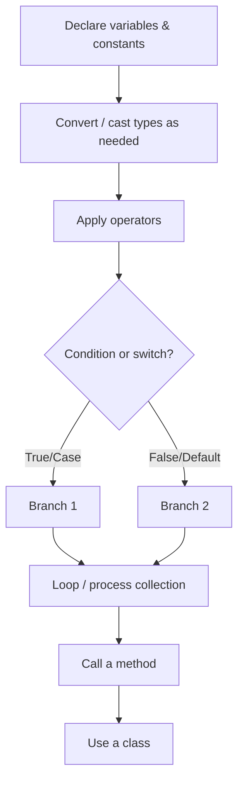

# C# Basics

A detailed introduction to the core building blocks of the C# language: variables, data types, constants, value vs. reference semantics, type conversion, operators, string formatting, conditionals, nullability, loops, collections, and methods. Every concept below has a runnable counterpart in [src/Program.cs](./src/Program.cs).

## Goals

- Declare variables with explicit types and with `var`, and know the common built-in types.
- Declare constants and understand why they can never change.
- Tell value types and reference types apart, and know what "copying" means for each.
- Convert between types safely, with implicit conversions, explicit casts, and `Parse`/`TryParse`.
- Use arithmetic, compound-assignment, and logical operators.
- Format values for output with string interpolation and format specifiers.
- Write `if`/`else`, ternary, `switch` statements, and `switch` expressions.
- Handle absent values with nullable types, `?.`, `??`, and `??=`.
- Write `for`, `while`, `do-while`, and `foreach` loops.
- Work with arrays (including multi-dimensional and jagged) and `List<T>`.
- Define methods with default and `params` parameters.
- Define a simple class with properties and a constructor.

## 1. Variables and data types

A variable is a named storage location with a type. C# is statically typed: once declared, a variable's type cannot change.

```csharp
string name = "Alice";
int age = 25;
double height = 1.68;
bool isStudent = false;
char grade = 'A';
```

| Type      | Stores                          | Example   |
| --------- | ------------------------------- | --------- |
| `int`     | Whole numbers                   | `42`      |
| `double`  | Floating-point numbers          | `3.14`    |
| `decimal` | Precise decimal numbers (money) | `19.99m`  |
| `bool`    | `true` / `false`                | `true`    |
| `char`    | A single character              | `'A'`     |
| `string`  | Text                            | `"Hello"` |

`var` tells the compiler to infer the type from the initializer. The variable is still strongly typed - `var` is just a shorthand at the declaration site.

```csharp
var favoriteNumber = 7; // inferred as int
```

Prefer `decimal` (not `double`) for money and other values where exact decimal precision matters - `double` uses binary floating-point and can introduce tiny rounding errors that are unacceptable in financial math.

## 2. Constants

`const` declares a value that is fixed at compile time and can never be reassigned - useful for values like mathematical constants or fixed limits that should never accidentally change.

```csharp
const double Pi = 3.14159;
double circleArea = Pi * 2 * 2;
// Pi = 3.14; // <- would not compile: a const can never be reassigned
```

`const` must be initialized with a value known at compile time. If you need an immutable value that's computed at runtime (e.g. from configuration), use `readonly` on a field instead - it can be set once, in the constructor, and never changed after that.

## 3. Value types vs. reference types

This distinction explains a lot of behavior that otherwise looks surprising. **Value types** (`int`, `double`, `bool`, `char`, `struct`) hold their data directly; assigning one variable to another **copies the value**, so the two variables are completely independent afterward:

```csharp
int x = 10;
int y = x; // copies the value
y = 99;
Console.WriteLine(x); // still 10 - x and y are independent
```

**Reference types** (`string`, arrays, `List<T>`, and any `class`) hold a reference to data stored elsewhere; assigning one variable to another **copies the reference**, so both variables end up pointing at the _same_ underlying object:

```csharp
var box1 = new int[] { 1, 2, 3 };
var box2 = box1; // copies the reference, not the array
box2[0] = 99;
Console.WriteLine(box1[0]); // 99 - box1 and box2 point at the same array
```

(`string` is a reference type but behaves like a value because it's immutable - every operation that looks like it "changes" a string actually produces a new one, so you never observe two variables silently diverging.)

## 4. Type conversion and casting

**Implicit conversion** happens automatically when no data can be lost (a smaller type fitting into a larger one, e.g. `int` → `double`):

```csharp
int wholeNumber = 42;
double asDouble = wholeNumber; // safe, automatic
```

**Explicit conversion (a cast)** is required when data could be lost, so you must opt in with `(type)`:

```csharp
double preciseNumber = 3.99;
int truncated = (int)preciseNumber; // 3 - the fractional part is discarded, not rounded
```

**Parsing** converts text to a number. `Parse` throws an exception if the text is invalid; `TryParse` never throws - it returns `true`/`false` and gives you the result through an `out` parameter, which is almost always the better choice for input you don't fully trust:

```csharp
int parsed = int.Parse("123");                 // 123, or throws FormatException on bad input
bool ok = int.TryParse("not a number", out int result); // ok=false, result=0, no exception
```

## 5. Operators

```csharp
int a = 10, b = 3;
a + b;  // 13  - addition
a - b;  // 7   - subtraction
a * b;  // 30  - multiplication
a / b;  // 3   - integer division (fraction is truncated)
a % b;  // 1   - remainder (modulo)
```

Comparison operators (`==`, `!=`, `<`, `>`, `<=`, `>=`) return `bool`. Logical operators combine boolean expressions: `&&` (and), `||` (or), `!` (not).

Compound assignment and increment/decrement operators are shorthand for "update this variable based on itself":

```csharp
counter += 5;  // counter = counter + 5
counter++;     // counter = counter + 1
counter--;     // counter = counter - 1
```

## 6. String interpolation and formatting

String interpolation (`$"..."`) embeds expressions directly in a string. A `:` inside the braces applies a **format specifier** that controls how the value is rendered:

```csharp
decimal price = 1234.5m;
$"{price}";     // "1234.5"     - default formatting
$"{price:C}";   // "$1,234.50"  - currency (culture-dependent symbol)
$"{price:F2}";  // "1234.50"    - fixed, always 2 decimal places
$"{age,5}";     // "   25"      - right-aligned in a 5-character field
```

`string.Format` does the same thing with positional placeholders (`{0}`, `{1}`, ...) instead of embedded expressions - useful when the format string itself comes from somewhere else (a resource file, a template):

```csharp
string.Format("{0} is {1} years old", name, age);
```

## 7. Conditionals and switch

```csharp
if (score >= 90)
{
    Console.WriteLine("Excellent");
}
else if (score >= 70)
{
    Console.WriteLine("Good");
}
else
{
    Console.WriteLine("Needs improvement");
}
```

The ternary operator is a compact `if`/`else` that evaluates to a value:

```csharp
string rank = score >= 90 ? "Excellent" : "Needs improvement";
```

A classic `switch` **statement** branches on a value and requires `break` (or another jump) at the end of each case:

```csharp
switch (grade)
{
    case 'A':
        Console.WriteLine("Grade A: outstanding.");
        break;
    default:
        Console.WriteLine("Grade: keep improving.");
        break;
}
```

A `switch` **expression** (the modern form) is more compact and always produces a value - no `break`, no statements, just `pattern => value`:

```csharp
string gradeLabel = grade switch
{
    'A' => "outstanding",
    'B' => "good",
    _ => "keep improving", // _ is the default/catch-all pattern
};
```

Prefer the switch expression whenever you're just computing a value from a set of cases - it's shorter and the compiler checks that every case produces the same type.

## 8. Nullable types and null handling

Value types like `int` normally can't be `null`. Adding `?` makes a **nullable value type** (`int?`, i.e. `Nullable<int>`) that can represent "no value":

```csharp
int? maybeAge = null;
maybeAge ??= 18; // "if null, assign this" - the null-coalescing assignment operator
```

Reference types (`string`, classes) can always be `null`; the `?`/`??` operators help you handle that safely without an explicit `if`:

```csharp
string? maybeName = null;
maybeName?.Length;          // null-conditional: skips the call and evaluates to null instead of throwing
maybeName ?? "Unknown";     // null-coalescing: use maybeName if it's not null, otherwise "Unknown"
```

`?.` is the key defense against `NullReferenceException` - it short-circuits the whole chain to `null` the moment something in it is `null`, instead of crashing.

## 9. Loops

```csharp
for (var i = 1; i <= 5; i++)
{
    Console.WriteLine(i);
}

var count = 5;
while (count > 0)
{
    Console.WriteLine(count);
    count--;
}

var n = 0;
do
{
    Console.WriteLine(n); // runs at least once, even if the condition is already false
} while (n++ < 0);

foreach (var letter in "ABC")
{
    Console.WriteLine(letter); // A, B, C
}
```

Use `for` when you know how many iterations you need, `while` when you loop until a condition changes, `do-while` when the body must run at least once regardless of the condition, and `foreach` when you just need to visit every element of a collection without managing an index.

## 10. Arrays and collections

An array has a fixed size and a single element type:

```csharp
var numbers = new[] { 1, 2, 3, 4, 5 };
var sum = numbers.Sum();
```

`List<T>` is a resizable collection - the everyday choice when the number of items can change:

```csharp
var fruits = new List<string> { "apple", "banana", "cherry" };
fruits.Add("date");
```

A **2D (rectangular) array** has fixed rows and columns, all the same length:

```csharp
int[,] grid = { { 1, 2 }, { 3, 4 } };
grid[1, 0]; // 3
```

A **jagged array** is an array of arrays, where each row can have a different length - more flexible, and the more common choice in practice:

```csharp
int[][] jagged = { new[] { 1 }, new[] { 2, 3 }, new[] { 4, 5, 6 } };
jagged[2].Length; // 3
```

## 11. Methods

A method is a named, reusable block of code:

```csharp
static int Square(int n) => n * n;

Console.WriteLine(Square(6)); // 36
```

A parameter can have a **default value**, making it optional at the call site:

```csharp
static string Greet(string person, string greeting = "Hello") => $"{greeting}, {person}!";

Greet("Bob");       // "Hello, Bob!"
Greet("Bob", "Hi"); // "Hi, Bob!"
```

`params` lets a method accept any number of arguments as an array, without the caller having to build the array themselves:

```csharp
static int Add(params int[] values) => values.Sum();

Add(1, 2, 3, 4); // 10
```

## 12. A first class

Classes bundle data (fields/properties) and behavior (methods) together:

```csharp
class Animal
{
    public string Name { get; }
    public string Species { get; }

    public Animal(string name, string species)
    {
        Name = name;
        Species = species;
    }

    public void Describe() => Console.WriteLine($"{Name} is a {Species}.");
}

var dog = new Animal("Rex", "Dog");
dog.Describe(); // Rex is a Dog.
```

## Flow recap



## Common pitfalls

- **Confusing `/` on integers with real division** - `10 / 3` is `3`, not `3.333`; cast at least one operand to `double` first if you need the fraction.
- **Rounding vs. truncation** - `(int)3.99` gives `3`, not `4`. Use `Math.Round` when you actually want rounding.
- **`Parse` on untrusted input** - it throws on invalid text; use `TryParse` for anything that isn't guaranteed to already be a valid number (user input, file contents, etc.).
- **Assuming arrays/lists copy on assignment** - `var b = a;` for a reference type shares the same underlying object; mutating `b` mutates `a` too. Use `.ToArray()`/`.ToList()` (or `Clone()`) if you need an independent copy.
- **`double` for money** - accumulated floating-point rounding error can produce results like `0.30000000000000004`; use `decimal` instead.

## Exercises

1. Write a method `bool IsPrime(int n)` and use it to print every prime number from 2 to 30 with a `for` loop.
2. Rewrite the `switch` statement for `grade` as a `switch` expression that also handles `'C'` and `'D'`.
3. Given a `string? input` that might be `null`, use `?.` and `??` in one expression to print its length, or `"empty"` if it's `null`.
4. Create a jagged array representing a small triangle (`[1]`, `[1,2]`, `[1,2,3]`), then use nested `foreach` loops to print every value.
5. Write a method `double Average(params double[] values)` and call it with 0, 1, and 5 arguments - decide what it should do when called with none.

## Running the project

```bash
cd lectures/01-csharp-basics/src
dotnet run
```

## Notes

- See [src/Program.cs](./src/Program.cs) for the full runnable sample covering every section above, in the same order.
- This lecture intentionally stays surface-level on classes; OOP concepts like inheritance, interfaces, and polymorphism are covered in [03-csharp-oop](../03-csharp-oop/README.md).
