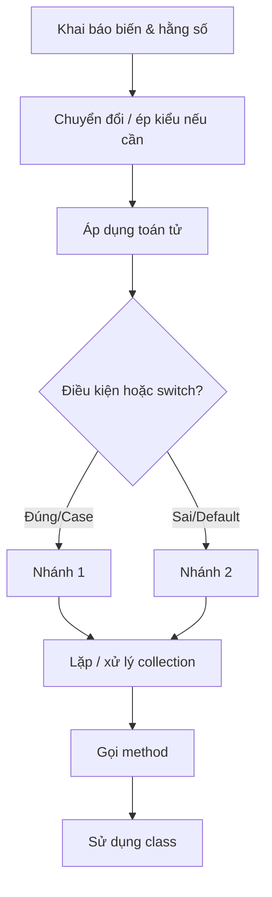

# C# cơ bản

Bài giảng chi tiết về các thành phần cốt lõi của ngôn ngữ C#: biến, kiểu dữ liệu, hằng số, ngữ nghĩa giá trị vs. tham chiếu, chuyển đổi kiểu, toán tử, định dạng chuỗi, cấu trúc điều kiện, xử lý null, vòng lặp, collection, và method. Mỗi khái niệm bên dưới đều có ví dụ chạy được tương ứng trong [src/Program.cs](./src/Program.cs).

## Mục tiêu

- Khai báo biến với kiểu tường minh và với `var`, và nắm các kiểu dựng sẵn thông dụng.
- Khai báo hằng số và hiểu vì sao chúng không bao giờ thay đổi được.
- Phân biệt kiểu giá trị (value type) và kiểu tham chiếu (reference type), và hiểu "sao chép" nghĩa là gì với từng loại.
- Chuyển đổi giữa các kiểu một cách an toàn: chuyển đổi ngầm định, ép kiểu tường minh, và `Parse`/`TryParse`.
- Sử dụng toán tử số học, toán tử gán rút gọn, và toán tử logic.
- Định dạng giá trị khi in ra bằng string interpolation và format specifier.
- Viết `if`/`else`, toán tử ba ngôi, câu lệnh `switch`, và biểu thức `switch`.
- Xử lý giá trị vắng mặt bằng nullable type, `?.`, `??`, và `??=`.
- Viết vòng lặp `for`, `while`, `do-while`, và `foreach`.
- Làm việc với mảng (kể cả mảng nhiều chiều và mảng jagged) và `List<T>`.
- Định nghĩa method với tham số mặc định và `params`.
- Định nghĩa một class đơn giản với property và constructor.

## 1. Biến và kiểu dữ liệu

Biến là một vùng lưu trữ có tên và có kiểu. C# là ngôn ngữ kiểu tĩnh (statically typed): một khi đã khai báo, kiểu của biến không thể thay đổi.

```csharp
string name = "Alice";
int age = 25;
double height = 1.68;
bool isStudent = false;
char grade = 'A';
```

| Kiểu      | Lưu trữ                          | Ví dụ     |
| --------- | -------------------------------- | --------- |
| `int`     | Số nguyên                        | `42`      |
| `double`  | Số thực (dấu phẩy động)          | `3.14`    |
| `decimal` | Số thập phân chính xác (tiền tệ) | `19.99m`  |
| `bool`    | `true` / `false`                 | `true`    |
| `char`    | Một ký tự                        | `'A'`     |
| `string`  | Chuỗi ký tự (văn bản)            | `"Hello"` |

`var` yêu cầu compiler tự suy luận kiểu từ giá trị khởi tạo. Biến vẫn có kiểu tường minh (strongly typed) - `var` chỉ là cách viết tắt tại nơi khai báo.

```csharp
var favoriteNumber = 7; // được suy luận là int
```

Ưu tiên dùng `decimal` (thay vì `double`) cho tiền tệ và các giá trị cần độ chính xác thập phân tuyệt đối - `double` dùng số thực nhị phân (binary floating-point) nên có thể phát sinh sai số làm tròn nhỏ, không chấp nhận được trong tính toán tài chính.

## 2. Hằng số (Constants)

`const` khai báo một giá trị cố định ngay tại thời điểm biên dịch và không bao giờ gán lại được - hữu ích cho những giá trị như hằng số toán học hoặc giới hạn cố định không nên vô tình bị thay đổi.

```csharp
const double Pi = 3.14159;
double circleArea = Pi * 2 * 2;
// Pi = 3.14; // <- lỗi biên dịch: const không bao giờ gán lại được
```

`const` bắt buộc phải khởi tạo bằng một giá trị đã biết tại compile time. Nếu cần một giá trị bất biến nhưng được tính toán lúc runtime (ví dụ đọc từ configuration), hãy dùng `readonly` cho field - nó chỉ có thể được gán một lần, trong constructor, và không thay đổi được sau đó.

## 3. Kiểu giá trị vs. kiểu tham chiếu

Sự khác biệt này giải thích rất nhiều hành vi mà nếu không biết trước sẽ thấy "kỳ lạ". **Kiểu giá trị** (`int`, `double`, `bool`, `char`, `struct`) lưu dữ liệu trực tiếp; gán biến này cho biến khác sẽ **sao chép giá trị**, nên hai biến sau đó hoàn toàn độc lập:

```csharp
int x = 10;
int y = x; // sao chép giá trị
y = 99;
Console.WriteLine(x); // vẫn là 10 - x và y độc lập với nhau
```

**Kiểu tham chiếu** (`string`, mảng, `List<T>`, và mọi `class`) lưu một tham chiếu tới dữ liệu nằm ở nơi khác; gán biến này cho biến khác sẽ **sao chép tham chiếu**, nên cả hai biến cuối cùng cùng trỏ đến _cùng một_ đối tượng:

```csharp
var box1 = new int[] { 1, 2, 3 };
var box2 = box1; // sao chép tham chiếu, không sao chép mảng
box2[0] = 99;
Console.WriteLine(box1[0]); // 99 - box1 và box2 cùng trỏ đến một mảng
```

(`string` là kiểu tham chiếu nhưng hành xử giống kiểu giá trị vì nó bất biến (immutable) - mọi thao tác trông như "thay đổi" một string thực ra đều tạo ra một string mới, nên bạn sẽ không bao giờ thấy hai biến âm thầm lệch nhau.)

## 4. Chuyển đổi kiểu và ép kiểu

**Chuyển đổi ngầm định (implicit conversion)** xảy ra tự động khi không có dữ liệu nào bị mất (kiểu nhỏ hơn vừa vặn với kiểu lớn hơn, ví dụ `int` → `double`):

```csharp
int wholeNumber = 42;
double asDouble = wholeNumber; // an toàn, tự động
```

**Chuyển đổi tường minh (ép kiểu / cast)** bắt buộc khi dữ liệu có thể bị mất, nên bạn phải chủ động dùng `(kiểu)`:

```csharp
double preciseNumber = 3.99;
int truncated = (int)preciseNumber; // 3 - phần thập phân bị bỏ đi, không làm tròn
```

**Parsing** chuyển văn bản thành số. `Parse` sẽ ném exception nếu văn bản không hợp lệ; `TryParse` không bao giờ ném exception - nó trả về `true`/`false` và đưa kết quả qua tham số `out`, gần như luôn là lựa chọn tốt hơn cho dữ liệu đầu vào bạn không hoàn toàn tin tưởng:

```csharp
int parsed = int.Parse("123");                 // 123, hoặc ném FormatException nếu input sai
bool ok = int.TryParse("not a number", out int result); // ok=false, result=0, không có exception
```

## 5. Toán tử

```csharp
int a = 10, b = 3;
a + b;  // 13  - cộng
a - b;  // 7   - trừ
a * b;  // 30  - nhân
a / b;  // 3   - chia lấy phần nguyên (phần thập phân bị cắt bỏ)
a % b;  // 1   - chia lấy phần dư (modulo)
```

Toán tử so sánh (`==`, `!=`, `<`, `>`, `<=`, `>=`) trả về `bool`. Toán tử logic dùng để kết hợp các biểu thức boolean: `&&` (và), `||` (hoặc), `!` (phủ định).

Toán tử gán rút gọn và tăng/giảm là cách viết tắt cho "cập nhật biến này dựa trên chính nó":

```csharp
counter += 5;  // counter = counter + 5
counter++;     // counter = counter + 1
counter--;     // counter = counter - 1
```

## 6. String interpolation và định dạng

String interpolation (`$"..."`) nhúng trực tiếp biểu thức vào trong chuỗi. Dấu `:` bên trong dấu ngoặc nhọn áp dụng một **format specifier** để kiểm soát cách giá trị được hiển thị:

```csharp
decimal price = 1234.5m;
$"{price}";     // "1234.5"     - định dạng mặc định
$"{price:C}";   // "$1,234.50"  - tiền tệ (ký hiệu phụ thuộc culture)
$"{price:F2}";  // "1234.50"    - cố định, luôn 2 chữ số thập phân
$"{age,5}";     // "   25"      - căn phải trong một khối 5 ký tự
```

`string.Format` làm điều tương tự nhưng dùng placeholder theo vị trí (`{0}`, `{1}`, ...) thay vì nhúng biểu thức trực tiếp - hữu ích khi bản thân format string đến từ nơi khác (file resource, template):

```csharp
string.Format("{0} is {1} years old", name, age);
```

## 7. Cấu trúc điều kiện và switch

```csharp
if (score >= 90)
{
    Console.WriteLine("Excellent");
}
else if (score >= 70)
{
    Console.WriteLine("Good");
}
else
{
    Console.WriteLine("Needs improvement");
}
```

Toán tử ba ngôi là dạng viết gọn của `if`/`else`, trả về một giá trị:

```csharp
string rank = score >= 90 ? "Excellent" : "Needs improvement";
```

Câu lệnh `switch` cổ điển rẽ nhánh theo một giá trị và yêu cầu `break` (hoặc một lệnh nhảy khác) ở cuối mỗi case:

```csharp
switch (grade)
{
    case 'A':
        Console.WriteLine("Grade A: outstanding.");
        break;
    default:
        Console.WriteLine("Grade: keep improving.");
        break;
}
```

Biểu thức `switch` (dạng hiện đại) gọn hơn và luôn trả về một giá trị - không cần `break`, không cần statement, chỉ cần `pattern => value`:

```csharp
string gradeLabel = grade switch
{
    'A' => "outstanding",
    'B' => "good",
    _ => "keep improving", // _ là pattern mặc định/bắt tất cả
};
```

Ưu tiên dùng switch expression bất cứ khi nào bạn chỉ cần tính ra một giá trị từ một tập các trường hợp - ngắn gọn hơn và compiler sẽ kiểm tra mọi case đều trả về cùng một kiểu.

## 8. Nullable type và xử lý null

Kiểu giá trị như `int` bình thường không thể là `null`. Thêm `?` sẽ tạo ra một **nullable value type** (`int?`, tức `Nullable<int>`) có thể biểu diễn "không có giá trị":

```csharp
int? maybeAge = null;
maybeAge ??= 18; // "nếu null thì gán giá trị này" - toán tử gán null-coalescing
```

Kiểu tham chiếu (`string`, class) luôn có thể là `null`; toán tử `?.`/`??` giúp bạn xử lý điều đó an toàn mà không cần viết `if` tường minh:

```csharp
string? maybeName = null;
maybeName?.Length;          // null-conditional: bỏ qua lời gọi và trả về null thay vì ném exception
maybeName ?? "Unknown";     // null-coalescing: dùng maybeName nếu không null, ngược lại dùng "Unknown"
```

`?.` là "lá chắn" quan trọng chống lại `NullReferenceException` - nó cắt ngắn toàn bộ chuỗi thành `null` ngay khi có một phần tử nào đó là `null`, thay vì làm chương trình crash.

## 9. Vòng lặp

```csharp
for (var i = 1; i <= 5; i++)
{
    Console.WriteLine(i);
}

var count = 5;
while (count > 0)
{
    Console.WriteLine(count);
    count--;
}

var n = 0;
do
{
    Console.WriteLine(n); // chạy ít nhất một lần, kể cả khi điều kiện đã sai từ đầu
} while (n++ < 0);

foreach (var letter in "ABC")
{
    Console.WriteLine(letter); // A, B, C
}
```

Dùng `for` khi biết trước số lần lặp, `while` khi lặp cho đến khi một điều kiện thay đổi, `do-while` khi thân vòng lặp phải chạy ít nhất một lần bất kể điều kiện, và `foreach` khi chỉ cần duyệt qua từng phần tử của collection mà không cần quản lý chỉ số (index).

## 10. Mảng và collection

Mảng (array) có kích thước cố định và chỉ chứa một kiểu phần tử:

```csharp
var numbers = new[] { 1, 2, 3, 4, 5 };
var sum = numbers.Sum();
```

`List<T>` là collection có thể thay đổi kích thước - lựa chọn phổ biến khi số lượng phần tử có thể thay đổi:

```csharp
var fruits = new List<string> { "apple", "banana", "cherry" };
fruits.Add("date");
```

**Mảng 2 chiều (rectangular array)** có số hàng và cột cố định, tất cả các hàng cùng độ dài:

```csharp
int[,] grid = { { 1, 2 }, { 3, 4 } };
grid[1, 0]; // 3
```

**Mảng jagged (jagged array)** là một mảng của các mảng, mỗi hàng có thể có độ dài khác nhau - linh hoạt hơn, và là lựa chọn phổ biến hơn trong thực tế:

```csharp
int[][] jagged = { new[] { 1 }, new[] { 2, 3 }, new[] { 4, 5, 6 } };
jagged[2].Length; // 3
```

## 11. Method (hàm)

Method là một khối code có tên, có thể tái sử dụng:

```csharp
static int Square(int n) => n * n;

Console.WriteLine(Square(6)); // 36
```

Một tham số có thể có **giá trị mặc định**, giúp nó trở thành tùy chọn khi gọi:

```csharp
static string Greet(string person, string greeting = "Hello") => $"{greeting}, {person}!";

Greet("Bob");       // "Hello, Bob!"
Greet("Bob", "Hi"); // "Hi, Bob!"
```

`params` cho phép method nhận số lượng tham số bất kỳ dưới dạng mảng, mà nơi gọi không cần tự tạo mảng:

```csharp
static int Add(params int[] values) => values.Sum();

Add(1, 2, 3, 4); // 10
```

## 12. Class đầu tiên

Class gói gọn dữ liệu (field/property) và hành vi (method) vào cùng một nơi:

```csharp
class Animal
{
    public string Name { get; }
    public string Species { get; }

    public Animal(string name, string species)
    {
        Name = name;
        Species = species;
    }

    public void Describe() => Console.WriteLine($"{Name} is a {Species}.");
}

var dog = new Animal("Rex", "Dog");
dog.Describe(); // Rex is a Dog.
```

## Sơ đồ tổng quan



## Lỗi thường gặp

- **Nhầm `/` giữa hai số nguyên với phép chia thực** - `10 / 3` cho ra `3`, không phải `3.333`; hãy ép ít nhất một toán hạng sang `double` nếu cần lấy phần thập phân.
- **Làm tròn vs. cắt bỏ (truncation)** - `(int)3.99` cho ra `3`, không phải `4`. Dùng `Math.Round` khi thực sự muốn làm tròn.
- **Dùng `Parse` với input không tin cậy** - nó ném exception nếu văn bản không hợp lệ; dùng `TryParse` cho mọi thứ chưa chắc là số hợp lệ (input người dùng, nội dung file, v.v.).
- **Nghĩ rằng mảng/list được sao chép khi gán** - `var b = a;` với kiểu tham chiếu sẽ chia sẻ cùng một đối tượng; thay đổi `b` cũng làm thay đổi `a`. Dùng `.ToArray()`/`.ToList()` (hoặc `Clone()`) nếu cần một bản sao độc lập.
- **Dùng `double` cho tiền tệ** - sai số làm tròn tích lũy có thể cho ra kết quả như `0.30000000000000004`; hãy dùng `decimal` thay thế.

## Bài tập

1. Viết method `bool IsPrime(int n)` và dùng nó để in mọi số nguyên tố từ 2 đến 30 bằng vòng lặp `for`.
2. Viết lại câu lệnh `switch` cho `grade` thành biểu thức `switch`, có xử lý thêm `'C'` và `'D'`.
3. Cho một `string? input` có thể là `null`, dùng `?.` và `??` trong cùng một biểu thức để in độ dài của nó, hoặc in `"empty"` nếu nó là `null`.
4. Tạo một mảng jagged biểu diễn một tam giác nhỏ (`[1]`, `[1,2]`, `[1,2,3]`), rồi dùng hai vòng `foreach` lồng nhau để in ra từng giá trị.
5. Viết method `double Average(params double[] values)` và gọi nó với 0, 1, và 5 tham số - quyết định nó nên làm gì khi không có tham số nào.

## Chạy thử project

```bash
cd lectures/01-csharp-basics/src
dotnet run
```

## Ghi chú

- Xem file [src/Program.cs](./src/Program.cs) để có ví dụ chạy được đầy đủ cho tất cả các phần ở trên, theo đúng thứ tự.
- Bài giảng này cố tình chỉ dừng ở mức bề mặt với class; các khái niệm OOP như kế thừa, interface, đa hình được trình bày trong [03-csharp-oop](../03-csharp-oop/README.vi.md).
