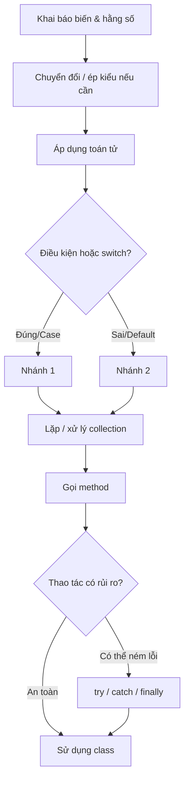

# C# cơ bản

Bài giảng chi tiết về các thành phần cốt lõi của ngôn ngữ C#: comment, biến, kiểu dữ liệu, nhập/xuất qua console, hằng số, enum, ngữ nghĩa giá trị vs. tham chiếu, chuyển đổi kiểu, toán tử, class `Math`, định dạng và xử lý chuỗi, cấu trúc điều kiện, xử lý null, phạm vi biến, vòng lặp, collection, tuple, method, xử lý ngoại lệ, và một class đầu tiên. Mỗi khái niệm bên dưới đều có ví dụ chạy được tương ứng trong [src/Program.cs](./src/Program.cs).

## Mục tiêu

- Viết comment giải thích ý định, kể cả XML doc comment.
- Khai báo biến với kiểu tường minh và với `var`, và nắm các kiểu dựng sẵn thông dụng.
- Đọc dữ liệu nhập từ console một cách an toàn, không bị crash khi input sai hoặc thiếu.
- Khai báo hằng số và hiểu vì sao chúng không bao giờ thay đổi được.
- Định nghĩa `enum` cho một tập giá trị cố định thay vì dùng số/chuỗi "ma thuật" (magic number/string).
- Phân biệt kiểu giá trị (value type) và kiểu tham chiếu (reference type), và hiểu "sao chép" nghĩa là gì với từng loại.
- Chuyển đổi giữa các kiểu một cách an toàn: chuyển đổi ngầm định, ép kiểu tường minh, và `Parse`/`TryParse`.
- Sử dụng toán tử số học, toán tử gán rút gọn, toán tử logic, và các hàm tiện ích của `Math`.
- Định dạng giá trị khi in ra bằng string interpolation và format specifier, và xử lý chuỗi bằng các method chuỗi thông dụng.
- Viết `if`/`else`, toán tử ba ngôi, câu lệnh `switch`, và biểu thức `switch`.
- Xử lý giá trị vắng mặt bằng nullable type, `?.`, `??`, và `??=`.
- Hiểu phạm vi biến (variable scope) - nơi một biến tồn tại và không tồn tại.
- Viết vòng lặp `for`, `while`, `do-while`, và `foreach`.
- Làm việc với mảng (kể cả mảng nhiều chiều và mảng jagged) và `List<T>`.
- Gom nhóm các giá trị liên quan bằng tuple, kể cả deconstruction.
- Định nghĩa method với tham số mặc định và `params`.
- Xử lý lỗi lúc runtime bằng `try`/`catch`/`finally`.
- Định nghĩa một class đơn giản với property và constructor.

## 1. Comment

Comment bị compiler bỏ qua; chúng tồn tại để giúp người đọc code hiểu hơn. Ưu tiên giải thích _vì sao_ một điều gì đó được làm theo cách nhất định - bản thân code đã thể hiện _cái gì_ được làm rồi.

```csharp
// Comment một dòng - mọi thứ sau // trên dòng này bị bỏ qua.

/* Comment nhiều dòng -
   có thể trải dài nhiều dòng. */

/// <summary>
/// XML doc comment - mô tả một thành phần cho IntelliSense/tooling.
/// Đặt ngay phía trên method, class, ... mà nó mô tả.
/// </summary>
static void Greet() => Console.WriteLine("Hi!");

Greet();
```

## 2. Biến và kiểu dữ liệu

Biến là một vùng lưu trữ có tên và có kiểu. C# là ngôn ngữ kiểu tĩnh (statically typed): một khi đã khai báo, kiểu của biến không thể thay đổi.

```csharp
string name = "Alice";
int age = 25;
double height = 1.68;
bool isStudent = false;
char grade = 'A';
```

| Kiểu      | Lưu trữ                                        | Ví dụ     |
| --------- | ---------------------------------------------- | --------- |
| `byte`    | Số nguyên, từ 0 đến 255                        | `255`     |
| `short`   | Số nguyên, khoảng ±32 nghìn                    | `1000`    |
| `int`     | Số nguyên, khoảng ±2.1 tỷ                      | `42`      |
| `long`    | Số nguyên, khoảng ±9.2 tỷ tỷ                   | `42L`     |
| `float`   | Số thực (dấu phẩy động), độ chính xác thấp hơn | `3.14f`   |
| `double`  | Số thực (dấu phẩy động), độ chính xác cao hơn  | `3.14`    |
| `decimal` | Số thập phân chính xác (tiền tệ)               | `19.99m`  |
| `bool`    | `true` / `false`                               | `true`    |
| `char`    | Một ký tự                                      | `'A'`     |
| `string`  | Chuỗi ký tự (văn bản)                          | `"Hello"` |
| `object`  | Bất cứ thứ gì - kiểu gốc của mọi kiểu          | `42`      |

`int` và `double` là lựa chọn mặc định cho số nguyên và số có phần thập phân trong đa số trường hợp; chỉ dùng các kiểu còn lại khi thực sự cần phạm vi giá trị hoặc độ chính xác riêng của chúng. Hậu tố `L`/`f`/`m` báo cho compiler biết một literal số thuộc kiểu nào - nếu không có hậu tố, `42` mặc định là `int` và `3.14` mặc định là `double`.

`var` yêu cầu compiler tự suy luận kiểu từ giá trị khởi tạo. Biến vẫn có kiểu tường minh (strongly typed) - `var` chỉ là cách viết tắt tại nơi khai báo.

```csharp
var favoriteNumber = 7; // được suy luận là int
```

Ưu tiên dùng `decimal` (thay vì `double`) cho tiền tệ và các giá trị cần độ chính xác thập phân tuyệt đối - `double` dùng số thực nhị phân (binary floating-point) nên có thể phát sinh sai số làm tròn nhỏ, không chấp nhận được trong tính toán tài chính.

## 3. Nhập dữ liệu từ console

`Console.WriteLine` dùng để xuất dữ liệu; `Console.ReadLine` đọc một dòng văn bản do người dùng gõ vào (hoặc được pipe vào chương trình) và trả về dưới dạng `string`. Nó trả về `null` khi không còn dữ liệu để đọc (ví dụ: input stream bị redirect và đã đọc hết) - luôn kiểm tra `null` thay vì mặc định là có văn bản thật:

```csharp
Console.Write("Enter your name: ");
string? input = Console.ReadLine();
string userName = string.IsNullOrWhiteSpace(input) ? "Anonymous" : input;
Console.WriteLine($"Hello, {userName}!");
```

Vì `ReadLine` luôn trả về `string` (hoặc `null`), hãy kết hợp với `TryParse` để đọc số một cách an toàn:

```csharp
Console.Write("Enter your age: ");
string? ageInput = Console.ReadLine();
int userAge = int.TryParse(ageInput, out var parsedAge) ? parsedAge : 0;
Console.WriteLine($"Next year you'll be {userAge + 1}.");
```

## 4. Hằng số (Constants)

`const` khai báo một giá trị cố định ngay tại thời điểm biên dịch và không bao giờ gán lại được - hữu ích cho những giá trị như hằng số toán học hoặc giới hạn cố định không nên vô tình bị thay đổi.

```csharp
const double Pi = 3.14159;
double circleArea = Pi * 2 * 2;
// Pi = 3.14; // <- lỗi biên dịch: const không bao giờ gán lại được
```

`const` bắt buộc phải khởi tạo bằng một giá trị đã biết tại compile time. Nếu cần một giá trị bất biến nhưng được tính toán lúc runtime (ví dụ đọc từ configuration), hãy dùng `readonly` cho field - nó chỉ có thể được gán một lần, trong constructor, và không thay đổi được sau đó.

## 5. Enum

`enum` định nghĩa một tập giá trị cố định, có tên - lựa chọn an toàn và dễ đọc hơn số/chuỗi "ma thuật" khi một giá trị chỉ có thể là một trong vài lựa chọn đã biết trước.

```csharp
Weekday today = Weekday.Wednesday;
Console.WriteLine(today);      // "Wednesday" - ToString() in ra tên thành viên
Console.WriteLine((int)today); // 2 - các thành viên được lưu dưới dạng int, đánh số từ 0 mặc định

enum Weekday
{
    Monday,
    Tuesday,
    Wednesday,
    Thursday,
    Friday,
    Saturday,
    Sunday
}
```

Enum kết hợp rất tự nhiên với `switch`, và compiler có thể cảnh báo nếu `switch` trên một enum chưa xử lý hết mọi thành viên.

(Giống với class `Animal` ở phần sau của bài giảng, khai báo `enum` được viết _sau_ nơi nó được dùng - một top-level statement bắt buộc phải đứng trước mọi khai báo `class`/`enum`/`namespace` trong file.)

## 6. Kiểu giá trị vs. kiểu tham chiếu

Sự khác biệt này giải thích rất nhiều hành vi mà nếu không biết trước sẽ thấy "kỳ lạ". **Kiểu giá trị** (`int`, `double`, `bool`, `char`, `struct`, `enum`) lưu dữ liệu trực tiếp; gán biến này cho biến khác sẽ **sao chép giá trị**, nên hai biến sau đó hoàn toàn độc lập:

```csharp
int x = 10;
int y = x; // sao chép giá trị
y = 99;
Console.WriteLine(x); // vẫn là 10 - x và y độc lập với nhau
```

**Kiểu tham chiếu** (`string`, mảng, `List<T>`, và mọi `class`) lưu một tham chiếu tới dữ liệu nằm ở nơi khác; gán biến này cho biến khác sẽ **sao chép tham chiếu**, nên cả hai biến cuối cùng cùng trỏ đến _cùng một_ đối tượng:

```csharp
var box1 = new int[] { 1, 2, 3 };
var box2 = box1; // sao chép tham chiếu, không sao chép mảng
box2[0] = 99;
Console.WriteLine(box1[0]); // 99 - box1 và box2 cùng trỏ đến một mảng
```

(`string` là kiểu tham chiếu nhưng hành xử giống kiểu giá trị vì nó bất biến (immutable) - mọi thao tác trông như "thay đổi" một string thực ra đều tạo ra một string mới, nên bạn sẽ không bao giờ thấy hai biến âm thầm lệch nhau.)

## 7. Chuyển đổi kiểu và ép kiểu

**Chuyển đổi ngầm định (implicit conversion)** xảy ra tự động khi không có dữ liệu nào bị mất (kiểu nhỏ hơn vừa vặn với kiểu lớn hơn, ví dụ `int` → `double`):

```csharp
int wholeNumber = 42;
double asDouble = wholeNumber; // an toàn, tự động
```

**Chuyển đổi tường minh (ép kiểu / cast)** bắt buộc khi dữ liệu có thể bị mất, nên bạn phải chủ động dùng `(kiểu)`:

```csharp
double preciseNumber = 3.99;
int truncated = (int)preciseNumber; // 3 - phần thập phân bị bỏ đi, không làm tròn
```

**Parsing** chuyển văn bản thành số. `Parse` sẽ ném exception nếu văn bản không hợp lệ; `TryParse` không bao giờ ném exception - nó trả về `true`/`false` và đưa kết quả qua tham số `out`, gần như luôn là lựa chọn tốt hơn cho dữ liệu đầu vào bạn không hoàn toàn tin tưởng:

```csharp
int parsed = int.Parse("123");                 // 123, hoặc ném FormatException nếu input sai
bool ok = int.TryParse("not a number", out int result); // ok=false, result=0, không có exception
```

## 8. Toán tử

```csharp
int a = 10, b = 3;
Console.WriteLine(a + b); // 13  - cộng
Console.WriteLine(a - b); // 7   - trừ
Console.WriteLine(a * b); // 30  - nhân
Console.WriteLine(a / b); // 3   - chia lấy phần nguyên (phần thập phân bị cắt bỏ)
Console.WriteLine(a % b); // 1   - chia lấy phần dư (modulo)
```

Toán tử so sánh (`==`, `!=`, `<`, `>`, `<=`, `>=`) trả về `bool`. Toán tử logic dùng để kết hợp các biểu thức boolean: `&&` (và), `||` (hoặc), `!` (phủ định).

Toán tử gán rút gọn và tăng/giảm là cách viết tắt cho "cập nhật biến này dựa trên chính nó":

```csharp
var counter = 0;
counter += 5;  // counter = counter + 5
counter++;     // counter = counter + 1
counter--;     // counter = counter - 1
Console.WriteLine(counter); // 5
```

## 9. Class `Math`

`System.Math` cung cấp các static method cho những phép toán số học thông dụng, để bạn không phải tự viết lại:

```csharp
Console.WriteLine(Math.Round(3.14159, 2)); // 3.14 - làm tròn tới 2 chữ số thập phân
Console.WriteLine(Math.Max(4, 9));         // 9    - giá trị lớn hơn trong hai giá trị
Console.WriteLine(Math.Min(4, 9));         // 4    - giá trị nhỏ hơn trong hai giá trị
Console.WriteLine(Math.Abs(-7));           // 7    - giá trị tuyệt đối
Console.WriteLine(Math.Sqrt(16));          // 4    - căn bậc hai
Console.WriteLine(Math.Pow(2, 10));        // 1024 - 2 lũy thừa 10
```

`Math.Round` là thứ bạn nên dùng thay vì ép kiểu khi thực sự muốn làm tròn thay vì cắt bỏ (xem [Lỗi thường gặp](#lỗi-thường-gặp)).

## 10. String interpolation và định dạng

String interpolation (`$"..."`) nhúng trực tiếp biểu thức vào trong chuỗi. Dấu `:` bên trong dấu ngoặc nhọn áp dụng một **format specifier** để kiểm soát cách giá trị được hiển thị:

```csharp
string name = "Alice";
int age = 25;
decimal price = 1234.5m;
Console.WriteLine($"{price}");    // "1234.5"     - định dạng mặc định
Console.WriteLine($"{price:C}");  // "$1,234.50"  - tiền tệ (ký hiệu phụ thuộc culture)
Console.WriteLine($"{price:F2}"); // "1234.50"    - cố định, luôn 2 chữ số thập phân
Console.WriteLine($"[{age,5}]");  // "[   25]"    - căn phải trong một khối 5 ký tự
```

`string.Format` làm điều tương tự nhưng dùng placeholder theo vị trí (`{0}`, `{1}`, ...) thay vì nhúng biểu thức trực tiếp - hữu ích khi bản thân format string đến từ nơi khác (file resource, template):

```csharp
string name = "Alice";
int age = 25;
Console.WriteLine(string.Format("{0} is {1} years old", name, age));
```

## 11. Các thao tác chuỗi thông dụng

Chuỗi có sẵn nhiều method để kiểm tra và biến đổi văn bản. Vì string bất biến (immutable), mỗi method dưới đây đều trả về một chuỗi _mới_ thay vì thay đổi chuỗi gốc:

```csharp
string sentence = "  Hello, C# World!  ";
Console.WriteLine(sentence.Trim());                     // "Hello, C# World!" - xóa khoảng trắng đầu/cuối
Console.WriteLine(sentence.Trim().ToUpper());            // "HELLO, C# WORLD!"
Console.WriteLine(sentence.Contains("World"));           // True
Console.WriteLine(sentence.Trim().Replace("C#", "F#"));  // "Hello, F# World!"
Console.WriteLine(sentence.Trim().Substring(7, 2));      // "C#" - 2 ký tự bắt đầu từ vị trí 7

string[] words = sentence.Trim().Split(' ');
Console.WriteLine(words.Length); // 3
```

## 12. Verbatim string, raw string, và escape sequence

Trong một chuỗi thông thường, `\` bắt đầu một **escape sequence** (`\n` xuống dòng, `\t` tab, `\\` dấu backslash thật, `\"` dấu ngoặc kép thật):

```csharp
string withEscapes = "Line1\nLine2\tTabbed\\Backslash";
Console.WriteLine(withEscapes);
```

**Verbatim string** (`@"..."`) coi `\` là ký tự thông thường, nên đường dẫn file hay regex không cần escape (dấu `"` thật vẫn cần viết đôi thành `""`):

```csharp
string path = @"C:\Users\Alice\file.txt"; // không cần escape các dấu backslash
Console.WriteLine(path);
```

**Raw string literal** (`"""..."""`, C# 11+) không cần escape bất cứ thứ gì, kể cả dấu ngoặc kép - rất tiện khi nhúng JSON, HTML, hoặc văn bản có nhiều dấu ngoặc kép:

```csharp
string json = """
{
  "name": "Alice"
}
""";
Console.WriteLine(json);
```

## 13. Cấu trúc điều kiện và switch

```csharp
int score = 78;

if (score >= 90)
{
    Console.WriteLine("Excellent");
}
else if (score >= 70)
{
    Console.WriteLine("Good");
}
else
{
    Console.WriteLine("Needs improvement");
}
```

Toán tử ba ngôi là dạng viết gọn của `if`/`else`, trả về một giá trị:

```csharp
int score = 78;
string rank = score >= 90 ? "Excellent" : "Needs improvement";
Console.WriteLine(rank);
```

Câu lệnh `switch` cổ điển rẽ nhánh theo một giá trị và yêu cầu `break` (hoặc một lệnh nhảy khác) ở cuối mỗi case:

```csharp
char grade = 'A';

switch (grade)
{
    case 'A':
        Console.WriteLine("Grade A: outstanding.");
        break;
    default:
        Console.WriteLine("Grade: keep improving.");
        break;
}
```

Biểu thức `switch` (dạng hiện đại) gọn hơn và luôn trả về một giá trị - không cần `break`, không cần statement, chỉ cần `pattern => value`:

```csharp
char grade = 'A';
string gradeLabel = grade switch
{
    'A' => "outstanding",
    'B' => "good",
    _ => "keep improving", // _ là pattern mặc định/bắt tất cả
};
Console.WriteLine(gradeLabel);
```

Ưu tiên dùng switch expression bất cứ khi nào bạn chỉ cần tính ra một giá trị từ một tập các trường hợp - ngắn gọn hơn và compiler sẽ kiểm tra mọi case đều trả về cùng một kiểu.

## 14. Nullable type và xử lý null

Kiểu giá trị như `int` bình thường không thể là `null`. Thêm `?` sẽ tạo ra một **nullable value type** (`int?`, tức `Nullable<int>`) có thể biểu diễn "không có giá trị":

```csharp
int? maybeAge = null;
maybeAge ??= 18; // "nếu null thì gán giá trị này" - toán tử gán null-coalescing
```

Kiểu tham chiếu (`string`, class) luôn có thể là `null`; toán tử `?.`/`??` giúp bạn xử lý điều đó an toàn mà không cần viết `if` tường minh:

```csharp
string? maybeName = null;
Console.WriteLine(maybeName?.Length);      // null-conditional: bỏ qua lời gọi và trả về null thay vì ném exception
Console.WriteLine(maybeName ?? "Unknown"); // null-coalescing: dùng maybeName nếu không null, ngược lại dùng "Unknown"
```

`?.` là "lá chắn" quan trọng chống lại `NullReferenceException` - nó cắt ngắn toàn bộ chuỗi thành `null` ngay khi có một phần tử nào đó là `null`, thay vì làm chương trình crash.

## 15. Phạm vi biến (Variable scope)

Một biến chỉ tồn tại (visible) trong khối (`{ }`) nơi nó được khai báo, và mọi khối lồng bên trong khối đó. Khi khối kết thúc, biến biến mất:

```csharp
int outer = 10;
{
    int inner = 20; // inner chỉ tồn tại trong khối này
    Console.WriteLine(outer + inner); // 30 - inner nhìn thấy được outer, vì khối của outer bao khối này
}
// Console.WriteLine(inner); // <- lỗi biên dịch ở đây: inner đã hết phạm vi
Console.WriteLine(outer); // 10 - vẫn truy cập được ngoài khối inner
```

Đây là lý do biến đếm của vòng lặp `for` (`for (var i = ...)`) không thể đọc được sau vòng lặp - `i` chỉ có phạm vi trong chính vòng lặp đó. Điều này cũng có nghĩa là bạn có thể an toàn dùng lại một tên ngắn như `i` ở hai vòng lặp không liên quan mà không sợ xung đột.

## 16. Vòng lặp

```csharp
for (var i = 1; i <= 5; i++)
{
    Console.WriteLine(i);
}

var count = 5;
while (count > 0)
{
    Console.WriteLine(count);
    count--;
}

var n = 0;
do
{
    Console.WriteLine(n); // chạy ít nhất một lần, kể cả khi điều kiện đã sai từ đầu
} while (n++ < 0);

foreach (var letter in "ABC")
{
    Console.WriteLine(letter); // A, B, C
}
```

Dùng `for` khi biết trước số lần lặp, `while` khi lặp cho đến khi một điều kiện thay đổi, `do-while` khi thân vòng lặp phải chạy ít nhất một lần bất kể điều kiện, và `foreach` khi chỉ cần duyệt qua từng phần tử của collection mà không cần quản lý chỉ số (index).

## 17. Mảng và collection

Mảng (array) có kích thước cố định và chỉ chứa một kiểu phần tử:

```csharp
var numbers = new[] { 1, 2, 3, 4, 5 };
var sum = numbers.Sum();
Console.WriteLine(sum); // 15
```

`List<T>` là collection có thể thay đổi kích thước - lựa chọn phổ biến khi số lượng phần tử có thể thay đổi:

```csharp
var fruits = new List<string> { "apple", "banana", "cherry" };
fruits.Add("date");
Console.WriteLine(string.Join(", ", fruits)); // apple, banana, cherry, date
```

**Mảng 2 chiều (rectangular array)** có số hàng và cột cố định, tất cả các hàng cùng độ dài:

```csharp
int[,] grid = { { 1, 2 }, { 3, 4 } };
Console.WriteLine(grid[1, 0]); // 3
```

**Mảng jagged (jagged array)** là một mảng của các mảng, mỗi hàng có thể có độ dài khác nhau - linh hoạt hơn, và là lựa chọn phổ biến hơn trong thực tế:

```csharp
int[][] jagged = { new[] { 1 }, new[] { 2, 3 }, new[] { 4, 5, 6 } };
Console.WriteLine(jagged[2].Length); // 3
```

## 18. Tuple

Tuple gom một tập nhỏ, cố định các giá trị lại với nhau mà không cần định nghĩa một class - tiện cho việc gom nhóm cục bộ, nhanh, hoặc cho một method cần trả về nhiều hơn một giá trị:

```csharp
(string name, int age) person = ("Alice", 25);
Console.WriteLine($"{person.name} is {person.age}"); // các phần tử có tên: person.name, person.age
```

**Deconstruction** tách một tuple ra thành các biến riêng biệt:

```csharp
var (city, population) = ("Hanoi", 8_000_000);
Console.WriteLine($"{city}: {population}");
```

Trả về một tuple từ method là cách nhẹ nhàng thay thế việc phải định nghĩa hẳn một class chỉ để mang hai, ba giá trị trở lại cho nơi gọi:

```csharp
static (int min, int max) MinMax(int[] values) => (values.Min(), values.Max());

var (min, max) = MinMax(new[] { 4, 1, 9, 2 });
Console.WriteLine($"min={min}, max={max}");
```

## 19. Method (hàm)

Method là một khối code có tên, có thể tái sử dụng:

```csharp
static int Square(int n) => n * n;

Console.WriteLine(Square(6)); // 36
```

Một tham số có thể có **giá trị mặc định**, giúp nó trở thành tùy chọn khi gọi:

```csharp
static string Greet(string person, string greeting = "Hello") => $"{greeting}, {person}!";

Console.WriteLine(Greet("Bob"));       // "Hello, Bob!"
Console.WriteLine(Greet("Bob", "Hi")); // "Hi, Bob!"
```

`params` cho phép method nhận số lượng tham số bất kỳ dưới dạng mảng, mà nơi gọi không cần tự tạo mảng:

```csharp
static int Add(params int[] values) => values.Sum();

Console.WriteLine(Add(1, 2, 3, 4)); // 10
```

## 20. Xử lý ngoại lệ (Exception handling)

Một số lỗi chỉ có thể phát hiện lúc runtime - input sai, thiếu file, một lời gọi mạng bị lỗi. `try`/`catch` cho phép bạn chạy đoạn code "có rủi ro" và phục hồi thay vì làm crash toàn bộ chương trình:

```csharp
try
{
    int result = int.Parse("not a number"); // ném FormatException
    Console.WriteLine(result);              // không bao giờ chạy tới đây
}
catch (FormatException ex)
{
    Console.WriteLine($"Invalid input: {ex.Message}");
}
finally
{
    Console.WriteLine("This always runs, whether an exception happened or not.");
}
```

Hãy bắt loại exception cụ thể nhất mà bạn thực sự có thể xử lý (`FormatException` ở trên), thay vì `catch (Exception)` trần trụi âm thầm nuốt luôn cả những lỗi bạn không lường trước. `finally` là nơi để dọn dẹp (đóng file, giải phóng tài nguyên) - phải chạy dù có lỗi hay không.

## 21. Class đầu tiên

Class gói gọn dữ liệu (field/property) và hành vi (method) vào cùng một nơi:

```csharp
var dog = new Animal("Rex", "Dog");
dog.Describe(); // Rex is a Dog.

class Animal
{
    public string Name { get; }
    public string Species { get; }

    public Animal(string name, string species)
    {
        Name = name;
        Species = species;
    }

    public void Describe() => Console.WriteLine($"{Name} is a {Species}.");
}
```

(Một top-level statement như `var dog = ...` ở trên bắt buộc phải đứng _trước_ mọi khai báo `class`/`namespace` trong file - đó là lý do phần dùng được viết trước, dù đọc có vẻ "ngược". `dotnet run` vẫn thực thi các statement từ trên xuống dưới như bình thường; khai báo class chỉ được compiler đưa lên xử lý trước.)

## Sơ đồ tổng quan



## Lỗi thường gặp

- **Nhầm `/` giữa hai số nguyên với phép chia thực** - `10 / 3` cho ra `3`, không phải `3.333`; hãy ép ít nhất một toán hạng sang `double` nếu cần lấy phần thập phân.
- **Làm tròn vs. cắt bỏ (truncation)** - `(int)3.99` cho ra `3`, không phải `4`. Dùng `Math.Round` khi thực sự muốn làm tròn.
- **Dùng `Parse` với input không tin cậy** - nó ném exception nếu văn bản không hợp lệ; dùng `TryParse` cho mọi thứ chưa chắc là số hợp lệ (input người dùng, nội dung file, v.v.).
- **Cho rằng `Console.ReadLine()` luôn trả về văn bản** - nó trả về `null` khi không còn dữ liệu để đọc (ví dụ input bị redirect/pipe đã đọc hết); luôn kiểm tra `null` trước khi dùng kết quả.
- **Nghĩ rằng mảng/list được sao chép khi gán** - `var b = a;` với kiểu tham chiếu sẽ chia sẻ cùng một đối tượng; thay đổi `b` cũng làm thay đổi `a`. Dùng `.ToArray()`/`.ToList()` (hoặc `Clone()`) nếu cần một bản sao độc lập.
- **Dùng `double` cho tiền tệ** - sai số làm tròn tích lũy có thể cho ra kết quả như `0.30000000000000004`; hãy dùng `decimal` thay thế.
- **Bắt `Exception` quá rộng** - `catch (Exception)` nuốt luôn mọi loại lỗi, kể cả những bug bạn chưa từng muốn xử lý âm thầm. Hãy bắt đúng loại exception cụ thể mà bạn biết cách xử lý.

## Bài tập

1. Viết method `bool IsPrime(int n)` và dùng nó để in mọi số nguyên tố từ 2 đến 30 bằng vòng lặp `for`.
2. Viết lại câu lệnh `switch` cho `grade` thành biểu thức `switch`, có xử lý thêm `'C'` và `'D'`.
3. Cho một `string? input` có thể là `null`, dùng `?.` và `??` trong cùng một biểu thức để in độ dài của nó, hoặc in `"empty"` nếu nó là `null`.
4. Tạo một mảng jagged biểu diễn một tam giác nhỏ (`[1]`, `[1,2]`, `[1,2,3]`), rồi dùng hai vòng `foreach` lồng nhau để in ra từng giá trị.
5. Viết method `double Average(params double[] values)` và gọi nó với 0, 1, và 5 tham số - quyết định nó nên làm gì khi không có tham số nào.
6. Định nghĩa `enum Season { Spring, Summer, Autumn, Winter }`, rồi viết một biểu thức `switch` ánh xạ mỗi mùa sang một mô tả ngắn gọn.
7. Hỏi người dùng nhập hai số bằng `Console.ReadLine()`, `TryParse` cả hai, rồi in ra tổng của chúng - không được crash nếu một trong hai input không hợp lệ.
8. Viết một method trả về `(bool success, int value)` từ việc thử parse một chuỗi, rồi gọi nó và deconstruct kết quả.
9. Bọc `int.Parse` trên một chuỗi không hợp lệ (hardcode) trong `try`/`catch`, và in ra thông báo thân thiện thay vì để chương trình crash.

## Chạy thử project

```bash
cd lectures/01-csharp-basics/src
dotnet run
```

## Ghi chú

- Xem file [src/Program.cs](./src/Program.cs) để có ví dụ chạy được đầy đủ cho tất cả các phần ở trên, theo đúng thứ tự.
- Sample project có đọc dữ liệu từ console (xem [3. Nhập dữ liệu từ console](#3-nhập-dữ-liệu-từ-console)) - khi chạy không tương tác (ví dụ input được pipe vào, hoặc không có input nào), `Console.ReadLine()` trả về `null` và sample sẽ dùng giá trị mặc định thay vì bị crash.
- Bài giảng này cố tình chỉ dừng ở mức bề mặt với class; các khái niệm OOP như kế thừa, interface, đa hình được trình bày trong [03-csharp-oop](../03-csharp-oop/README.vi.md).
