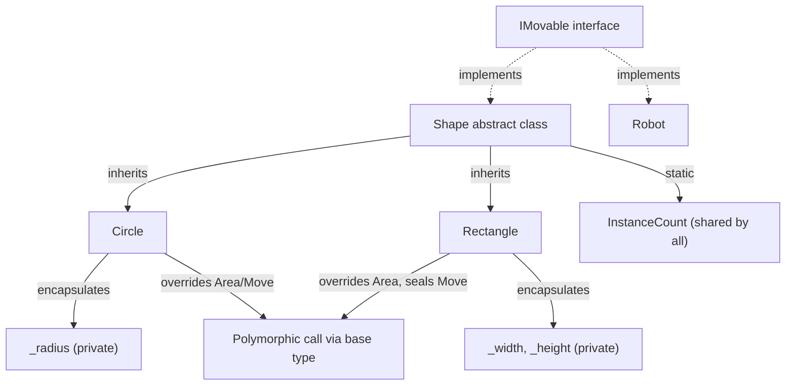

# C# OOP (Object-Oriented Programming)

A detailed walkthrough of object-oriented programming in C#: the four pillars (encapsulation, inheritance, polymorphism, abstraction), plus the supporting mechanics you need to use them correctly - access modifiers, constructors, static members, overloading vs. overriding vs. hiding, and `sealed`. Every concept below has a runnable counterpart in [src/Program.cs](./src/Program.cs).

> This lecture builds on [01-csharp-basics](../01-csharp-basics/README.md). Make sure you're comfortable with classes, properties, and methods first.

## Goals

- Protect an object's internal state with encapsulation (private fields, controlled access).
- Choose the right access modifier (`public`, `private`, `protected`, `internal`) for a member.
- Share and extend behavior across classes with inheritance, and know what a constructor chain does.
- Tell static members apart from instance members and know when to use each.
- Let derived classes override base behavior, and call that behavior polymorphically.
- Distinguish `override` (polymorphic) from `new`/method hiding (not polymorphic) from overloading (different signature, same name).
- Define a contract with `interface`/`abstract class` and program against it (abstraction).
- Use `sealed` to stop further inheritance or overriding on purpose.
- Recognize when composition is a better tool than inheritance.

## 1. Encapsulation

Encapsulation means hiding an object's internal state and only exposing it through a controlled API - so the object can enforce its own rules (invariants) instead of trusting every caller to do the right thing.

```csharp
class BankAccount
{
    public string Owner { get; }
    public decimal Balance { get; private set; } // can only change from inside the class

    public BankAccount(string owner, decimal initialBalance)
    {
        Owner = owner;
        Balance = initialBalance;
    }

    public void Deposit(decimal amount)
    {
        if (amount <= 0) throw new ArgumentOutOfRangeException(nameof(amount));
        Balance += amount;
    }

    public void Withdraw(decimal amount)
    {
        if (amount > Balance) throw new InvalidOperationException("Insufficient funds.");
        Balance -= amount;
    }
}
```

Outside code can call `Deposit`/`Withdraw`, but cannot assign `account.Balance = 1_000_000` directly - the `private set` blocks it at compile time. This is the difference between a public field (no protection, anyone can put the object into an invalid state) and a property with controlled access (every change goes through code that can validate it).

### Access modifiers

| Modifier                        | Visible from                                                        |
| ------------------------------- | ------------------------------------------------------------------- |
| `public`                        | Anywhere.                                                           |
| `private` (default for members) | Only inside the same class.                                         |
| `protected`                     | The same class, and any class that derives from it.                 |
| `internal`                      | Anywhere in the same project/assembly.                              |
| `protected internal`            | The same assembly, OR any derived class (even in another assembly). |
| `private protected`             | The same assembly AND a derived class (both conditions).            |

Rule of thumb: start with the most restrictive modifier that still works (`private`), and only widen it (`protected`, then `internal`, then `public`) when something outside actually needs access. This keeps the "surface area" other code can depend on as small as possible.

## 2. Inheritance

Inheritance lets a class (the derived/child class) reuse and extend the members of another class (the base/parent class) with `: BaseClass`.

```csharp
abstract class Shape
{
    public abstract double Area();
    public void Describe() => Console.WriteLine($"{GetType().Name} area = {Area():F2}");
}

class Circle : Shape
{
    private readonly double _radius;
    public Circle(double radius) => _radius = radius;
    public override double Area() => Math.PI * _radius * _radius;
}

class Rectangle : Shape
{
    private readonly double _width, _height;
    public Rectangle(double width, double height) => (_width, _height) = (width, height);
    public override double Area() => _width * _height;
}
```

`Circle` and `Rectangle` both inherit `Describe()` from `Shape` for free, and each supplies its own `Area()`.

### Constructor chaining

A derived class's constructor always runs its base class's constructor first (implicitly, or explicitly via `: base(...)`). In the sample project, `Shape` has a `protected` constructor that increments a counter - every time a `Circle` or `Rectangle` is created, that base constructor runs automatically before the derived constructor's own body:

```csharp
abstract class Shape
{
    public static int InstanceCount { get; private set; }
    protected Shape() => InstanceCount++; // runs for every derived instance too
    // ...
}
```

`protected` here is deliberate: the constructor must be callable by derived classes, but `Shape` is `abstract` so it can never be instantiated directly - `public` would be misleading since `new Shape()` is not actually valid.

## 3. Static vs. instance members

An **instance member** belongs to each object separately (`_radius` is different for every `Circle`). A **static member** belongs to the type itself - there is exactly one copy, shared by every instance (and accessible even with no instance at all).

```csharp
abstract class Shape
{
    public static int InstanceCount { get; private set; } // one shared counter
    protected Shape() => InstanceCount++;
}

Console.WriteLine(Shape.InstanceCount); // read from the type, not from an object
```

Use `static` for things that don't depend on a particular object's state: counters, caching, pure helper/utility methods (`Math.Sqrt`, `string.Join`), and factory methods. If a member needs `this` - i.e., it reads or writes fields that differ per object - it must be an instance member.

## 4. Constructors and object initializers

A constructor sets up an object's initial state. C# also supports **object initializer syntax**, which sets properties right after the constructor finishes:

```csharp
class Rectangle : Shape
{
    public string Label { get; init; } = "Rectangle"; // init: settable only during construction

    public Rectangle(double width, double height) { /* ... */ }
}

var square = new Rectangle(width: 2, height: 2) { Label = "Square-ish rectangle" };
```

`init` (instead of `set`) means `Label` can be set by the constructor or by an object initializer, but never again afterwards - a middle ground between a fully read-only property (`get;` only, must be set in the constructor) and a freely mutable one (`get; set;`).

## 5. Polymorphism

Polymorphism ("many forms") means code written against the base type automatically runs the derived type's overridden behavior at runtime - the actual object's type decides which method body executes, not the variable's declared type.

```csharp
var shapes = new List<Shape> { new Circle(3), new Rectangle(4, 5) };

foreach (var shape in shapes)
{
    shape.Describe(); // calls each shape's own Area() override
}
// Circle area = 28.27
// Rectangle area = 20.00
```

The `foreach` loop doesn't know or care whether an element is a `Circle` or a `Rectangle` - it just calls `Describe()`, and the correct `Area()` implementation runs for each object. This is why polymorphism matters in practice: you can add a new `Shape` subclass later, and every place that already loops over `List<Shape>` handles it correctly without changes.

## 6. Overloading vs. overriding vs. hiding

These three look similar but mean very different things - mixing them up is a common source of bugs.

**Overloading**: same method name, _different parameter list_, resolved entirely at **compile time** based on the arguments you pass.

```csharp
class BankAccount
{
    public void Describe() => Console.WriteLine($"{Owner}: {Balance:C}");
    public void Describe(string prefix) => Console.WriteLine($"{prefix} {Owner}: {Balance:C}");
}

account.Describe();               // picks the no-argument overload
account.Describe("Statement:");   // picks the (string) overload
```

**Overriding** (`virtual`/`override`): same signature, _replaces_ the base implementation, and **is polymorphic** - a base-typed reference still calls the derived version:

```csharp
class Base { public virtual void Greet() => Console.WriteLine("Hello from Base"); }
class OverrideDerived : Base
{
    public override void Greet() => Console.WriteLine("Hello from OverrideDerived (override)");
}

Base overridden = new OverrideDerived();
overridden.Greet(); // "Hello from OverrideDerived" - even though the variable is typed Base
```

**Hiding** (`new`): declares an unrelated method that happens to share a name, and is **not** polymorphic - which version runs depends on the variable's _declared_ (compile-time) type, not the object's actual type:

```csharp
class HideDerived : Base
{
    public new void Greet() => Console.WriteLine("Hello from HideDerived (new/hiding)");
}

Base hidden = new HideDerived();
hidden.Greet(); // "Hello from Base" - the compile-time type (Base) decides, not the real object
```

If you want a base-typed reference to always run the derived behavior, you need `virtual`/`override`, never `new`. The compiler warns if you override an existing method signature without either keyword, precisely because this mistake is easy to make.

## 7. Abstraction

Abstraction means exposing _what_ something can do without exposing _how_ - typically via an `interface` or an `abstract class`. Callers depend on the contract, not the concrete type.

```csharp
interface IMovable
{
    void Move();
}

class Circle : Shape, IMovable
{
    public override void Move() => Console.WriteLine("Circle rolls forward.");
}

class Robot : IMovable
{
    public void Move() => Console.WriteLine("Robot walks forward.");
}
```

```csharp
var movers = new List<IMovable> { new Circle(1), new Robot("R2") };
foreach (var mover in movers)
{
    mover.Move(); // each type's own implementation
}
```

`Circle` and `Robot` are unrelated types with no shared base class, but both satisfy `IMovable`, so they can be used interchangeably wherever an `IMovable` is expected.

**`interface` vs. `abstract class`** - both let you define a contract without full implementation, but:

|                        | `interface`                                                         | `abstract class`                                 |
| ---------------------- | ------------------------------------------------------------------- | ------------------------------------------------ |
| Shared fields/state    | No                                                                  | Yes                                              |
| Multiple inheritance   | A class can implement many interfaces                               | A class can inherit only one base class          |
| Constructors           | No                                                                  | Yes                                              |
| Default implementation | Allowed (default interface members), but rarely used for core logic | Common - shared behavior lives in the base class |

Prefer an interface for a pure "can do X" contract with no shared state. Prefer an abstract class when derived types genuinely share fields or common implementation (like `Shape.InstanceCount` and `Describe()` above).

## 8. `sealed`

`sealed` closes off further inheritance or overriding - a deliberate way to say "this is final, don't extend it."

- `sealed class Foo` - no class can inherit from `Foo` at all.
- `sealed override void Method()` - a derived class can override a virtual method once, then seal that specific override so no class further down the hierarchy can override it again.

```csharp
class Rectangle : Shape
{
    // No subclass of Rectangle may override Move() again after this.
    public sealed override void Move() => Console.WriteLine($"{Label} slides sideways.");
}

// class Square : Rectangle { public override void Move() { } } // compile error
```

Use `sealed` when overriding further would break an invariant the class relies on, or simply to keep a type's behavior predictable and closed for extension once you're confident it's correct.

## Composition over inheritance

Inheritance is powerful but easy to overuse - deep inheritance chains get rigid and hard to change. A common guideline: prefer **composition** ("has-a", holding another object as a field) over inheritance ("is-a") when you just want to reuse behavior rather than model a genuine type hierarchy.

```csharp
// Inheritance: "a Car IS-A Vehicle" - appropriate, Car really is a kind of Vehicle.
class Vehicle { /* ... */ }
class Car : Vehicle { /* ... */ }

// Composition: "a Car HAS-A Engine" - Car delegates to Engine instead of being one.
class Engine { public void Start() => Console.WriteLine("Engine starts."); }
class Car
{
    private readonly Engine _engine = new();
    public void Start() => _engine.Start();
}
```

Reach for inheritance when the relationship is truly "is a kind of" and you need polymorphism (like `Shape`/`Circle`/`Rectangle` above). Reach for composition when you just want to reuse a piece of behavior without committing to a rigid type hierarchy.

## How the pillars relate



## Common pitfalls

- **Public setters everywhere** defeat encapsulation - if any code anywhere can mutate a property freely, the class can't guarantee its own invariants.
- **Using `new` instead of `override`** silently breaks polymorphism - a base-typed reference calls the base version, which usually isn't what was intended.
- **Forgetting `virtual`** on a base method means derived classes can't override it at all (only hide it with `new`), which can be intentional or an oversight - be explicit about which one it is.
- **Deep inheritance chains** (`A : B : C : D`) make it hard to reason about which method actually runs; prefer shallow hierarchies and composition once behavior sharing gets complicated.
- **Confusing `interface` with `abstract class`** - reaching for an abstract class just to avoid writing an interface (or vice versa) when the other fits the problem better.

## Exercises

1. Add a `Triangle : Shape` class (base and height) and confirm it slots into the existing `List<Shape>` loop with no other code changes - that's polymorphism doing its job.
2. Add a `Withdraw` overload on `BankAccount` that takes a `string note` parameter and includes it in a console message - practice overloading.
3. Change `HideDerived.Greet()` to use `override` instead of `new` and predict the output of the existing calls before running it.
4. Add a `Perimeter()` abstract method to `Shape` and implement it in `Circle` and `Rectangle` - practice extending an existing abstraction.
5. Refactor `Robot` to hold an `Engine` (composition) instead of only printing text in `Move()`, and have `Move()` delegate to `Engine.Start()`.

## Running the project

```bash
cd lectures/03-csharp-oop/src
dotnet run
```

## Notes

- See [src/Program.cs](./src/Program.cs) for the full runnable sample covering every section above, in the same order.
- This lecture stays within single-inheritance class hierarchies and interfaces; more advanced topics (generics, records, pattern matching over types) are better suited to their own lecture.
