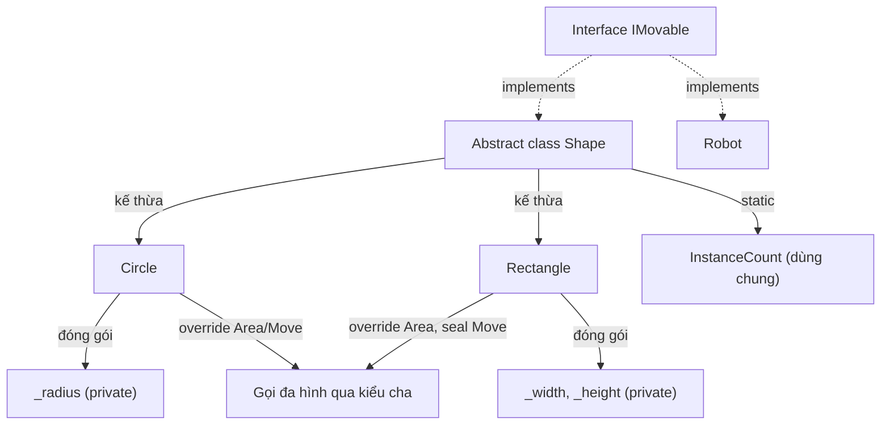

# C# OOP (Lập trình hướng đối tượng)

Bài giảng chi tiết về lập trình hướng đối tượng trong C#: bốn trụ cột (đóng gói, kế thừa, đa hình, trừu tượng), cùng các cơ chế hỗ trợ cần biết để dùng chúng đúng cách - access modifier, constructor, static member, phân biệt overload/override/hiding, và `sealed`. Mỗi khái niệm bên dưới đều có ví dụ chạy được tương ứng trong [src/Program.cs](./src/Program.cs).

> Bài giảng này tiếp nối [01-csharp-basics](../01-csharp-basics/README.vi.md). Hãy đảm bảo bạn đã nắm vững class, property, và method trước.

## Mục tiêu

- Bảo vệ trạng thái nội bộ của đối tượng bằng tính đóng gói (private field, truy cập có kiểm soát).
- Chọn đúng access modifier (`public`, `private`, `protected`, `internal`) cho từng thành viên.
- Chia sẻ và mở rộng hành vi giữa các class bằng tính kế thừa, và hiểu chuỗi gọi constructor hoạt động thế nào.
- Phân biệt static member với instance member và biết khi nào dùng loại nào.
- Cho phép class con override hành vi của class cha, và gọi hành vi đó theo kiểu đa hình.
- Phân biệt `override` (đa hình) với `new`/method hiding (không đa hình) với overload (khác signature, cùng tên).
- Định nghĩa một hợp đồng (contract) bằng `interface`/`abstract class` và lập trình dựa trên hợp đồng đó (tính trừu tượng).
- Dùng `sealed` để chủ động chặn kế thừa hoặc override tiếp.
- Nhận biết khi nào composition là lựa chọn tốt hơn kế thừa.

## 1. Tính đóng gói (Encapsulation)

Đóng gói nghĩa là ẩn trạng thái nội bộ của đối tượng và chỉ cho phép truy cập thông qua một API có kiểm soát - nhờ đó đối tượng tự đảm bảo được các quy tắc (invariant) của mình thay vì trông chờ mọi nơi gọi đều làm đúng.

```csharp
class BankAccount
{
    public string Owner { get; }
    public decimal Balance { get; private set; } // chỉ có thể thay đổi từ bên trong class

    public BankAccount(string owner, decimal initialBalance)
    {
        Owner = owner;
        Balance = initialBalance;
    }

    public void Deposit(decimal amount)
    {
        if (amount <= 0) throw new ArgumentOutOfRangeException(nameof(amount));
        Balance += amount;
    }

    public void Withdraw(decimal amount)
    {
        if (amount > Balance) throw new InvalidOperationException("Insufficient funds.");
        Balance -= amount;
    }
}
```

Code bên ngoài có thể gọi `Deposit`/`Withdraw`, nhưng không thể gán trực tiếp `account.Balance = 1_000_000` - vì `private set` đã chặn điều đó ngay từ lúc biên dịch. Đây chính là khác biệt giữa một field public (không được bảo vệ, ai cũng có thể đưa đối tượng vào trạng thái không hợp lệ) và một property có truy cập được kiểm soát (mọi thay đổi đều đi qua code có thể kiểm tra tính hợp lệ).

### Access modifier

| Modifier                        | Nhìn thấy được từ                                                 |
| ------------------------------- | ----------------------------------------------------------------- |
| `public`                        | Ở bất cứ đâu.                                                     |
| `private` (mặc định của member) | Chỉ trong cùng class.                                             |
| `protected`                     | Trong cùng class, và bất kỳ class nào kế thừa từ nó.              |
| `internal`                      | Ở bất cứ đâu trong cùng project/assembly.                         |
| `protected internal`            | Cùng assembly, HOẶC bất kỳ class con nào (kể cả ở assembly khác). |
| `private protected`             | Cùng assembly VÀ là class con (cả hai điều kiện).                 |

Quy tắc chung: bắt đầu với modifier hạn chế nhất mà vẫn hoạt động được (`private`), chỉ nới rộng (`protected`, rồi `internal`, rồi `public`) khi thực sự có nơi khác cần truy cập. Điều này giữ cho "bề mặt" mà code khác có thể phụ thuộc vào càng nhỏ càng tốt.

## 2. Tính kế thừa (Inheritance)

Kế thừa cho phép một class (class con/dẫn xuất) tái sử dụng và mở rộng thành viên của một class khác (class cha/cơ sở) thông qua cú pháp `: BaseClass`.

```csharp
abstract class Shape
{
    public abstract double Area();
    public void Describe() => Console.WriteLine($"{GetType().Name} area = {Area():F2}");
}

class Circle : Shape
{
    private readonly double _radius;
    public Circle(double radius) => _radius = radius;
    public override double Area() => Math.PI * _radius * _radius;
}

class Rectangle : Shape
{
    private readonly double _width, _height;
    public Rectangle(double width, double height) => (_width, _height) = (width, height);
    public override double Area() => _width * _height;
}
```

`Circle` và `Rectangle` đều thừa hưởng `Describe()` từ `Shape` mà không cần viết lại, và mỗi class tự cung cấp `Area()` riêng của mình.

### Chuỗi gọi constructor

Constructor của class con luôn gọi constructor của class cha trước (ngầm định, hoặc tường minh qua `: base(...)`). Trong project mẫu, `Shape` có một constructor `protected` để tăng một bộ đếm - mỗi khi một `Circle` hoặc `Rectangle` được tạo, constructor của `Shape` sẽ tự động chạy trước khi phần thân constructor của class con chạy:

```csharp
abstract class Shape
{
    public static int InstanceCount { get; private set; }
    protected Shape() => InstanceCount++; // chạy cho mọi instance của class con
    // ...
}
```

`protected` ở đây là chủ ý: constructor cần được các class con gọi tới, nhưng `Shape` là `abstract` nên không bao giờ được khởi tạo trực tiếp - dùng `public` sẽ gây hiểu lầm vì `new Shape()` thực ra không hợp lệ.

## 3. Static vs. instance member

**Instance member** thuộc về từng đối tượng riêng biệt (`_radius` khác nhau ở mỗi `Circle`). **Static member** thuộc về chính kiểu (type) - chỉ có đúng một bản sao, được chia sẻ bởi mọi instance (và truy cập được kể cả khi không có instance nào).

```csharp
abstract class Shape
{
    public static int InstanceCount { get; private set; } // một bộ đếm dùng chung
    protected Shape() => InstanceCount++;
}

Console.WriteLine(Shape.InstanceCount); // đọc từ kiểu, không phải từ một đối tượng
```

Dùng `static` cho những thứ không phụ thuộc vào trạng thái của một đối tượng cụ thể: bộ đếm, cache, các hàm tiện ích thuần túy (`Math.Sqrt`, `string.Join`), và factory method. Nếu một member cần dùng `this` - tức là đọc/ghi field khác nhau tùy đối tượng - nó phải là instance member.

## 4. Constructor và object initializer

Constructor thiết lập trạng thái ban đầu của đối tượng. C# còn hỗ trợ **cú pháp object initializer**, cho phép gán property ngay sau khi constructor chạy xong:

```csharp
class Rectangle : Shape
{
    public string Label { get; init; } = "Rectangle"; // init: chỉ gán được lúc khởi tạo

    public Rectangle(double width, double height) { /* ... */ }
}

var square = new Rectangle(width: 2, height: 2) { Label = "Square-ish rectangle" };
```

`init` (thay vì `set`) nghĩa là `Label` có thể được gán bởi constructor hoặc bởi object initializer, nhưng không bao giờ gán lại được sau đó nữa - một điểm trung gian giữa property chỉ đọc hoàn toàn (`get;` không có setter, phải gán trong constructor) và property có thể thay đổi tự do (`get; set;`).

## 5. Tính đa hình (Polymorphism)

Đa hình ("nhiều hình dạng") nghĩa là code viết dựa trên kiểu cha sẽ tự động chạy đúng hành vi đã được override của kiểu con tại thời điểm runtime - kiểu thực sự của đối tượng quyết định method nào chạy, không phải kiểu khai báo của biến.

```csharp
var shapes = new List<Shape> { new Circle(3), new Rectangle(4, 5) };

foreach (var shape in shapes)
{
    shape.Describe(); // gọi đúng Area() của từng shape
}
// Circle area = 28.27
// Rectangle area = 20.00
```

Vòng lặp `foreach` không cần biết (và không quan tâm) phần tử là `Circle` hay `Rectangle` - nó chỉ gọi `Describe()`, và implementation `Area()` đúng sẽ chạy cho từng đối tượng. Đây là lý do đa hình quan trọng trong thực tế: bạn có thể thêm một `Shape` con mới sau này, và mọi nơi đã có vòng lặp trên `List<Shape>` vẫn xử lý đúng mà không cần sửa gì thêm.

## 6. Overload vs. override vs. hiding

Ba khái niệm này trông giống nhau nhưng ý nghĩa rất khác - nhầm lẫn giữa chúng là nguồn lỗi phổ biến.

**Overload (nạp chồng)**: cùng tên method, _khác danh sách tham số_, được quyết định hoàn toàn ở **compile time** dựa trên tham số bạn truyền vào.

```csharp
class BankAccount
{
    public void Describe() => Console.WriteLine($"{Owner}: {Balance:C}");
    public void Describe(string prefix) => Console.WriteLine($"{prefix} {Owner}: {Balance:C}");
}

account.Describe();               // chọn overload không tham số
account.Describe("Statement:");   // chọn overload (string)
```

**Override** (`virtual`/`override`): cùng signature, _thay thế_ implementation của class cha, và **có tính đa hình** - một biến khai báo kiểu cha vẫn gọi đúng phiên bản của class con:

```csharp
class Base { public virtual void Greet() => Console.WriteLine("Hello from Base"); }
class OverrideDerived : Base
{
    public override void Greet() => Console.WriteLine("Hello from OverrideDerived (override)");
}

Base overridden = new OverrideDerived();
overridden.Greet(); // "Hello from OverrideDerived" - dù biến được khai báo kiểu Base
```

**Hiding** (`new`): khai báo một method không liên quan nhưng trùng tên, và **không** có tính đa hình - phiên bản nào chạy phụ thuộc vào kiểu _khai báo_ (compile-time) của biến, không phải kiểu thực sự của đối tượng:

```csharp
class HideDerived : Base
{
    public new void Greet() => Console.WriteLine("Hello from HideDerived (new/hiding)");
}

Base hidden = new HideDerived();
hidden.Greet(); // "Hello from Base" - kiểu compile-time (Base) quyết định, không phải đối tượng thực
```

Nếu muốn một biến khai báo kiểu cha luôn chạy đúng hành vi của class con, bạn phải dùng `virtual`/`override`, không bao giờ dùng `new`. Trình biên dịch sẽ cảnh báo nếu bạn override một signature đã tồn tại mà không dùng từ khóa nào cả, chính vì lỗi này rất dễ mắc phải.

## 7. Tính trừu tượng (Abstraction)

Trừu tượng nghĩa là chỉ công bố _đối tượng làm được gì_ mà không công bố _làm như thế nào_ - thường thông qua `interface` hoặc `abstract class`. Nơi gọi chỉ phụ thuộc vào hợp đồng, không phụ thuộc vào kiểu cụ thể.

```csharp
interface IMovable
{
    void Move();
}

class Circle : Shape, IMovable
{
    public override void Move() => Console.WriteLine("Circle rolls forward.");
}

class Robot : IMovable
{
    public void Move() => Console.WriteLine("Robot walks forward.");
}
```

```csharp
var movers = new List<IMovable> { new Circle(1), new Robot("R2") };
foreach (var mover in movers)
{
    mover.Move(); // implementation riêng của từng kiểu
}
```

`Circle` và `Robot` là hai kiểu không liên quan, không chung class cha, nhưng cả hai đều thỏa mãn `IMovable`, nên có thể dùng thay thế cho nhau ở bất cứ đâu cần một `IMovable`.

**`interface` vs. `abstract class`** - cả hai đều cho phép định nghĩa hợp đồng mà không cần implementation đầy đủ, nhưng:

|                         | `interface`                                                        | `abstract class`                                   |
| ----------------------- | ------------------------------------------------------------------ | -------------------------------------------------- |
| Field/state dùng chung  | Không                                                              | Có                                                 |
| Đa kế thừa              | Một class có thể implement nhiều interface                         | Một class chỉ kế thừa được một base class          |
| Constructor             | Không có                                                           | Có                                                 |
| Implementation mặc định | Có (default interface member), nhưng ít khi dùng cho logic cốt lõi | Phổ biến - hành vi dùng chung nằm trong base class |

Ưu tiên interface cho một hợp đồng "làm được X" thuần túy, không chia sẻ state. Ưu tiên abstract class khi các class con thực sự chia sẻ field hoặc implementation chung (như `Shape.InstanceCount` và `Describe()` ở trên).

## 8. `sealed`

`sealed` chặn hẳn việc kế thừa hoặc override tiếp - một cách chủ động nói rằng "cái này là bản cuối, đừng mở rộng nữa."

- `sealed class Foo` - không class nào được kế thừa từ `Foo`.
- `sealed override void Method()` - class con có thể override một method virtual một lần, rồi seal chính override đó lại để không class nào ở tầng dưới được override tiếp.

```csharp
class Rectangle : Shape
{
    // Không class con nào của Rectangle được override Move() lần nữa sau dòng này.
    public sealed override void Move() => Console.WriteLine($"{Label} slides sideways.");
}

// class Square : Rectangle { public override void Move() { } } // lỗi biên dịch
```

Dùng `sealed` khi việc override tiếp sẽ phá vỡ một invariant mà class đang dựa vào, hoặc đơn giản là để giữ hành vi của một kiểu ổn định, "đóng lại để mở rộng" một khi bạn đã chắc chắn nó đúng.

## Composition thay vì kế thừa

Kế thừa mạnh mẽ nhưng dễ bị lạm dụng - chuỗi kế thừa sâu khiến code cứng nhắc và khó thay đổi. Một nguyên tắc phổ biến: ưu tiên **composition** ("has-a", giữ một đối tượng khác làm field) hơn kế thừa ("is-a") khi bạn chỉ muốn tái sử dụng hành vi chứ không thực sự mô hình hóa một hệ thống phân cấp kiểu.

```csharp
// Kế thừa: "một Car LÀ MỘT Vehicle" - hợp lý, Car thực sự là một loại Vehicle.
class Vehicle { /* ... */ }
class Car : Vehicle { /* ... */ }

// Composition: "một Car CÓ MỘT Engine" - Car ủy quyền cho Engine thay vì LÀ một Engine.
class Engine { public void Start() => Console.WriteLine("Engine starts."); }
class Car
{
    private readonly Engine _engine = new();
    public void Start() => _engine.Start();
}
```

Dùng kế thừa khi mối quan hệ thực sự là "là một loại của" và bạn cần tính đa hình (như `Shape`/`Circle`/`Rectangle` ở trên). Dùng composition khi bạn chỉ muốn tái sử dụng một phần hành vi mà không muốn ràng buộc vào một hệ thống phân cấp kiểu cứng nhắc.

## Mối quan hệ giữa các trụ cột



## Lỗi thường gặp

- **Setter public ở khắp nơi** phá vỡ tính đóng gói - nếu code nào cũng có thể thay đổi property tự do, class không thể đảm bảo được invariant của chính nó.
- **Dùng `new` thay vì `override`** âm thầm phá vỡ tính đa hình - biến khai báo kiểu cha sẽ gọi phiên bản của class cha, thường không phải điều bạn muốn.
- **Quên `virtual`** trên method của class cha khiến class con hoàn toàn không override được (chỉ hide được bằng `new`), điều này có thể là chủ ý hoặc sơ suất - hãy rõ ràng về việc bạn muốn cái nào.
- **Chuỗi kế thừa quá sâu** (`A : B : C : D`) khiến việc suy luận method nào thực sự chạy trở nên khó khăn; ưu tiên hệ thống phân cấp nông và composition khi việc chia sẻ hành vi trở nên phức tạp.
- **Nhầm lẫn `interface` với `abstract class`** - chọn abstract class chỉ để tránh viết interface (hoặc ngược lại) trong khi loại kia phù hợp hơn với bài toán.

## Bài tập

1. Thêm class `Triangle : Shape` (đáy và chiều cao) và kiểm tra nó chạy được ngay trong vòng lặp `List<Shape>` hiện có mà không cần sửa code nào khác - đó chính là tính đa hình phát huy tác dụng.
2. Thêm overload cho `Withdraw` trên `BankAccount` nhận thêm tham số `string note` và in kèm ghi chú đó ra console - luyện tập overload.
3. Đổi `HideDerived.Greet()` từ `new` sang `override` và dự đoán output của các lệnh gọi hiện có trước khi chạy thử.
4. Thêm abstract method `Perimeter()` vào `Shape` và implement trong `Circle` và `Rectangle` - luyện tập mở rộng một abstraction có sẵn.
5. Refactor `Robot` để nó giữ một `Engine` (composition) thay vì chỉ in text trong `Move()`, và để `Move()` ủy quyền cho `Engine.Start()`.

## Chạy thử project

```bash
cd lectures/03-csharp-oop/src
dotnet run
```

## Ghi chú

- Xem file [src/Program.cs](./src/Program.cs) để có ví dụ chạy được đầy đủ cho tất cả các phần ở trên, theo đúng thứ tự.
- Bài giảng này chỉ dừng ở hệ thống phân cấp class đơn kế thừa và interface; các chủ đề nâng cao hơn (generic, record, pattern matching theo kiểu) phù hợp hơn với một bài giảng riêng.
