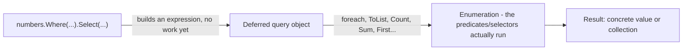

# LINQ (Language Integrated Query)

A detailed tour of LINQ to Objects: query vs. method syntax, every major operator family (filtering, projection, ordering, grouping, joining, set operations, aggregation, element/quantifier operators, partitioning, conversion), and the execution model (deferred vs. immediate) that explains most of the bugs people hit with it. Every concept below has a runnable counterpart in [src/Program.cs](./src/Program.cs).

> This lecture builds on [02-csharp-collections](../02-csharp-collections/README.md), which introduces `Where`, `Select`, `OrderBy`, and `GroupBy` briefly. Here we cover the full operator surface and how LINQ actually executes.

## Goals

- Write the same query in method syntax and query syntax, and know when each reads better.
- Filter and project with `Where`, `Select`, and `SelectMany` (including flattening nested collections).
- Sort with `OrderBy`/`OrderByDescending` and `ThenBy`/`ThenByDescending`.
- Group data with `GroupBy`, and combine two sequences with `Join` and `GroupJoin`.
- Apply set operations (`Distinct`, `Union`, `Intersect`, `Except`) and partitioning (`Skip`, `Take`, `SkipWhile`, `TakeWhile`, `Chunk`).
- Aggregate with `Count`, `Sum`, `Min`, `Max`, `Average`, and the general-purpose `Aggregate`.
- Pick the right element operator (`First` vs. `FirstOrDefault` vs. `Single` vs. `SingleOrDefault`) and know what each throws on.
- Materialize a query with `ToList`, `ToArray`, `ToDictionary`, `ToHashSet`, or `ToLookup` - and know why you sometimes must.
- Explain **deferred execution**: why a query variable doesn't run until enumerated, and why enumerating it twice can run it twice.
- Recognize the classic "multiple enumeration" and "captured variable" pitfalls before they cause a bug.
- Understand `IEnumerable<T>` (LINQ to Objects, runs in-process) vs. `IQueryable<T>` (translated to another query language, e.g. SQL via EF Core) at a conceptual level.

## 1. What LINQ is

LINQ (**L**anguage **IN**tegrated **Q**uery) is a set of extension methods - defined in `System.Linq` - on `IEnumerable<T>` (and, separately, `IQueryable<T>`) that let you filter, transform, sort, group, and aggregate sequences with a consistent, composable API instead of hand-written loops.

```csharp
var numbers = new List<int> { 5, 2, 8, 1, 9, 3 };

// Without LINQ
var evensLoop = new List<int>();
foreach (var n in numbers)
{
    if (n % 2 == 0) evensLoop.Add(n);
}

// With LINQ
var evensLinq = numbers.Where(n => n % 2 == 0).ToList();
```

Both produce `[2, 8]`. The LINQ version says _what_ you want (the even numbers), not _how_ to loop and accumulate them - and it composes: you can chain `.Where(...).Select(...).OrderBy(...)` into a single readable pipeline instead of nesting loops.

### Method syntax vs. query syntax

Every LINQ query can be written as a chain of extension methods (**method syntax**) or as a SQL-like expression (**query syntax**). The compiler translates query syntax into the exact same method calls - they are 100% equivalent, and you can mix them (query syntax for the shape, method syntax for anything it doesn't cover, like `Sum`).

```csharp
record Product(string Name, decimal Price, string Category);

var products = new List<Product>
{
    new("Laptop", 1500m, "Electronics"),
    new("Mouse", 25m, "Electronics"),
    new("Desk", 300m, "Furniture"),
    new("Chair", 150m, "Furniture"),
};

// Method syntax
var cheapMethod = products
    .Where(p => p.Price < 500)
    .OrderBy(p => p.Price)
    .Select(p => p.Name);

// Query syntax
var cheapQuery =
    from p in products
    where p.Price < 500
    orderby p.Price
    select p.Name;
```

Both yield `["Mouse", "Chair", "Desk"]`. Query syntax reads well for filter/sort/project pipelines with joins or grouping; method syntax is required for operators with no query-syntax keyword (`Sum`, `Count`, `Any`, `Take`, ...). Most C# code in the wild leans on method syntax because it's what's needed for the majority of operators anyway - this lecture uses method syntax throughout, with query syntax called out where it's genuinely clearer.

## 2. Filtering - `Where`

`Where` keeps only the elements that satisfy a predicate (`Func<T, bool>`):

```csharp
var electronics = products.Where(p => p.Category == "Electronics");
// Laptop, Mouse

var indexed = products.Where((p, index) => index % 2 == 0); // even positions
// Laptop, Desk
```

`Where` never modifies the source sequence - it produces a new sequence of references (or values, for value types) into the original data.

## 3. Projection - `Select` and `SelectMany`

`Select` transforms each element into something else - a different shape, a different type, or just one property:

```csharp
var names = products.Select(p => p.Name);                    // IEnumerable<string>
var summaries = products.Select(p => $"{p.Name}: {p.Price:C}"); // IEnumerable<string>
var withIndex = products.Select((p, i) => $"{i}: {p.Name}");    // index overload
```

`SelectMany` flattens a sequence-of-sequences into a single sequence - use it whenever `Select` would leave you with `IEnumerable<IEnumerable<T>>`:

```csharp
record Order(string Customer, List<string> Items);

var orders = new List<Order>
{
    new("Alice", new List<string> { "Book", "Pen" }),
    new("Bob", new List<string> { "Laptop" }),
};

var allItemsWrong = orders.Select(o => o.Items);      // IEnumerable<List<string>> - nested!
var allItemsFlat = orders.SelectMany(o => o.Items);   // IEnumerable<string> - flattened: Book, Pen, Laptop

// Projecting a pair from the outer and inner element together:
var customerItems = orders.SelectMany(
    o => o.Items,
    (order, item) => $"{order.Customer} bought {item}");
// "Alice bought Book", "Alice bought Pen", "Bob bought Laptop"
```

## 4. Ordering - `OrderBy`, `ThenBy`

`OrderBy`/`OrderByDescending` sort by a key; `ThenBy`/`ThenByDescending` add a secondary sort key for ties. Chaining a second `OrderBy` instead of `ThenBy` **replaces** the previous order instead of refining it - a common mistake.

```csharp
var sorted = products
    .OrderBy(p => p.Category)
    .ThenByDescending(p => p.Price)
    .Select(p => $"{p.Category}/{p.Name}: {p.Price:C}");
// Electronics/Laptop, Electronics/Mouse, Furniture/Chair, Furniture/Desk
```

`OrderBy` is a **stable sort**: elements that compare equal keep their original relative order.

## 5. Grouping - `GroupBy`

`GroupBy` buckets elements by a key into `IGrouping<TKey, TElement>` - each group is itself an `IEnumerable<TElement>` with a `Key` property:

```csharp
var byCategory = products.GroupBy(p => p.Category);

foreach (var group in byCategory)
{
    Console.WriteLine($"{group.Key}: {group.Count()} item(s), total {group.Sum(p => p.Price):C}");
    foreach (var p in group) Console.WriteLine($"  - {p.Name}");
}
// Electronics: 2 item(s), total $1,525.00
//   - Laptop
//   - Mouse
// Furniture: 2 item(s), total $450.00
//   - Desk
//   - Chair
```

`GroupBy` has a result-selector overload that projects each group directly, avoiding a separate `Select`:

```csharp
var totals = products.GroupBy(
    p => p.Category,
    (category, items) => new { Category = category, Total = items.Sum(p => p.Price) });
```

## 6. Joining - `Join` and `GroupJoin`

`Join` is an inner join: pair elements from two sequences whose keys match (like a SQL `INNER JOIN`).

```csharp
record Category(string Name, string Manager);

var categories = new List<Category>
{
    new("Electronics", "Dana"),
    new("Furniture", "Sam"),
};

var joined = products.Join(
    categories,
    product => product.Category,      // outer key selector
    category => category.Name,        // inner key selector
    (product, category) => $"{product.Name} is managed by {category.Manager}");
// "Laptop is managed by Dana", "Mouse is managed by Dana", "Desk is managed by Sam", "Chair is managed by Sam"
```

`GroupJoin` is closer to a SQL `LEFT JOIN` combined with grouping: each outer element gets a _collection_ of matching inner elements (empty, not skipped, if there are no matches).

```csharp
var grouped = categories.GroupJoin(
    products,
    category => category.Name,
    product => product.Category,
    (category, matchingProducts) => new
    {
        category.Name,
        Products = matchingProducts.Select(p => p.Name).ToList(),
    });
// { Name = "Electronics", Products = [Laptop, Mouse] }
// { Name = "Furniture",   Products = [Desk, Chair] }
```

## 7. Set operations

These treat sequences as sets and compare elements by equality (`Equals`/`GetHashCode`, or a custom `IEqualityComparer<T>`):

| Method             | Meaning                                            |
| ------------------ | -------------------------------------------------- |
| `Distinct()`       | Unique elements, first occurrence kept.            |
| `Union(other)`     | Elements in either sequence, deduplicated.         |
| `Intersect(other)` | Elements present in both sequences.                |
| `Except(other)`    | Elements in the first sequence but not the second. |

```csharp
var a = new[] { 1, 2, 3, 4 };
var b = new[] { 3, 4, 5, 6 };

a.Distinct();       // 1, 2, 3, 4 (no dupes here, but would collapse them)
a.Union(b);         // 1, 2, 3, 4, 5, 6
a.Intersect(b);     // 3, 4
a.Except(b);        // 1, 2
```

## 8. Aggregation

```csharp
var prices = products.Select(p => p.Price);

products.Count();                        // 4
products.Count(p => p.Price > 200);      // 2
prices.Sum();                            // 1975
prices.Min();                            // 25
prices.Max();                            // 1500
prices.Average();                        // 493.75

// Aggregate: general-purpose fold, for anything the built-ins don't cover
var totalWithFee = prices.Aggregate(0m, (runningTotal, price) => runningTotal + price * 1.05m);
var namesJoined = products.Aggregate("", (acc, p) => acc == "" ? p.Name : $"{acc}, {p.Name}");
// "Laptop, Mouse, Desk, Chair" - String.Join(", ", ...) is simpler for this specific case,
// but Aggregate handles folds that don't map to any built-in operator.
```

## 9. Element operators

| Method                       | Empty sequence / no match             | More than one match |
| ---------------------------- | ------------------------------------- | ------------------- |
| `First()`                    | Throws `InvalidOperationException`    | Returns the first   |
| `FirstOrDefault()`           | Returns `default(T)` (`null`/`0`/...) | Returns the first   |
| `Single()`                   | Throws                                | **Throws**          |
| `SingleOrDefault()`          | Returns `default(T)`                  | **Throws**          |
| `Last()` / `LastOrDefault()` | Throws / returns `default(T)`         | Returns the last    |
| `ElementAt(i)`               | Throws if index is out of range       | Returns element `i` |

```csharp
products.First(p => p.Category == "Electronics");         // Laptop
products.FirstOrDefault(p => p.Category == "Toys");        // null - no match, no throw
products.Single(p => p.Name == "Desk");                    // Desk - exactly one match
products.SingleOrDefault(p => p.Category == "Toys");       // null - zero matches is fine for SingleOrDefault
// products.Single(p => p.Category == "Electronics");      // would throw - TWO matches
```

Reach for `Single`/`SingleOrDefault` specifically when "more than one result" is itself a bug you want to catch (e.g. looking up a record by a supposedly-unique ID) - `First`/`FirstOrDefault` silently ignore that case.

### Quantifiers

```csharp
products.Any();                                // true - sequence has at least one element
products.Any(p => p.Price > 1000);             // true - at least one match
products.All(p => p.Price > 0);                // true - every element matches
products.Contains(products[0]);                // true - uses equality comparison
```

`Any()` with no predicate is the idiomatic, efficient way to check "is this collection non-empty" - prefer it over `.Count() > 0`, which (for a plain `IEnumerable<T>`) may have to walk the whole sequence just to count it.

## 10. Partitioning

```csharp
var nums = new[] { 1, 2, 3, 4, 5, 6, 7, 8, 9, 10 };

nums.Skip(3);                          // 4, 5, 6, 7, 8, 9, 10
nums.Take(3);                          // 1, 2, 3
nums.Skip(3).Take(3);                  // 4, 5, 6 - a classic paging pattern
nums.TakeWhile(n => n < 5);            // 1, 2, 3, 4 - stops at the first failure
nums.SkipWhile(n => n < 5);            // 5, 6, 7, 8, 9, 10 - skips until the first failure, then takes the rest
nums.Chunk(3);                         // [1,2,3], [4,5,6], [7,8,9], [10]
```

`TakeWhile`/`SkipWhile` stop evaluating at the **first** element that fails the predicate - unlike `Where`, they don't keep scanning the rest of the sequence looking for more matches.

## 11. Conversion - materializing a query

`Where`, `Select`, `OrderBy`, etc. all return a _lazy_ `IEnumerable<T>`. The `To...` methods force it to run now and store the result in a concrete collection:

```csharp
List<Product> list = products.Where(p => p.Price > 100).ToList();
Product[] array = products.ToArray();
Dictionary<string, decimal> byName = products.ToDictionary(p => p.Name, p => p.Price);
HashSet<string> categorySet = products.Select(p => p.Category).ToHashSet();

// ToLookup is like ToDictionary but allows duplicate keys - each key maps to a collection
ILookup<string, Product> byCategory = products.ToLookup(p => p.Category);
byCategory["Electronics"]; // Laptop, Mouse - never throws, even for a missing key (returns empty)
```

## 12. Deferred execution

This is the single most important thing to understand about LINQ, and the source of most surprising bugs. Most LINQ operators (`Where`, `Select`, `OrderBy`, `GroupBy`, ...) are **deferred** (a.k.a. lazy): building the query does no work at all. Work happens only when the query is **enumerated** - by a `foreach`, or by a method that forces enumeration (`ToList`, `Count()`, `First()`, `Sum()`, ...).

```csharp
var numbers = new List<int> { 1, 2, 3 };

var query = numbers.Where(n =>
{
    Console.WriteLine($"Checking {n}");
    return n > 1;
});

Console.WriteLine("Query built, nothing printed yet");
foreach (var n in query) Console.WriteLine($"Got {n}"); // NOW "Checking 1/2/3" and "Got 2/3" print
```

### Consequence 1: the query re-reads live data

Because the query body doesn't run until enumerated, it sees whatever the source collection looks like **at enumeration time** - not at the time `Where`/`Select` was written:

```csharp
var list = new List<int> { 1, 2, 3 };
var query = list.Where(n => n > 1);

list.Add(4);
foreach (var n in query) Console.Write(n + " "); // 2 3 4 - sees the added element
```

### Consequence 2: multiple enumeration re-runs the query

Enumerating a deferred query twice (two `foreach` loops, or `.Count()` followed by a `foreach`) runs the underlying work **twice**. If the source is a database query or the predicate is expensive, this silently doubles the cost - and if the source is mutated between enumerations, the two runs can even see different data.

```csharp
var expensive = numbers.Where(n =>
{
    Console.WriteLine("Evaluating...");
    return n > 1;
});

var count = expensive.Count();   // evaluates the predicate for every element - once
var list = expensive.ToList();   // evaluates the predicate for every element - AGAIN
```

**Fix:** call `.ToList()` (or `.ToArray()`) once, right after building the query, and reuse that materialized list for everything downstream.

### Consequence 3: `ToList`/`ToArray`/`Sum`/`First`/etc. force immediate execution

These run the query right away and hand back either a concrete collection (`ToList`, `ToArray`, `ToDictionary`) or a single value (`Sum`, `Count`, `First`, `Any`). After that point, further mutations to the source have no effect on the already-produced result.



## 13. `IEnumerable<T>` vs. `IQueryable<T>`

Everything above is **LINQ to Objects**: it runs against in-memory `IEnumerable<T>` sequences, executing your C# lambdas directly, in-process.

`IQueryable<T>` (used by EF Core, LINQ to SQL, and similar ORMs) looks identical in code but works very differently: your lambda is compiled into an **expression tree** (data describing the query, not executable code), which the provider translates into another query language - typically SQL - and sends to the database. The filtering/sorting/grouping happens _there_, and only the matching rows come back over the wire.

```csharp
// Same syntax, very different execution:
IEnumerable<Product> inMemory = products.Where(p => p.Price > 100);       // runs in this process
IQueryable<Product> fromDb = dbContext.Products.Where(p => p.Price > 100); // becomes a SQL WHERE clause
```

The practical implication: not every C# expression can be translated to SQL (e.g. a call to a custom C# method the database knows nothing about), and pulling an `IQueryable<T>` into memory with `.ToList()` **before** filtering means the filtering happens in your process instead of the database - usually the wrong tradeoff for large tables. This lecture only covers LINQ to Objects (`IEnumerable<T>`); `IQueryable<T>`/EF Core deserves its own lecture.

## Common pitfalls

- **Multiple enumeration** - reusing a deferred query across several operations re-runs it every time; materialize with `.ToList()` once if you'll use the result more than once. See [section 12](#12-deferred-execution).
- **`OrderBy` then `OrderBy` instead of `ThenBy`** - the second `OrderBy` discards the first sort instead of adding a tiebreaker.
- **`Single`/`First` when a filter can match zero results** - `Single()`/`First()` throw on an empty sequence; use the `OrderDefault` variants unless "no match" is genuinely a bug.
- **`Count() > 0` instead of `Any()`** - `Any()` stops at the first element; `Count()` may have to enumerate everything just to produce a number.
- **Capturing a loop variable by reference in a closure** - modern C# (`foreach`) gives each iteration its own variable, so this is safe today, but capturing a _mutable_ variable declared outside the loop and referenced inside a deferred lambda can still surprise you, since the lambda reads the variable's value at enumeration time, not at the time the lambda was written.
- **Filtering an `IQueryable<T>` after `.ToList()`** - pulls the whole table into memory first, then filters in C#, instead of letting the database do it.

## Exercises

1. Given a `List<Order>` where each `Order` has a `List<OrderLine>`, use `SelectMany` to produce a flat list of every line item across all orders.
2. Group `products` by `Category` and produce, for each group, the name of the most expensive product in it (hint: `OrderByDescending(...).First()` inside the group projection).
3. Write a query that pages through a list 5 items at a time using `Skip`/`Take`, and compare it to doing the same with `Chunk(5)`.
4. Reproduce the "multiple enumeration" bug from [section 12](#12-deferred-execution) with a `Console.WriteLine` inside a `Select`, observe it print twice, then fix it with a single `.ToList()`.
5. Use `Join` to combine two lists (e.g. `Employee { DepartmentId }` and `Department { Id, Name }`) into a projection of `"{EmployeeName} works in {DepartmentName}"`.

## Running the project

```bash
cd lectures/04-linq/src
dotnet run
```

## Notes

- See [src/Program.cs](./src/Program.cs) for a runnable sample covering every section above, in the same order, with `Console.WriteLine` output you can read alongside the README.
- This lecture covers LINQ to Objects only (`IEnumerable<T>`); `IQueryable<T>` and EF Core query translation are introduced conceptually in [section 13](#13-ienumerablet-vs-iqueryablet) but deserve their own dedicated lecture.
