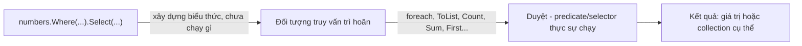

# LINQ (Language Integrated Query)

Bài giảng chi tiết về LINQ to Objects: cú pháp method vs. query, mọi nhóm toán tử chính (lọc, chiếu, sắp xếp, gom nhóm, join, phép toán tập hợp, tổng hợp, toán tử phần tử/định lượng, phân trang, chuyển đổi), và mô hình thực thi (deferred vs. immediate) - lý do đứng sau phần lớn lỗi mà người ta gặp khi dùng LINQ. Mọi khái niệm bên dưới đều có ví dụ chạy được trong [src/Program.cs](./src/Program.cs).

> Bài giảng này xây dựng trên [02-csharp-collections](../02-csharp-collections/README.md), nơi giới thiệu sơ lược `Where`, `Select`, `OrderBy`, và `GroupBy`. Ở đây ta đi sâu vào toàn bộ các toán tử và cách LINQ thực thi.

## Mục tiêu

- Viết cùng một truy vấn bằng cả method syntax lẫn query syntax, và biết khi nào mỗi cách dễ đọc hơn.
- Lọc và chiếu dữ liệu với `Where`, `Select`, và `SelectMany` (kể cả làm phẳng collection lồng nhau).
- Sắp xếp với `OrderBy`/`OrderByDescending` và `ThenBy`/`ThenByDescending`.
- Gom nhóm dữ liệu với `GroupBy`, và kết hợp hai sequence bằng `Join` và `GroupJoin`.
- Áp dụng phép toán tập hợp (`Distinct`, `Union`, `Intersect`, `Except`) và phân trang (`Skip`, `Take`, `SkipWhile`, `TakeWhile`, `Chunk`).
- Tổng hợp dữ liệu với `Count`, `Sum`, `Min`, `Max`, `Average`, và `Aggregate` đa năng.
- Chọn đúng toán tử phần tử (`First` vs. `FirstOrDefault` vs. `Single` vs. `SingleOrDefault`) và biết mỗi cái ném exception khi nào.
- Hiện thực hóa (materialize) truy vấn với `ToList`, `ToArray`, `ToDictionary`, `ToHashSet`, hoặc `ToLookup` - và biết vì sao đôi khi bắt buộc phải làm vậy.
- Giải thích **deferred execution** (thực thi trì hoãn): vì sao một biến truy vấn không chạy cho đến khi được duyệt (enumerate), và vì sao duyệt nó hai lần có thể khiến nó chạy hai lần.
- Nhận diện hai lỗi kinh điển "multiple enumeration" (duyệt nhiều lần) và "captured variable" (biến bị đóng gói/closure) trước khi chúng gây lỗi thật.
- Hiểu khái niệm `IEnumerable<T>` (LINQ to Objects, chạy trong tiến trình) so với `IQueryable<T>` (được dịch sang ngôn ngữ truy vấn khác, ví dụ SQL qua EF Core).

## 1. LINQ là gì

LINQ (**L**anguage **IN**tegrated **Q**uery) là một tập các extension method - định nghĩa trong `System.Linq` - trên `IEnumerable<T>` (và tách biệt, trên `IQueryable<T>`) cho phép lọc, biến đổi, sắp xếp, gom nhóm, và tổng hợp sequence với một API nhất quán, có thể kết hợp (composable) thay vì viết loop thủ công.

```csharp
var numbers = new List<int> { 5, 2, 8, 1, 9, 3 };

// Không dùng LINQ
var evensLoop = new List<int>();
foreach (var n in numbers)
{
    if (n % 2 == 0) evensLoop.Add(n);
}

// Dùng LINQ
var evensLinq = numbers.Where(n => n % 2 == 0).ToList();
```

Cả hai đều cho ra `[2, 8]`. Phiên bản LINQ diễn đạt *muốn gì* (các số chẵn) thay vì *làm thế nào* (lặp và tích lũy) - và nó có thể ghép chuỗi: bạn có thể nối `.Where(...).Select(...).OrderBy(...)` thành một pipeline dễ đọc thay vì lồng nhiều vòng lặp.

### Method syntax vs. query syntax

Mọi truy vấn LINQ đều có thể viết dưới dạng chuỗi extension method (**method syntax**) hoặc dạng biểu thức giống SQL (**query syntax**). Trình biên dịch dịch query syntax thành đúng các lời gọi method đó - chúng tương đương 100%, và bạn có thể trộn cả hai (query syntax cho phần khung, method syntax cho những gì query syntax không hỗ trợ, như `Sum`).

```csharp
record Product(string Name, decimal Price, string Category);

var products = new List<Product>
{
    new("Laptop", 1500m, "Electronics"),
    new("Mouse", 25m, "Electronics"),
    new("Desk", 300m, "Furniture"),
    new("Chair", 150m, "Furniture"),
};

// Method syntax
var cheapMethod = products
    .Where(p => p.Price < 500)
    .OrderBy(p => p.Price)
    .Select(p => p.Name);

// Query syntax
var cheapQuery =
    from p in products
    where p.Price < 500
    orderby p.Price
    select p.Name;
```

Cả hai cho ra `["Mouse", "Chair", "Desk"]`. Query syntax dễ đọc với pipeline lọc/sắp xếp/chiếu có join hoặc gom nhóm; method syntax là bắt buộc với các toán tử không có từ khóa query-syntax tương ứng (`Sum`, `Count`, `Any`, `Take`, ...). Phần lớn code C# thực tế nghiêng về method syntax vì nó cần thiết cho đa số toán tử - bài giảng này dùng method syntax xuyên suốt, chỉ nhắc query syntax ở những chỗ nó thực sự rõ ràng hơn.

## 2. Lọc dữ liệu - `Where`

`Where` chỉ giữ lại các phần tử thỏa mãn predicate (`Func<T, bool>`):

```csharp
var electronics = products.Where(p => p.Category == "Electronics");
// Laptop, Mouse

var indexed = products.Where((p, index) => index % 2 == 0); // vị trí chẵn
// Laptop, Desk
```

`Where` không bao giờ chỉnh sửa sequence gốc - nó tạo ra một sequence tham chiếu mới (hoặc giá trị mới, với kiểu giá trị) trỏ vào dữ liệu gốc.

## 3. Chiếu dữ liệu - `Select` và `SelectMany`

`Select` biến đổi mỗi phần tử thành thứ khác - hình dạng khác, kiểu khác, hoặc chỉ một property:

```csharp
var names = products.Select(p => p.Name);                    // IEnumerable<string>
var summaries = products.Select(p => $"{p.Name}: {p.Price:C}"); // IEnumerable<string>
var withIndex = products.Select((p, i) => $"{i}: {p.Name}");    // overload có index
```

`SelectMany` làm phẳng một sequence-của-sequence thành một sequence duy nhất - dùng nó bất cứ khi nào `Select` để lại bạn với `IEnumerable<IEnumerable<T>>`:

```csharp
record Order(string Customer, List<string> Items);

var orders = new List<Order>
{
    new("Alice", new List<string> { "Book", "Pen" }),
    new("Bob", new List<string> { "Laptop" }),
};

var allItemsWrong = orders.Select(o => o.Items);      // IEnumerable<List<string>> - lồng nhau!
var allItemsFlat = orders.SelectMany(o => o.Items);   // IEnumerable<string> - phẳng: Book, Pen, Laptop

// Chiếu một cặp gồm phần tử ngoài và phần tử trong cùng nhau:
var customerItems = orders.SelectMany(
    o => o.Items,
    (order, item) => $"{order.Customer} bought {item}");
// "Alice bought Book", "Alice bought Pen", "Bob bought Laptop"
```

## 4. Sắp xếp - `OrderBy`, `ThenBy`

`OrderBy`/`OrderByDescending` sắp xếp theo một key; `ThenBy`/`ThenByDescending` thêm key sắp xếp phụ khi các phần tử bằng nhau ở key chính. Gọi `OrderBy` lần thứ hai thay vì `ThenBy` sẽ **thay thế hoàn toàn** thứ tự trước đó thay vì tinh chỉnh nó - một lỗi thường gặp.

```csharp
var sorted = products
    .OrderBy(p => p.Category)
    .ThenByDescending(p => p.Price)
    .Select(p => $"{p.Category}/{p.Name}: {p.Price:C}");
// Electronics/Laptop, Electronics/Mouse, Furniture/Chair, Furniture/Desk
```

`OrderBy` là **sắp xếp ổn định** (stable sort): các phần tử có key bằng nhau giữ nguyên thứ tự tương đối ban đầu.

## 5. Gom nhóm - `GroupBy`

`GroupBy` gom các phần tử vào nhóm theo key, mỗi nhóm là `IGrouping<TKey, TElement>` - bản thân mỗi nhóm cũng là một `IEnumerable<TElement>` kèm property `Key`:

```csharp
var byCategory = products.GroupBy(p => p.Category);

foreach (var group in byCategory)
{
    Console.WriteLine($"{group.Key}: {group.Count()} item(s), total {group.Sum(p => p.Price):C}");
    foreach (var p in group) Console.WriteLine($"  - {p.Name}");
}
// Electronics: 2 item(s), total $1,525.00
//   - Laptop
//   - Mouse
// Furniture: 2 item(s), total $450.00
//   - Desk
//   - Chair
```

`GroupBy` có overload result-selector giúp chiếu từng nhóm ngay lập tức, tránh phải gọi thêm `Select`:

```csharp
var totals = products.GroupBy(
    p => p.Category,
    (category, items) => new { Category = category, Total = items.Sum(p => p.Price) });
```

## 6. Kết hợp sequence - `Join` và `GroupJoin`

`Join` là inner join: ghép cặp các phần tử từ hai sequence có key khớp nhau (giống SQL `INNER JOIN`).

```csharp
record Category(string Name, string Manager);

var categories = new List<Category>
{
    new("Electronics", "Dana"),
    new("Furniture", "Sam"),
};

var joined = products.Join(
    categories,
    product => product.Category,      // key selector của sequence ngoài
    category => category.Name,        // key selector của sequence trong
    (product, category) => $"{product.Name} is managed by {category.Manager}");
// "Laptop is managed by Dana", "Mouse is managed by Dana", "Desk is managed by Sam", "Chair is managed by Sam"
```

`GroupJoin` gần giống SQL `LEFT JOIN` kết hợp gom nhóm: mỗi phần tử ngoài nhận được một *collection* các phần tử trong khớp với nó (rỗng, chứ không bị bỏ qua, nếu không có phần tử khớp).

```csharp
var grouped = categories.GroupJoin(
    products,
    category => category.Name,
    product => product.Category,
    (category, matchingProducts) => new
    {
        category.Name,
        Products = matchingProducts.Select(p => p.Name).ToList(),
    });
// { Name = "Electronics", Products = [Laptop, Mouse] }
// { Name = "Furniture",   Products = [Desk, Chair] }
```

## 7. Phép toán tập hợp

Các toán tử này xem sequence như tập hợp và so sánh phần tử bằng equality (`Equals`/`GetHashCode`, hoặc `IEqualityComparer<T>` tùy chỉnh):

| Method              | Ý nghĩa                                                    |
| -------------------- | ------------------------------------------------------------ |
| `Distinct()`          | Các phần tử duy nhất, giữ lần xuất hiện đầu tiên.             |
| `Union(other)`        | Phần tử có ở sequence này hoặc sequence kia, đã loại trùng.   |
| `Intersect(other)`    | Phần tử có mặt ở cả hai sequence.                             |
| `Except(other)`       | Phần tử có ở sequence đầu nhưng không có ở sequence thứ hai.  |

```csharp
var a = new[] { 1, 2, 3, 4 };
var b = new[] { 3, 4, 5, 6 };

a.Distinct();       // 1, 2, 3, 4 (không có trùng ở đây, nhưng sẽ gộp nếu có)
a.Union(b);         // 1, 2, 3, 4, 5, 6
a.Intersect(b);     // 3, 4
a.Except(b);        // 1, 2
```

## 8. Tổng hợp dữ liệu

```csharp
var prices = products.Select(p => p.Price);

products.Count();                        // 4
products.Count(p => p.Price > 200);      // 2
prices.Sum();                            // 1975
prices.Min();                            // 25
prices.Max();                            // 1500
prices.Average();                        // 493.75

// Aggregate: fold đa năng, dùng cho những gì các toán tử có sẵn không đáp ứng được
var totalWithFee = prices.Aggregate(0m, (runningTotal, price) => runningTotal + price * 1.05m);
var namesJoined = products.Aggregate("", (acc, p) => acc == "" ? p.Name : $"{acc}, {p.Name}");
// "Laptop, Mouse, Desk, Chair" - String.Join(", ", ...) đơn giản hơn cho trường hợp cụ thể này,
// nhưng Aggregate xử lý được các phép fold mà không toán tử có sẵn nào bao quát được.
```

## 9. Toán tử phần tử

| Method                | Sequence rỗng / không khớp            | Khớp nhiều hơn một |
| ----------------------- | --------------------------------------- | --------------------- |
| `First()`                | Ném `InvalidOperationException`         | Trả về phần tử đầu    |
| `FirstOrDefault()`       | Trả về `default(T)` (`null`/`0`/...)    | Trả về phần tử đầu    |
| `Single()`                | Ném exception                           | **Ném exception**       |
| `SingleOrDefault()`      | Trả về `default(T)`                     | **Ném exception**       |
| `Last()` / `LastOrDefault()` | Ném / trả về `default(T)`           | Trả về phần tử cuối    |
| `ElementAt(i)`           | Ném nếu index nằm ngoài phạm vi          | Trả về phần tử tại `i` |

```csharp
products.First(p => p.Category == "Electronics");         // Laptop
products.FirstOrDefault(p => p.Category == "Toys");        // null - không khớp, không ném exception
products.Single(p => p.Name == "Desk");                    // Desk - khớp đúng một
products.SingleOrDefault(p => p.Category == "Toys");       // null - không khớp thì SingleOrDefault vẫn ổn
// products.Single(p => p.Category == "Electronics");      // sẽ ném exception - khớp HAI phần tử
```

Dùng `Single`/`SingleOrDefault` cụ thể khi việc "khớp nhiều hơn một kết quả" bản thân nó là lỗi bạn muốn phát hiện (ví dụ tra cứu bản ghi theo ID được cho là duy nhất) - `First`/`FirstOrDefault` bỏ qua trường hợp đó một cách âm thầm.

### Toán tử định lượng

```csharp
products.Any();                                // true - sequence có ít nhất một phần tử
products.Any(p => p.Price > 1000);             // true - có ít nhất một phần tử khớp
products.All(p => p.Price > 0);                // true - mọi phần tử đều khớp
products.Contains(products[0]);                // true - dùng equality comparison
```

`Any()` không kèm predicate là cách chuẩn mực, hiệu quả để kiểm tra "collection này có rỗng không" - ưu tiên dùng nó hơn `.Count() > 0`, vì (với `IEnumerable<T>` thuần) `Count()` có thể phải duyệt hết cả sequence chỉ để đếm.

## 10. Phân trang

```csharp
var nums = new[] { 1, 2, 3, 4, 5, 6, 7, 8, 9, 10 };

nums.Skip(3);                          // 4, 5, 6, 7, 8, 9, 10
nums.Take(3);                          // 1, 2, 3
nums.Skip(3).Take(3);                  // 4, 5, 6 - mẫu phân trang kinh điển
nums.TakeWhile(n => n < 5);            // 1, 2, 3, 4 - dừng ngay khi gặp phần tử đầu tiên không thỏa
nums.SkipWhile(n => n < 5);            // 5, 6, 7, 8, 9, 10 - bỏ qua đến phần tử đầu tiên không thỏa, rồi lấy phần còn lại
nums.Chunk(3);                         // [1,2,3], [4,5,6], [7,8,9], [10]
```

`TakeWhile`/`SkipWhile` dừng đánh giá ngay ở phần tử **đầu tiên** không thỏa predicate - khác với `Where`, chúng không tiếp tục quét phần còn lại của sequence để tìm thêm phần tử khớp.

## 11. Chuyển đổi - hiện thực hóa truy vấn

`Where`, `Select`, `OrderBy`, v.v. đều trả về `IEnumerable<T>` *lazy* (trì hoãn). Các method `To...` buộc truy vấn chạy ngay và lưu kết quả vào một collection cụ thể:

```csharp
List<Product> list = products.Where(p => p.Price > 100).ToList();
Product[] array = products.ToArray();
Dictionary<string, decimal> byName = products.ToDictionary(p => p.Name, p => p.Price);
HashSet<string> categorySet = products.Select(p => p.Category).ToHashSet();

// ToLookup giống ToDictionary nhưng cho phép key trùng - mỗi key ánh xạ tới một collection
ILookup<string, Product> byCategory = products.ToLookup(p => p.Category);
byCategory["Electronics"]; // Laptop, Mouse - không bao giờ ném exception, kể cả với key không tồn tại (trả về rỗng)
```

## 12. Deferred execution (thực thi trì hoãn)

Đây là điều quan trọng nhất cần hiểu về LINQ, và là nguồn gốc của phần lớn lỗi bất ngờ. Hầu hết toán tử LINQ (`Where`, `Select`, `OrderBy`, `GroupBy`, ...) đều **trì hoãn** (deferred, hay lazy): việc xây dựng truy vấn không thực hiện bất kỳ công việc nào cả. Công việc chỉ diễn ra khi truy vấn được **duyệt** (enumerate) - bởi `foreach`, hoặc bởi một method buộc phải duyệt (`ToList`, `Count()`, `First()`, `Sum()`, ...).

```csharp
var numbers = new List<int> { 1, 2, 3 };

var query = numbers.Where(n =>
{
    Console.WriteLine($"Checking {n}");
    return n > 1;
});

Console.WriteLine("Query built, nothing printed yet");
foreach (var n in query) Console.WriteLine($"Got {n}"); // BÂY GIỜ "Checking 1/2/3" và "Got 2/3" mới in ra
```

### Hệ quả 1: truy vấn đọc dữ liệu "sống" (live)

Vì thân truy vấn không chạy cho đến khi được duyệt, nó thấy dữ liệu nguồn trông như thế nào **tại thời điểm duyệt** - chứ không phải tại thời điểm `Where`/`Select` được viết ra:

```csharp
var list = new List<int> { 1, 2, 3 };
var query = list.Where(n => n > 1);

list.Add(4);
foreach (var n in query) Console.Write(n + " "); // 2 3 4 - thấy cả phần tử vừa thêm
```

### Hệ quả 2: duyệt nhiều lần chạy lại truy vấn nhiều lần

Duyệt một truy vấn trì hoãn hai lần (hai vòng `foreach`, hoặc `.Count()` rồi tới `foreach`) sẽ chạy lại phần công việc bên dưới **hai lần**. Nếu nguồn là một truy vấn database hoặc predicate tốn kém, điều này âm thầm nhân đôi chi phí - và nếu nguồn bị thay đổi giữa hai lần duyệt, hai lần chạy thậm chí có thể thấy dữ liệu khác nhau.

```csharp
var expensive = numbers.Where(n =>
{
    Console.WriteLine("Evaluating...");
    return n > 1;
});

var count = expensive.Count();   // đánh giá predicate cho từng phần tử - một lần
var list = expensive.ToList();   // đánh giá predicate cho từng phần tử - LẠI MỘT LẦN NỮA
```

**Cách khắc phục:** gọi `.ToList()` (hoặc `.ToArray()`) một lần duy nhất, ngay sau khi xây dựng truy vấn, rồi tái sử dụng list đã hiện thực hóa đó cho mọi thứ phía sau.

### Hệ quả 3: `ToList`/`ToArray`/`Sum`/`First`/v.v. buộc thực thi ngay lập tức

Các method này chạy truy vấn ngay và trả về hoặc một collection cụ thể (`ToList`, `ToArray`, `ToDictionary`) hoặc một giá trị đơn (`Sum`, `Count`, `First`, `Any`). Sau thời điểm đó, mọi thay đổi tiếp theo trên nguồn không còn ảnh hưởng đến kết quả đã được tạo ra.



## 13. `IEnumerable<T>` vs. `IQueryable<T>`

Mọi thứ ở trên đều là **LINQ to Objects**: chạy trên các sequence `IEnumerable<T>` trong bộ nhớ, thực thi trực tiếp lambda C# của bạn, ngay trong tiến trình.

`IQueryable<T>` (dùng bởi EF Core, LINQ to SQL, và các ORM tương tự) trông giống hệt trong code nhưng hoạt động rất khác: lambda của bạn được biên dịch thành **expression tree** (dữ liệu mô tả truy vấn, không phải code thực thi), mà provider sẽ dịch sang một ngôn ngữ truy vấn khác - thường là SQL - và gửi tới database. Việc lọc/sắp xếp/gom nhóm diễn ra *ở đó*, và chỉ các dòng khớp mới được trả về qua đường dây kết nối.

```csharp
// Cú pháp giống nhau, nhưng thực thi rất khác:
IEnumerable<Product> inMemory = products.Where(p => p.Price > 100);       // chạy trong tiến trình này
IQueryable<Product> fromDb = dbContext.Products.Where(p => p.Price > 100); // trở thành mệnh đề SQL WHERE
```

Hệ quả thực tế: không phải mọi biểu thức C# đều dịch được sang SQL (ví dụ lời gọi một method C# tùy chỉnh mà database không biết đến), và việc kéo một `IQueryable<T>` vào bộ nhớ bằng `.ToList()` **trước khi** lọc nghĩa là việc lọc diễn ra trong tiến trình của bạn thay vì trong database - thường là đánh đổi sai lầm với bảng dữ liệu lớn. Bài giảng này chỉ bao quát LINQ to Objects (`IEnumerable<T>`); `IQueryable<T>`/EF Core xứng đáng có một bài giảng riêng.

## Những lỗi thường gặp

- **Duyệt nhiều lần (multiple enumeration)** - tái sử dụng một truy vấn trì hoãn qua nhiều thao tác sẽ chạy lại nó mỗi lần; hãy hiện thực hóa bằng `.ToList()` một lần nếu bạn sẽ dùng kết quả nhiều hơn một lần. Xem [mục 12](#12-deferred-execution-thực-thi-trì-hoãn).
- **`OrderBy` rồi lại `OrderBy` thay vì `ThenBy`** - lần `OrderBy` thứ hai bỏ hẳn thứ tự sắp xếp trước đó thay vì thêm tiêu chí phụ.
- **`Single`/`First` khi bộ lọc có thể khớp không kết quả nào** - `Single()`/`First()` ném exception với sequence rỗng; hãy dùng biến thể `OrDefault` trừ khi "không khớp" thực sự là một lỗi.
- **`Count() > 0` thay vì `Any()`** - `Any()` dừng ngay ở phần tử đầu tiên; `Count()` có thể phải duyệt hết mọi thứ chỉ để cho ra một con số.
- **Bắt (capture) biến vòng lặp theo tham chiếu trong closure** - C# hiện đại (`foreach`) cấp cho mỗi lần lặp biến riêng của nó, nên điều này an toàn ngày nay, nhưng việc bắt một biến *có thể thay đổi* khai báo bên ngoài vòng lặp rồi tham chiếu trong lambda trì hoãn vẫn có thể gây bất ngờ, vì lambda đọc giá trị của biến tại thời điểm duyệt, không phải tại thời điểm lambda được viết.
- **Lọc một `IQueryable<T>` sau khi đã `.ToList()`** - kéo cả bảng vào bộ nhớ trước, rồi mới lọc bằng C#, thay vì để database làm việc đó.

## Bài tập

1. Cho một `List<Order>` mà mỗi `Order` có một `List<OrderLine>`, dùng `SelectMany` để tạo ra danh sách phẳng chứa mọi dòng đơn hàng của tất cả order.
2. Gom nhóm `products` theo `Category` và với mỗi nhóm, tạo ra tên của sản phẩm đắt nhất trong nhóm đó (gợi ý: `OrderByDescending(...).First()` bên trong phần chiếu nhóm).
3. Viết một truy vấn phân trang qua một list, mỗi lần 5 phần tử, dùng `Skip`/`Take`, rồi so sánh với cách làm tương tự bằng `Chunk(5)`.
4. Tái tạo lỗi "duyệt nhiều lần" ở [mục 12](#12-deferred-execution-thực-thi-trì-hoãn) bằng cách đặt `Console.WriteLine` bên trong `Select`, quan sát nó in ra hai lần, rồi sửa bằng một lần `.ToList()` duy nhất.
5. Dùng `Join` để kết hợp hai list (ví dụ `Employee { DepartmentId }` và `Department { Id, Name }`) thành một phép chiếu `"{EmployeeName} works in {DepartmentName}"`.

## Chạy project

```bash
cd lectures/04-linq/src
dotnet run
```

## Ghi chú

- Xem [src/Program.cs](./src/Program.cs) để có ví dụ chạy được, bao quát mọi mục ở trên theo đúng thứ tự, kèm `Console.WriteLine` để đối chiếu với README.
- Bài giảng này chỉ bao quát LINQ to Objects (`IEnumerable<T>`); `IQueryable<T>` và việc dịch truy vấn của EF Core được giới thiệu ở mức khái niệm tại [mục 13](#13-ienumerablet-vs-iqueryablet) nhưng xứng đáng có một bài giảng riêng.
