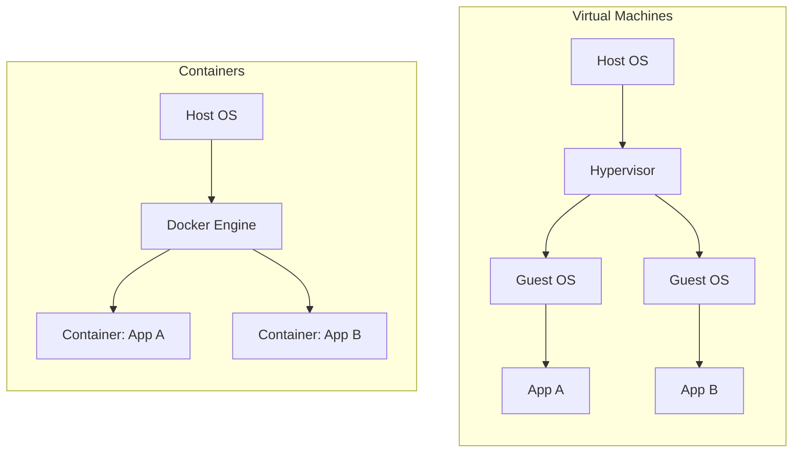
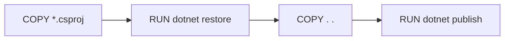
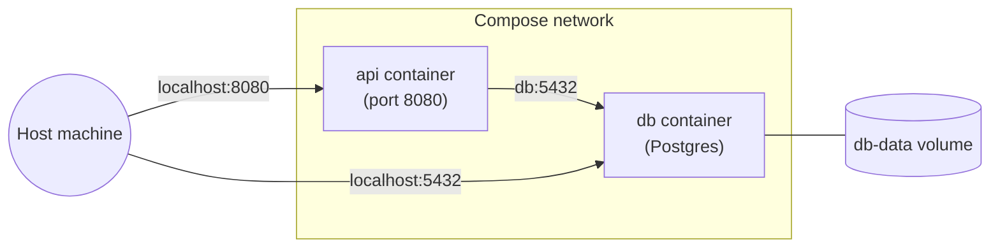

# Docker

A detailed introduction to Docker aimed at .NET developers: what containers actually are, the core concepts (image, container, registry, Dockerfile), the command-line workflow, how to containerize an ASP.NET Core Web API with a multi-stage build, volumes, networking, and Docker Compose for multi-container apps. Every command below has a runnable counterpart in [src/](./src/) - a minimal Web API plus a `Dockerfile`, `.dockerignore`, and `docker-compose.yml`.

> This lecture assumes no prior Docker knowledge. It does assume you can already run a .NET project with `dotnet run` (see [00-web-api-template](../00-web-api-template/README.md)).

## Goals

- Explain what a container is and how it differs from a virtual machine.
- Install Docker and verify it works.
- Understand the core vocabulary: image, container, Dockerfile, registry, tag, layer.
- Read and write a multi-stage `Dockerfile` for an ASP.NET Core app.
- Build an image, run a container from it, and map ports so you can reach it from the host.
- Pass configuration into a container with environment variables.
- Persist data across container restarts with volumes.
- Understand container networking well enough to connect an API container to a database container.
- Run a multi-container app (API + database) with a single `docker compose up`.
- Read logs, shell into a running container, and inspect its state for debugging.
- Know the everyday cleanup commands so your machine doesn't fill up with old images/containers.
- Recognize common Docker pitfalls before they cost you an afternoon.

## 1. What Docker is, and why

Docker packages an application together with everything it needs to run (runtime, libraries, config) into a single unit called an **image**. Running that image produces a **container** - an isolated process with its own filesystem, network interface, and process tree, but sharing the host machine's OS kernel.

The pitch: "it works on my machine" stops being a problem, because the container carries its entire environment with it. The same image runs identically on your laptop, a teammate's laptop, a CI runner, and production.

### Containers vs. virtual machines



A VM virtualizes an entire machine, including a full guest OS - it boots in seconds to minutes and consumes gigabytes of RAM/disk per instance. A container shares the host kernel and only isolates the process, filesystem, and network - it starts in milliseconds and typically weighs tens to hundreds of megabytes. The tradeoff is isolation strength (a VM's boundary is stronger) for speed and density - which is why containers are the default choice for packaging and deploying individual services, while VMs still make sense for running a fundamentally different OS or for hard multi-tenant isolation.

## 2. Installing Docker

- **Windows/Mac**: install [Docker Desktop](https://www.docker.com/products/docker-desktop/). It bundles the Docker Engine, CLI, and (on Mac/Windows) a lightweight Linux VM the engine actually runs in, since Docker containers are Linux containers.
- **Linux**: install the [Docker Engine](https://docs.docker.com/engine/install/) directly (no VM needed - the host kernel is already Linux).

Verify the install:

```bash
docker --version
docker run hello-world
```

`hello-world` downloads a tiny image, runs it, and prints a confirmation message - if that works, Docker is set up correctly.

## 3. Core vocabulary

| Term           | Meaning                                                                                                                                                                                                                       |
| -------------- | ----------------------------------------------------------------------------------------------------------------------------------------------------------------------------------------------------------------------------- |
| **Image**      | A read-only, versioned template: filesystem snapshot + metadata (entrypoint, exposed ports, env defaults). Built once, run many times.                                                                                        |
| **Container**  | A running (or stopped) instance of an image - an isolated process with its own filesystem layer on top of the image.                                                                                                          |
| **Dockerfile** | A text file of instructions describing how to build an image (base image, files to copy, commands to run, what to execute on start).                                                                                          |
| **Registry**   | A server that stores and distributes images (e.g. [Docker Hub](https://hub.docker.com/), GitHub Container Registry, Azure Container Registry). `docker pull`/`docker push` talk to a registry.                                |
| **Tag**        | A label on an image, usually `name:version` (e.g. `mcr.microsoft.com/dotnet/aspnet:10.0`). `latest` is just a conventional tag name, not a magic "newest" pointer.                                                            |
| **Layer**      | Each Dockerfile instruction that changes the filesystem produces a cached, immutable layer; an image is a stack of layers. Layers are the unit Docker reuses between builds (see [section 10](#10-layers-and-build-caching)). |
| **Volume**     | Docker-managed storage that outlives a container's lifecycle, used to persist or share data (see [section 8](#8-persisting-data-with-volumes)).                                                                               |

## 4. Everyday commands

Images:

```bash
docker images                    # list images on this machine
docker pull <image>:<tag>        # download an image from a registry
docker build -t <name>:<tag> .   # build an image from a Dockerfile in the current dir
docker rmi <image>               # delete an image
```

Containers:

```bash
docker run <image>                       # create + start a container, foreground
docker run -d <image>                    # ...detached (background)
docker run -p 8080:8080 <image>          # map host port 8080 -> container port 8080
docker run --name my-api <image>         # give the container a friendly name
docker run -e KEY=value <image>          # set an environment variable
docker ps                                # list running containers
docker ps -a                             # list ALL containers, including stopped ones
docker stop <container>                  # send SIGTERM, stop gracefully
docker rm <container>                    # delete a stopped container
docker logs <container>                  # view stdout/stderr
docker logs -f <container>               # follow (stream) logs live
docker exec -it <container> /bin/bash    # open a shell inside a running container
docker inspect <container>               # full JSON metadata (IP, mounts, env, ...)
```

`<container>` and `<image>` above accept either the name/tag or the ID shown by `docker ps`/`docker images` (a unique prefix of the ID is enough).

## 5. Writing a Dockerfile for a .NET app

The naive approach - one `FROM` with the SDK image, copy everything, `dotnet run` - works but ships the entire SDK (compiler, NuGet cache, build tooling) inside your production image, at ~800 MB+ and a much larger attack surface than the app needs. The standard fix is a **multi-stage build**: use the SDK image to compile and publish, then copy only the published output into a much smaller runtime-only image.

[src/Dockerfile](./src/Dockerfile):

```dockerfile
# syntax=docker/dockerfile:1

# ---- Stage 1: build ----
FROM mcr.microsoft.com/dotnet/sdk:10.0 AS build
WORKDIR /src

COPY DockerDemo.csproj .
RUN dotnet restore

COPY . .
RUN dotnet publish -c Release -o /app --no-restore

# ---- Stage 2: runtime ----
FROM mcr.microsoft.com/dotnet/aspnet:10.0 AS final
WORKDIR /app
USER app

COPY --from=build /app .

EXPOSE 8080

HEALTHCHECK --interval=30s --timeout=3s --start-period=5s \
    CMD curl -f http://localhost:8080/health || exit 1

ENTRYPOINT ["dotnet", "DockerDemo.dll"]
```

Walking through it:

- **`FROM ... AS build`** names the first stage `build` so a later stage can copy files out of it. This stage uses the **SDK** image (`dotnet/sdk`), which includes the compiler and CLI.
- **`COPY DockerDemo.csproj .` then `RUN dotnet restore`, separately from `COPY . .`** - this ordering is deliberate for build caching; see [section 10](#10-layers-and-build-caching).
- **`RUN dotnet publish -c Release -o /app`** compiles a Release build and writes the output (DLLs, `.deps.json`, `appsettings.json`, ...) to `/app` inside the build stage.
- **`FROM ... AS final`** starts a _fresh_ image based on the **ASP.NET runtime** image (`dotnet/aspnet`) - no SDK, no compiler, just what's needed to _run_ an already-built app. This is the image that actually gets shipped.
- **`USER app`** switches off the default root user (the base image ships an `app` user for exactly this) - a container running as root can do more damage if compromised.
- **`COPY --from=build /app .`** copies only the published output from the build stage into the runtime stage - the SDK, source code, and intermediate build artifacts never make it into the final image.
- **`EXPOSE 8080`** is documentation for humans and tooling; it does not itself publish the port (see [section 7](#7-networking-and-port-mapping)).
- **`HEALTHCHECK`** tells Docker how to periodically probe whether the container is actually working, not just running (see [section 9](#9-health-checks)).
- **`ENTRYPOINT`** is the command that runs when the container starts. `["dotnet", "DockerDemo.dll"]` (exec form, a JSON array) is preferred over the shell form (`dotnet DockerDemo.dll`) because it runs the process as PID 1 directly, without an intermediate shell - which matters for correctly forwarding signals like `SIGTERM` when Docker tries to stop the container.

### .dockerignore

Just like `.gitignore`, [src/.dockerignore](./src/.dockerignore) excludes files from the _build context_ (everything sent to the Docker daemon when you `docker build`):

```
bin/
obj/
*.user
.vs/
.vscode/
```

Without it, `COPY . .` would ship your local `bin`/`obj` folders (potentially built for the wrong OS/architecture) into the image and needlessly bloat the build context.

## 6. Building and running the sample

```bash
cd lectures/05-docker/src
docker build -t docker-demo .
docker run -d -p 8080:8080 --name docker-demo docker-demo
curl http://localhost:8080/api/hello
# {"message":"Hello from the Dockerized Web API!","source":"local (no GREETING_SOURCE set)","machineName":"a1b2c3d4e5f6"}
```

`machineName` will be a random-looking hex string - that's the container's own hostname, proof the code is running inside the container, not on your host.

Pass an environment variable in, to see it echoed back in the response:

```bash
docker run -d -p 8080:8080 -e GREETING_SOURCE=docker-run --name docker-demo-2 docker-demo
curl http://localhost:8080/api/hello   # "source":"docker-run"
```

Clean up:

```bash
docker stop docker-demo docker-demo-2
docker rm docker-demo docker-demo-2
```

## 7. Networking and port mapping

Each container gets its own network namespace and IP address on a private Docker network - by default, nothing outside Docker can reach it. `-p <host-port>:<container-port>` publishes a port by forwarding traffic from the host to the container:

```bash
docker run -p 8080:8080 docker-demo   # host:8080 -> container:8080
docker run -p 9000:8080 docker-demo   # host:9000 -> container:8080 (different host port)
```

`EXPOSE` in the Dockerfile is metadata only (and a hint for `docker run -P`, which auto-publishes all exposed ports to random host ports) - the actual mapping always comes from `-p` on `docker run` (or `ports:` in Compose).

Containers on the **same** user-defined Docker network can reach each other directly by container/service name, without any `-p` mapping - that's how the API container talks to the database container in [section 11](#11-multi-container-apps-with-docker-compose).

## 8. Persisting data with volumes

A container's own filesystem is ephemeral: `docker rm` deletes it along with any data written inside. **Volumes** are Docker-managed storage that live independently of any single container's lifecycle.

```bash
docker volume create my-data
docker run -v my-data:/var/lib/postgresql/data postgres:16-alpine
docker volume ls
docker volume rm my-data
```

There's also a **bind mount** (`-v <host-path>:<container-path>`), which maps a specific folder from the host filesystem instead of a Docker-managed volume - handy for local development (e.g. mounting source code so a container picks up file changes live), but ties the container to that host path, which is why named volumes are usually preferred for actual data persistence.

## 9. Health checks

`HEALTHCHECK` in the Dockerfile (or `healthcheck:` in Compose) tells Docker to periodically run a command inside the container and use its exit code to decide whether the container is `healthy`, `unhealthy`, or still `starting`:

```dockerfile
HEALTHCHECK --interval=30s --timeout=3s --start-period=5s \
    CMD curl -f http://localhost:8080/health || exit 1
```

`docker ps` then shows the container's health status alongside its uptime. This matters most in orchestration: Compose's `depends_on: condition: service_healthy` (used in [section 11](#11-multi-container-apps-with-docker-compose)) and Kubernetes readiness probes both rely on this signal to know when a dependency is actually ready, not just started.

## 10. Layers and build caching

Every `RUN`, `COPY`, and `ADD` instruction produces a cached, immutable **layer**. On a rebuild, Docker reuses a cached layer as-is if the instruction and its inputs are unchanged - and invalidates that layer _and every layer after it_ the moment something changes.

This is why the Dockerfile copies `DockerDemo.csproj` and runs `dotnet restore` _before_ copying the rest of the source:

```dockerfile
COPY DockerDemo.csproj .
RUN dotnet restore
COPY . .
RUN dotnet publish -c Release -o /app --no-restore
```



Editing a `.cs` file only invalidates `COPY . .` onward - the `restore` layer (often the slowest step, since it downloads NuGet packages) stays cached. Had the Dockerfile instead done one `COPY . .` up front, _any_ source change - even a comment - would invalidate `restore` too, re-downloading every package on every build.

General rule: order instructions from least-frequently-changing to most-frequently-changing.

## 11. Multi-container apps with Docker Compose

Real apps rarely run alone - an API usually needs a database, cache, message broker, etc. **Docker Compose** describes a multi-container application in one YAML file and manages the whole group with one command.

[src/docker-compose.yml](./src/docker-compose.yml):

```yaml
services:
  api:
    build: .
    ports:
      - "8080:8080"
    environment:
      - GREETING_SOURCE=docker-compose
    depends_on:
      db:
        condition: service_healthy

  db:
    image: postgres:16-alpine
    environment:
      - POSTGRES_PASSWORD=devpassword
      - POSTGRES_DB=dockerdemo
    ports:
      - "5432:5432"
    volumes:
      - db-data:/var/lib/postgresql/data
    healthcheck:
      test: ["CMD-SHELL", "pg_isready -U postgres"]
      interval: 5s
      timeout: 3s
      retries: 5

volumes:
  db-data:
```

```bash
cd lectures/05-docker/src
docker compose up --build   # build the api image (if needed) and start both services
docker compose ps           # list services and their status
docker compose logs -f api  # follow logs for just the api service
docker compose down         # stop and remove containers + the default network (keeps the volume)
docker compose down -v      # ...and also delete the named volume (db-data)
```

Key points:

- Compose creates a private network shared by all services in the file - `api` can reach the database at the hostname `db` (the service name), on port `5432`, with no `-p` mapping needed between them. The `5432:5432` in the file only exposes Postgres to the _host_ (e.g. for connecting with a local DB client) - it isn't what lets `api` reach `db`.
- `depends_on: condition: service_healthy` makes Compose wait for `db`'s `HEALTHCHECK` to pass before starting `api` - plain `depends_on` (no condition) only waits for the container to _start_, not for Postgres inside it to be ready to accept connections, which is a classic source of "connection refused" on the first run.
- `db-data` is a named volume (declared under the top-level `volumes:` key) - Postgres's data survives `docker compose down`, and is only deleted with the explicit `-v` flag.



## 12. Cleaning up

Images and containers accumulate quickly during development. Everyday cleanup:

```bash
docker ps -a                      # see what's around, including stopped containers
docker rm $(docker ps -aq)        # remove all stopped containers
docker image prune                # remove dangling (untagged) images
docker system prune                # remove stopped containers, dangling images, unused networks
docker system prune -a --volumes  # aggressive: also unused images and volumes - be sure first
```

`docker system prune -a --volumes` is destructive and machine-wide - read what it says it will remove before confirming.

## Common pitfalls

- **Shipping the SDK image to production** - always multi-stage build down to a runtime-only base image ([section 5](#5-writing-a-dockerfile-for-a-net-app)); the SDK image is for building, not running.
- **`COPY . .` before restoring dependencies** - defeats layer caching, making every rebuild re-download every package. Copy the project file(s) and restore first ([section 10](#10-layers-and-build-caching)).
- **Forgetting `.dockerignore`** - ships local `bin`/`obj` (wrong OS/arch binaries) and bloats the build context.
- **Assuming `EXPOSE` publishes a port** - it's documentation only; you still need `-p` on `docker run` or `ports:` in Compose.
- **Using `depends_on` without `condition: service_healthy` for a database** - the dependent service starts before the database is actually ready to accept connections, causing intermittent startup failures.
- **Writing data inside the container's own filesystem and expecting it to survive** - it's deleted with the container; use a volume for anything that must persist ([section 8](#8-persisting-data-with-volumes)).
- **Confusing `latest` for "the newest version"** - it's just a tag name like any other; nothing prevents `latest` from being stale or from pointing at an older build than expected. Pin explicit version tags in anything beyond local experiments.
- **Running as root in the final image** - drop to a non-root user (`USER app` in the .NET runtime images) unless the container genuinely needs root.

## Exercises

1. Build the sample image, run it, and confirm `curl http://localhost:8080/api/hello` responds. Then `docker exec -it` into the running container and check that `dotnet` (the SDK) is _not_ installed there - only the app and the ASP.NET runtime.
2. Change `Program.cs` to add a new endpoint, rebuild the image, and time how long the rebuild takes versus the first build. Explain which Dockerfile layers were reused, using [section 10](#10-layers-and-build-caching).
3. Run the sample without `-p` and try to `curl` it from the host - confirm it fails, then re-run with `-p 8080:8080` and confirm it works.
4. Start the full stack with `docker compose up --build`, confirm the API can reach Postgres (the api container starts successfully and stays healthy), then run `docker compose down` followed by `docker compose up` again and confirm the data volume persisted.
5. Deliberately introduce a bug that makes `/health` return a non-200 status, rebuild, and watch `docker ps` report the container as `unhealthy`.

## Running the project

```bash
# Standalone container
cd lectures/05-docker/src
docker build -t docker-demo .
docker run -d -p 8080:8080 --name docker-demo docker-demo
curl http://localhost:8080/api/hello

# Full stack with Docker Compose (API + Postgres)
docker compose up --build
```

## Notes

- See [src/Dockerfile](./src/Dockerfile) for the annotated multi-stage build and [src/docker-compose.yml](./src/docker-compose.yml) for the multi-container setup, both referenced throughout this lecture.
- This lecture covers Docker fundamentals for local development. Pushing images to a registry (`docker push`), CI/CD image builds, and orchestration at scale (Kubernetes) build on these concepts but are out of scope here.
