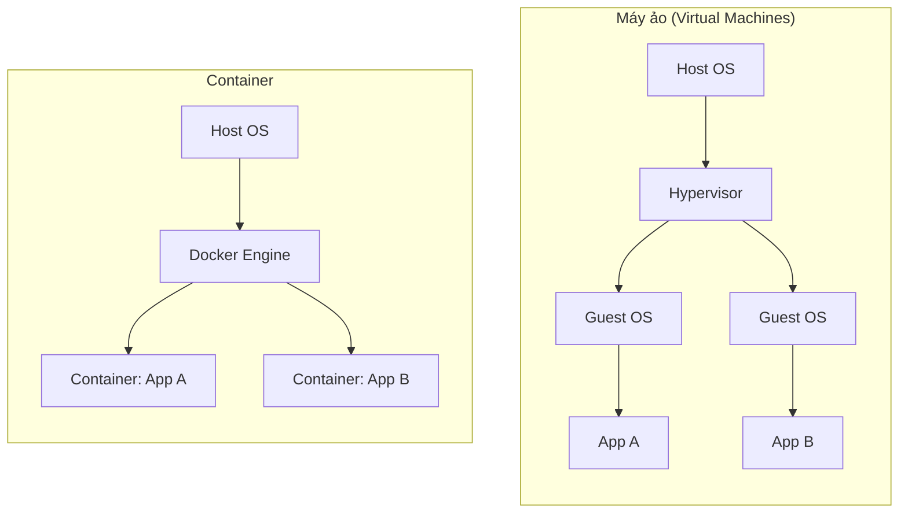
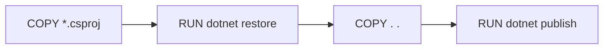
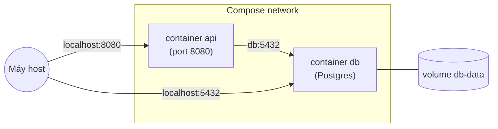

# Docker

Bài giảng nhập môn Docker thật chi tiết, dành cho dev .NET: container thực chất là gì, các khái niệm cốt lõi (image, container, registry, Dockerfile), quy trình làm việc với command-line, cách đóng gói (containerize) một ASP.NET Core Web API bằng multi-stage build, volume, networking, và Docker Compose cho ứng dụng nhiều container. Mọi lệnh bên dưới đều có ví dụ chạy được trong [src/](./src/) - một Web API tối giản kèm `Dockerfile`, `.dockerignore`, và `docker-compose.yml`.

> Bài này không yêu cầu bạn biết Docker từ trước. Tuy nhiên bạn cần biết chạy một project .NET bằng `dotnet run` (xem [00-web-api-template](../00-web-api-template/README.vi.md)).

## Mục tiêu

- Giải thích container là gì và khác gì với máy ảo (virtual machine).
- Cài đặt Docker và kiểm tra nó hoạt động.
- Nắm các thuật ngữ cốt lõi: image, container, Dockerfile, registry, tag, layer.
- Đọc và viết một `Dockerfile` dạng multi-stage cho ứng dụng ASP.NET Core.
- Build một image, chạy container từ image đó, và map port để truy cập được từ máy host.
- Truyền cấu hình vào container bằng biến môi trường (environment variable).
- Lưu trữ dữ liệu bền vững qua các lần restart container bằng volume.
- Hiểu networking của container đủ để kết nối container API với container database.
- Chạy một ứng dụng nhiều container (API + database) chỉ với một lệnh `docker compose up`.
- Đọc log, mở shell vào một container đang chạy, và inspect trạng thái của nó để debug.
- Biết các lệnh dọn dẹp thường dùng để máy không bị đầy vì image/container cũ.
- Nhận diện các lỗi thường gặp khi dùng Docker trước khi chúng làm mất cả buổi chiều của bạn.

## 1. Docker là gì, và tại sao cần nó

Docker đóng gói một ứng dụng cùng với mọi thứ nó cần để chạy (runtime, thư viện, config) thành một đơn vị duy nhất gọi là **image**. Chạy image đó sẽ tạo ra một **container** - một tiến trình (process) bị cô lập, có filesystem, network interface, và cây tiến trình riêng, nhưng vẫn dùng chung kernel của hệ điều hành host.

Lợi ích cốt lõi: câu chuyện "chạy được trên máy tôi mà" không còn là vấn đề, vì container mang theo toàn bộ môi trường của nó. Cùng một image chạy giống hệt nhau trên laptop của bạn, laptop đồng nghiệp, máy CI, và production.

### Container vs. máy ảo (VM)



VM ảo hóa toàn bộ một máy, bao gồm cả một hệ điều hành guest đầy đủ - nó khởi động trong vài giây đến vài phút và tốn hàng GB RAM/disk cho mỗi instance. Container thì dùng chung kernel của host và chỉ cô lập tiến trình, filesystem, network - nó khởi động trong vài mili-giây và thường chỉ nặng vài chục đến vài trăm MB. Đánh đổi ở đây là mức độ cô lập (ranh giới của VM chặt hơn) để lấy tốc độ và mật độ triển khai cao hơn - đó là lý do container trở thành lựa chọn mặc định để đóng gói và triển khai từng service riêng lẻ, còn VM vẫn hợp lý khi cần chạy một hệ điều hành hoàn toàn khác hoặc cần cô lập multi-tenant thật chặt.

## 2. Cài đặt Docker

- **Windows/Mac**: cài [Docker Desktop](https://www.docker.com/products/docker-desktop/). Nó đóng gói sẵn Docker Engine, CLI, và (trên Mac/Windows) một máy ảo Linux nhẹ mà engine thực sự chạy bên trong, vì container của Docker về bản chất là container Linux.
- **Linux**: cài [Docker Engine](https://docs.docker.com/engine/install/) trực tiếp (không cần VM - kernel của host đã là Linux sẵn).

Kiểm tra cài đặt:

```bash
docker --version
docker run hello-world
```

`hello-world` tải về một image rất nhỏ, chạy nó, và in ra thông báo xác nhận - nếu chạy được thì Docker đã cài đặt đúng.

## 3. Các thuật ngữ cốt lõi

| Thuật ngữ      | Ý nghĩa                                                                                                                                                                                                                                 |
| -------------- | --------------------------------------------------------------------------------------------------------------------------------------------------------------------------------------------------------------------------------------- |
| **Image**      | Một bản mẫu chỉ-đọc (read-only), có version: snapshot filesystem + metadata (entrypoint, port expose, giá trị env mặc định). Build một lần, chạy được nhiều lần.                                                                        |
| **Container**  | Một instance đang chạy (hoặc đã dừng) của một image - một tiến trình cô lập với lớp filesystem riêng nằm trên image.                                                                                                                    |
| **Dockerfile** | File text chứa các chỉ thị mô tả cách build image (image gốc, file cần copy, lệnh cần chạy, chạy gì khi khởi động).                                                                                                                     |
| **Registry**   | Server lưu trữ và phân phối image (ví dụ [Docker Hub](https://hub.docker.com/), GitHub Container Registry, Azure Container Registry). `docker pull`/`docker push` làm việc với registry.                                                |
| **Tag**        | Nhãn gắn lên image, thường có dạng `tên:phiên_bản` (ví dụ `mcr.microsoft.com/dotnet/aspnet:10.0`). `latest` chỉ là một tên tag theo quy ước, không phải con trỏ ma thuật trỏ đến "bản mới nhất".                                        |
| **Layer**      | Mỗi chỉ thị trong Dockerfile làm thay đổi filesystem sẽ tạo ra một layer bất biến, được cache lại; một image là một chồng các layer. Layer là đơn vị mà Docker tái sử dụng giữa các lần build (xem [mục 10](#10-layer-và-build-cache)). |
| **Volume**     | Bộ nhớ do Docker quản lý, tồn tại độc lập với vòng đời của một container, dùng để lưu trữ hoặc chia sẻ dữ liệu (xem [mục 8](#8-lưu-trữ-dữ-liệu-bền-vững-với-volume)).                                                                   |

## 4. Các lệnh dùng hằng ngày

Image:

```bash
docker images                    # liệt kê các image có trên máy
docker pull <image>:<tag>        # tải image từ registry về
docker build -t <name>:<tag> .   # build image từ Dockerfile trong thư mục hiện tại
docker rmi <image>               # xóa một image
```

Container:

```bash
docker run <image>                       # tạo + chạy container, foreground
docker run -d <image>                    # ...chạy nền (detached)
docker run -p 8080:8080 <image>          # map port 8080 của host -> port 8080 của container
docker run --name my-api <image>         # đặt tên thân thiện cho container
docker run -e KEY=value <image>          # set biến môi trường
docker ps                                # liệt kê các container đang chạy
docker ps -a                             # liệt kê TẤT CẢ container, kể cả đã dừng
docker stop <container>                  # gửi SIGTERM, dừng container êm ái
docker rm <container>                    # xóa một container đã dừng
docker logs <container>                  # xem stdout/stderr
docker logs -f <container>               # theo dõi (stream) log theo thời gian thực
docker exec -it <container> /bin/bash    # mở shell vào bên trong container đang chạy
docker inspect <container>               # metadata JSON đầy đủ (IP, mount, env, ...)
```

`<container>` và `<image>` ở trên có thể dùng tên/tag hoặc ID hiển thị từ `docker ps`/`docker images` (chỉ cần một tiền tố đủ để ID không bị trùng).

## 5. Viết Dockerfile cho ứng dụng .NET

Cách làm ngây thơ - một `FROM` với image SDK, copy hết mọi thứ, `dotnet run` - vẫn chạy được nhưng lại đóng gói cả bộ SDK (compiler, cache NuGet, tooling build) vào image production, nặng khoảng 800 MB+ và có bề mặt tấn công (attack surface) lớn hơn nhiều so với mức cần thiết. Cách chuẩn để khắc phục là **multi-stage build**: dùng image SDK để compile và publish, sau đó chỉ copy phần output đã publish sang một image runtime nhỏ gọn hơn nhiều.

[src/Dockerfile](./src/Dockerfile):

```dockerfile
# syntax=docker/dockerfile:1

# ---- Stage 1: build ----
FROM mcr.microsoft.com/dotnet/sdk:10.0 AS build
WORKDIR /src

COPY DockerDemo.csproj .
RUN dotnet restore

COPY . .
RUN dotnet publish -c Release -o /app --no-restore

# ---- Stage 2: runtime ----
FROM mcr.microsoft.com/dotnet/aspnet:10.0 AS final
WORKDIR /app
USER app

COPY --from=build /app .

EXPOSE 8080

HEALTHCHECK --interval=30s --timeout=3s --start-period=5s \
    CMD curl -f http://localhost:8080/health || exit 1

ENTRYPOINT ["dotnet", "DockerDemo.dll"]
```

Giải thích từng phần:

- **`FROM ... AS build`** đặt tên cho stage đầu tiên là `build` để stage sau có thể copy file ra từ đó. Stage này dùng image **SDK** (`dotnet/sdk`), có kèm compiler và CLI.
- **`COPY DockerDemo.csproj .` rồi mới `RUN dotnet restore`, tách riêng khỏi `COPY . .`** - thứ tự này là cố ý, để tối ưu build cache; xem [mục 10](#10-layer-và-build-cache).
- **`RUN dotnet publish -c Release -o /app`** compile bản Release và ghi output (DLL, `.deps.json`, `appsettings.json`, ...) vào `/app` bên trong stage build.
- **`FROM ... AS final`** khởi tạo một image _hoàn toàn mới_ dựa trên image **ASP.NET runtime** (`dotnet/aspnet`) - không có SDK, không có compiler, chỉ có những gì cần để _chạy_ một ứng dụng đã build sẵn. Đây mới là image thực sự được triển khai.
- **`USER app`** chuyển khỏi user root mặc định (image gốc đã có sẵn user `app` chính cho mục đích này) - một container chạy bằng root nếu bị xâm nhập sẽ gây thiệt hại lớn hơn.
- **`COPY --from=build /app .`** chỉ copy phần output đã publish từ stage build sang stage runtime - SDK, source code, và các artifact build trung gian không hề lọt vào image cuối cùng.
- **`EXPOSE 8080`** chỉ là tài liệu (documentation) cho người đọc và các công cụ; bản thân nó không hề publish port ra ngoài (xem [mục 7](#7-networking-và-port-mapping)).
- **`HEALTHCHECK`** báo cho Docker biết cách kiểm tra định kỳ xem container có thực sự hoạt động không, chứ không chỉ là đang chạy (xem [mục 9](#9-health-check)).
- **`ENTRYPOINT`** là lệnh chạy khi container khởi động. `["dotnet", "DockerDemo.dll"]` (dạng exec, một mảng JSON) được ưu tiên hơn dạng shell (`dotnet DockerDemo.dll`) vì nó chạy tiến trình trực tiếp làm PID 1, không qua shell trung gian - điều này quan trọng để forward đúng các tín hiệu như `SIGTERM` khi Docker cố dừng container.

### .dockerignore

Tương tự `.gitignore`, [src/.dockerignore](./src/.dockerignore) loại trừ file khỏi _build context_ (mọi thứ được gửi tới Docker daemon khi bạn chạy `docker build`):

```
bin/
obj/
*.user
.vs/
.vscode/
```

Nếu không có file này, `COPY . .` sẽ đóng gói luôn thư mục `bin`/`obj` cục bộ (có thể build cho sai hệ điều hành/kiến trúc) vào image và làm build context phình to không cần thiết.

## 6. Build và chạy project mẫu

```bash
cd lectures/05-docker/src
docker build -t docker-demo .
docker run -d -p 8080:8080 --name docker-demo docker-demo
curl http://localhost:8080/api/hello
# {"message":"Hello from the Dockerized Web API!","source":"local (no GREETING_SOURCE set)","machineName":"a1b2c3d4e5f6"}
```

`machineName` sẽ là một chuỗi hex trông ngẫu nhiên - đó chính là hostname của container, bằng chứng code đang chạy bên trong container chứ không phải trên máy host.

Truyền một biến môi trường vào, để thấy nó được phản hồi lại trong response:

```bash
docker run -d -p 8080:8080 -e GREETING_SOURCE=docker-run --name docker-demo-2 docker-demo
curl http://localhost:8080/api/hello   # "source":"docker-run"
```

Dọn dẹp:

```bash
docker stop docker-demo docker-demo-2
docker rm docker-demo docker-demo-2
```

## 7. Networking và port mapping

Mỗi container có network namespace và địa chỉ IP riêng trên một mạng Docker private - mặc định, không thứ gì bên ngoài Docker có thể truy cập vào nó. `-p <port-host>:<port-container>` publish một port bằng cách forward traffic từ host vào container:

```bash
docker run -p 8080:8080 docker-demo   # host:8080 -> container:8080
docker run -p 9000:8080 docker-demo   # host:9000 -> container:8080 (port host khác)
```

`EXPOSE` trong Dockerfile chỉ là metadata (và là gợi ý cho `docker run -P`, tự động publish mọi port đã expose sang port ngẫu nhiên trên host) - việc map port thực sự luôn đến từ `-p` trên `docker run` (hoặc `ports:` trong Compose).

Các container nằm trên **cùng** một mạng Docker do người dùng định nghĩa có thể gọi trực tiếp lẫn nhau bằng tên container/service, không cần map `-p` gì cả - đó là cách container API nói chuyện với container database ở [mục 11](#11-ứng-dụng-nhiều-container-với-docker-compose).

## 8. Lưu trữ dữ liệu bền vững với volume

Filesystem riêng của một container là tạm thời (ephemeral): `docker rm` sẽ xóa nó cùng với mọi dữ liệu ghi bên trong. **Volume** là bộ nhớ do Docker quản lý, tồn tại độc lập với vòng đời của bất kỳ container cụ thể nào.

```bash
docker volume create my-data
docker run -v my-data:/var/lib/postgresql/data postgres:16-alpine
docker volume ls
docker volume rm my-data
```

Ngoài ra còn có **bind mount** (`-v <đường-dẫn-host>:<đường-dẫn-container>`), map một thư mục cụ thể từ filesystem của host thay vì dùng volume do Docker quản lý - tiện cho phát triển local (ví dụ mount source code để container tự cập nhật khi file thay đổi), nhưng lại gắn chặt container với đường dẫn host đó, đó là lý do named volume thường được ưu tiên hơn cho việc lưu trữ dữ liệu thực sự.

## 9. Health check

`HEALTHCHECK` trong Dockerfile (hoặc `healthcheck:` trong Compose) báo cho Docker định kỳ chạy một lệnh bên trong container và dùng exit code của nó để quyết định container đang `healthy`, `unhealthy`, hay vẫn `starting`:

```dockerfile
HEALTHCHECK --interval=30s --timeout=3s --start-period=5s \
    CMD curl -f http://localhost:8080/health || exit 1
```

`docker ps` sau đó sẽ hiển thị trạng thái health của container bên cạnh thời gian chạy. Điều này quan trọng nhất trong bối cảnh orchestration: `depends_on: condition: service_healthy` của Compose (dùng ở [mục 11](#11-ứng-dụng-nhiều-container-với-docker-compose)) và readiness probe của Kubernetes đều dựa vào tín hiệu này để biết khi nào một dependency thực sự sẵn sàng, chứ không chỉ mới khởi động.

## 10. Layer và build cache

Mỗi chỉ thị `RUN`, `COPY`, `ADD` tạo ra một **layer** bất biến, được cache lại. Khi build lại, Docker sẽ tái sử dụng layer đã cache nguyên vẹn nếu chỉ thị và input của nó không đổi - và sẽ vô hiệu hóa (invalidate) layer đó _cùng mọi layer phía sau nó_ ngay khi có gì đó thay đổi.

Đây là lý do Dockerfile copy `DockerDemo.csproj` và chạy `dotnet restore` _trước khi_ copy phần source code còn lại:

```dockerfile
COPY DockerDemo.csproj .
RUN dotnet restore
COPY . .
RUN dotnet publish -c Release -o /app --no-restore
```



Sửa một file `.cs` chỉ vô hiệu hóa từ `COPY . .` trở đi - layer `restore` (thường là bước chậm nhất, vì nó tải NuGet package) vẫn được giữ trong cache. Nếu Dockerfile chỉ dùng một `COPY . .` ngay từ đầu, _bất kỳ_ thay đổi nào trong source - kể cả sửa một comment - cũng sẽ vô hiệu hóa luôn `restore`, khiến mọi package bị tải lại ở mỗi lần build.

Quy tắc chung: sắp xếp các chỉ thị theo thứ tự từ ít thay đổi nhất đến thường xuyên thay đổi nhất.

## 11. Ứng dụng nhiều container với Docker Compose

Ứng dụng thực tế hiếm khi chạy đơn độc - một API thường cần database, cache, message broker, v.v. **Docker Compose** mô tả một ứng dụng nhiều container trong một file YAML duy nhất và quản lý cả nhóm bằng một lệnh.

[src/docker-compose.yml](./src/docker-compose.yml):

```yaml
services:
  api:
    build: .
    ports:
      - "8080:8080"
    environment:
      - GREETING_SOURCE=docker-compose
    depends_on:
      db:
        condition: service_healthy

  db:
    image: postgres:16-alpine
    environment:
      - POSTGRES_PASSWORD=devpassword
      - POSTGRES_DB=dockerdemo
    ports:
      - "5432:5432"
    volumes:
      - db-data:/var/lib/postgresql/data
    healthcheck:
      test: ["CMD-SHELL", "pg_isready -U postgres"]
      interval: 5s
      timeout: 3s
      retries: 5

volumes:
  db-data:
```

```bash
cd lectures/05-docker/src
docker compose up --build   # build image api (nếu cần) và khởi động cả hai service
docker compose ps           # liệt kê các service và trạng thái của chúng
docker compose logs -f api  # theo dõi log của riêng service api
docker compose down         # dừng và xóa container + network mặc định (giữ lại volume)
docker compose down -v      # ...và xóa luôn named volume (db-data)
```

Những điểm cần chú ý:

- Compose tạo một mạng private dùng chung cho mọi service trong file - `api` có thể gọi tới database qua hostname `db` (chính là tên service), trên port `5432`, không cần map `-p` gì giữa hai container. Dòng `5432:5432` trong file chỉ expose Postgres ra _host_ (ví dụ để kết nối bằng một DB client cục bộ) - nó không phải lý do `api` gọi được tới `db`.
- `depends_on: condition: service_healthy` khiến Compose chờ `HEALTHCHECK` của `db` pass rồi mới khởi động `api` - `depends_on` trơn (không có `condition`) chỉ chờ container _khởi động_, chứ không chờ Postgres bên trong nó sẵn sàng nhận kết nối, đây là nguyên nhân kinh điển gây lỗi "connection refused" ở lần chạy đầu tiên.
- `db-data` là một named volume (khai báo dưới key `volumes:` cấp cao nhất) - dữ liệu Postgres vẫn còn sau `docker compose down`, và chỉ bị xóa khi dùng cờ `-v` một cách tường minh.



## 12. Dọn dẹp

Image và container tích tụ rất nhanh trong quá trình phát triển. Các lệnh dọn dẹp thường dùng:

```bash
docker ps -a                      # xem những gì đang có, kể cả container đã dừng
docker rm $(docker ps -aq)        # xóa mọi container đã dừng
docker image prune                # xóa image "dangling" (không còn tag)
docker system prune                # xóa container đã dừng, image dangling, network không dùng
docker system prune -a --volumes  # mạnh tay: xóa cả image và volume không dùng - cân nhắc kỹ trước khi chạy
```

`docker system prune -a --volumes` là lệnh mang tính phá hủy và ảnh hưởng toàn máy - hãy đọc kỹ nó sẽ xóa gì trước khi xác nhận.

## Các lỗi thường gặp

- **Đóng gói image SDK vào production** - luôn multi-stage build xuống image runtime-only ([mục 5](#5-viết-dockerfile-cho-ứng-dụng-net)); image SDK dùng để build, không phải để chạy.
- **`COPY . .` trước khi restore dependency** - phá hỏng layer cache, khiến mỗi lần build lại phải tải lại toàn bộ package. Hãy copy (các) file project và restore trước ([mục 10](#10-layer-và-build-cache)).
- **Quên `.dockerignore`** - đóng gói `bin`/`obj` cục bộ (binary sai OS/kiến trúc) và làm build context phình to.
- **Nghĩ rằng `EXPOSE` sẽ publish port** - nó chỉ là tài liệu; bạn vẫn cần `-p` trên `docker run` hoặc `ports:` trong Compose.
- **Dùng `depends_on` mà không có `condition: service_healthy` cho database** - service phụ thuộc khởi động trước khi database thực sự sẵn sàng nhận kết nối, gây lỗi khởi động không ổn định (intermittent).
- **Ghi dữ liệu vào filesystem riêng của container rồi mong nó tồn tại lâu dài** - nó sẽ bị xóa cùng container; hãy dùng volume cho bất cứ thứ gì cần lưu trữ bền vững ([mục 8](#8-lưu-trữ-dữ-liệu-bền-vững-với-volume)).
- **Nhầm `latest` là "phiên bản mới nhất"** - nó chỉ là một tên tag như bao tag khác; không có gì đảm bảo `latest` không cũ hoặc trỏ tới một bản build cũ hơn mong đợi. Hãy ghim tag phiên bản tường minh cho mọi thứ ngoài phạm vi thử nghiệm cục bộ.
- **Chạy image cuối cùng bằng root** - hãy chuyển sang user không phải root (`USER app` trong các image runtime .NET) trừ khi container thực sự cần quyền root.

## Bài tập

1. Build image mẫu, chạy nó, và xác nhận `curl http://localhost:8080/api/hello` trả về phản hồi đúng. Sau đó `docker exec -it` vào container đang chạy và kiểm tra `dotnet` (bộ SDK) _không_ được cài ở đó - chỉ có app và ASP.NET runtime.
2. Sửa `Program.cs` để thêm một endpoint mới, build lại image, và đo thời gian build lại so với lần build đầu tiên. Giải thích những layer nào trong Dockerfile được tái sử dụng, dựa vào [mục 10](#10-layer-và-build-cache).
3. Chạy project mẫu mà không dùng `-p` và thử `curl` từ host - xác nhận nó thất bại, sau đó chạy lại với `-p 8080:8080` và xác nhận nó hoạt động.
4. Khởi động toàn bộ stack bằng `docker compose up --build`, xác nhận container API kết nối được tới Postgres (container api khởi động thành công và giữ trạng thái healthy), sau đó chạy `docker compose down` rồi `docker compose up` lại lần nữa và xác nhận dữ liệu trong volume vẫn còn.
5. Cố tình tạo một lỗi khiến `/health` trả về status khác 200, build lại, và quan sát `docker ps` báo container ở trạng thái `unhealthy`.

## Chạy project

```bash
# Container đơn lẻ
cd lectures/05-docker/src
docker build -t docker-demo .
docker run -d -p 8080:8080 --name docker-demo docker-demo
curl http://localhost:8080/api/hello

# Chạy cả stack với Docker Compose (API + Postgres)
docker compose up --build
```

## Ghi chú

- Xem [src/Dockerfile](./src/Dockerfile) để có bản multi-stage build đầy đủ chú thích và [src/docker-compose.yml](./src/docker-compose.yml) cho cấu hình nhiều container, cả hai đều được tham chiếu xuyên suốt bài giảng này.
- Bài này tập trung vào các kiến thức nền tảng của Docker cho phát triển local. Việc đẩy image lên registry (`docker push`), build image trong CI/CD, và orchestration ở quy mô lớn (Kubernetes) đều xây dựng trên các khái niệm này nhưng nằm ngoài phạm vi bài giảng.
